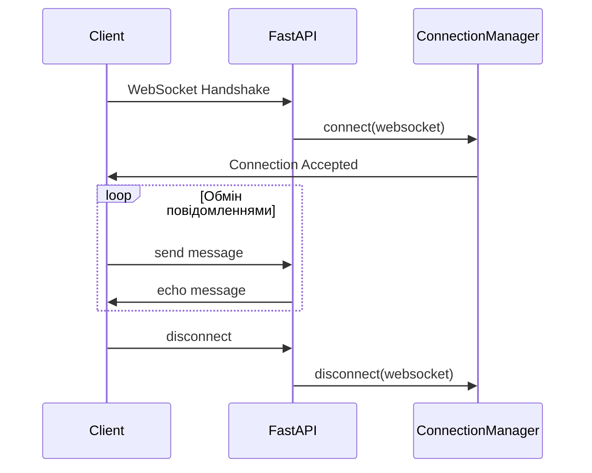

# Лабораторна робота 7 Реалізація WebSocket застосунку

## Мета

Після виконання лабораторної роботи студент зможе створювати WebSocket endpoints у FastAPI, управляти активними з'єднаннями через ConnectionManager, обробляти події підключення та відключення клієнтів, а також розробляти простий frontend для тестування real-time комунікації.

## Завдання

Розробити базовий WebSocket сервер на FastAPI, який реалізує функціонал echo-сервера з управлінням з'єднаннями. Створити простий HTML/JavaScript frontend для взаємодії з сервером. Продемонструвати роботу системи через скріншоти та описати архітектуру рішення в документації.

## Теоретичні відомості

### WebSocket протокол

WebSocket є протоколом повнодуплексної комунікації, який працює поверх TCP з'єднання. На відміну від HTTP, де клієнт завжди ініціює запит, WebSocket дозволяє серверу активно надсилати дані клієнту в будь-який момент після встановлення з'єднання.

Життєвий цикл WebSocket з'єднання складається з наступних етапів:

1. Handshake через HTTP запит з заголовком Upgrade
2. Встановлення WebSocket з'єднання
3. Обмін повідомленнями (frames)
4. Закриття з'єднання

Основні переваги WebSocket порівняно з HTTP polling включають зменшення затримок, ефективніше використання ресурсів сервера та можливість двосторонньої комунікації в реальному часі.

### WebSocket у FastAPI

FastAPI надає вбудовану підтримку WebSocket через декоратор `@app.websocket()`. Базова робота з WebSocket включає наступні кроки:

Спочатку необхідно прийняти з'єднання методом `accept()`, після чого можна обмінюватись повідомленнями через `receive_text()` та `send_text()`. Важливо обробляти виключення `WebSocketDisconnect`, яке виникає при розриві з'єднання клієнтом.

### Патерн ConnectionManager

ConnectionManager є класичним патерном для управління активними WebSocket з'єднаннями. Він зберігає список активних підключень та надає методи для додавання, видалення з'єднань та розсилки повідомлень.

Основні методи ConnectionManager:

- `connect(websocket)` - приймає нове з'єднання та додає його до списку активних
- `disconnect(websocket)` - видаляє з'єднання зі списку
- `send_personal_message(message, websocket)` - надсилає повідомлення конкретному клієнту
- `broadcast(message)` - надсилає повідомлення всім підключеним клієнтам

### Echo Server концепція

Echo server є найпростішою реалізацією WebSocket сервера, яка повертає клієнту те саме повідомлення, яке було отримано. Така реалізація дозволяє протестувати базову функціональність WebSocket без складної бізнес-логіки.



## Хід роботи

### Крок 1. Підготовка середовища

Створіть новий проєкт та встановіть необхідні залежності:

```bash
mkdir websocket-basics
cd websocket-basics
python -m venv venv
source venv/bin/activate  # для Windows: venv\Scripts\activate
pip install fastapi uvicorn python-multipart
```

Створіть базову структуру проєкту:

```
websocket-basics/
├── main.py
├── static/
│   └── index.html
├── requirements.txt
└── README.md
```

### Крок 2. Реалізація ConnectionManager

У файлі `main.py` створіть клас ConnectionManager для управління WebSocket з'єднаннями:

```python
from fastapi import FastAPI, WebSocket, WebSocketDisconnect
from typing import List

class ConnectionManager:
    def __init__(self):
        self.active_connections: List[WebSocket] = []
    
    async def connect(self, websocket: WebSocket):
        await websocket.accept()
        self.active_connections.append(websocket)
        print(f"Client connected. Total connections: {len(self.active_connections)}")
    
    def disconnect(self, websocket: WebSocket):
        self.active_connections.remove(websocket)
        print(f"Client disconnected. Total connections: {len(self.active_connections)}")
    
    async def send_personal_message(self, message: str, websocket: WebSocket):
        await websocket.send_text(message)
```

Зверніть увагу, що методи для надсилання повідомлень є асинхронними, оскільки вони виконують операції введення-виведення.

### Крок 3. Створення WebSocket endpoint

Додайте FastAPI застосунок та WebSocket endpoint до `main.py`:

```python
from fastapi.staticfiles import StaticFiles

app = FastAPI(title="WebSocket Echo Server")

# Mount static files
app.mount("/static", StaticFiles(directory="static"), name="static")

manager = ConnectionManager()

@app.websocket("/ws")
async def websocket_endpoint(websocket: WebSocket):
    await manager.connect(websocket)
    try:
        while True:
            # Отримуємо повідомлення від клієнта
            data = await websocket.receive_text()
            
            # Echo: надсилаємо те саме повідомлення назад
            await manager.send_personal_message(f"Echo: {data}", websocket)
            
    except WebSocketDisconnect:
        manager.disconnect(websocket)
```

Цикл `while True` забезпечує постійне прослуховування нових повідомлень від клієнта. Блок `try-except` гарантує коректну обробку відключення.

### Крок 4. Створення HTML frontend

Створіть файл `static/index.html` з простим інтерфейсом для тестування:

```html
<!DOCTYPE html>
<html>
<head>
    <title>WebSocket Echo Test</title>
    <style>
        body {
            font-family: Arial, sans-serif;
            max-width: 800px;
            margin: 50px auto;
            padding: 20px;
        }
        #messages {
            border: 1px solid #ccc;
            height: 300px;
            overflow-y: auto;
            padding: 10px;
            margin-bottom: 10px;
            background-color: #f9f9f9;
        }
        .message {
            margin: 5px 0;
            padding: 5px;
        }
        .sent {
            color: blue;
        }
        .received {
            color: green;
        }
        .status {
            color: gray;
            font-style: italic;
        }
        input, button {
            padding: 10px;
            font-size: 14px;
        }
        #messageInput {
            width: 70%;
        }
    </style>
</head>
<body>
    <h1>WebSocket Echo Server</h1>
    
    <div id="status" class="status">Disconnected</div>
    
    <div id="messages"></div>
    
    <input type="text" id="messageInput" placeholder="Enter message..." />
    <button onclick="sendMessage()">Send</button>
    <button onclick="connect()">Connect</button>
    <button onclick="disconnect()">Disconnect</button>
    
    <script>
        let ws = null;
        
        function connect() {
            ws = new WebSocket("ws://localhost:8000/ws");
            
            ws.onopen = function(event) {
                document.getElementById("status").textContent = "Connected";
                addMessage("Connected to server", "status");
            };
            
            ws.onmessage = function(event) {
                addMessage("Server: " + event.data, "received");
            };
            
            ws.onclose = function(event) {
                document.getElementById("status").textContent = "Disconnected";
                addMessage("Disconnected from server", "status");
            };
            
            ws.onerror = function(error) {
                addMessage("Error: " + error, "status");
            };
        }
        
        function disconnect() {
            if (ws) {
                ws.close();
            }
        }
        
        function sendMessage() {
            const input = document.getElementById("messageInput");
            const message = input.value;
            
            if (ws && ws.readyState === WebSocket.OPEN && message) {
                ws.send(message);
                addMessage("You: " + message, "sent");
                input.value = "";
            }
        }
        
        function addMessage(message, className) {
            const messagesDiv = document.getElementById("messages");
            const messageDiv = document.createElement("div");
            messageDiv.className = "message " + className;
            messageDiv.textContent = message;
            messagesDiv.appendChild(messageDiv);
            messagesDiv.scrollTop = messagesDiv.scrollHeight;
        }
        
        // Відправка по Enter
        document.getElementById("messageInput").addEventListener("keypress", function(event) {
            if (event.key === "Enter") {
                sendMessage();
            }
        });
    </script>
</body>
</html>
```

Frontend використовує нативний JavaScript WebSocket API для встановлення з'єднання з сервером. Події `onopen`, `onmessage`, `onclose` та `onerror` обробляють різні стани з'єднання.

### Крок 5. Додавання health check endpoint

Додайте простий HTTP endpoint для перевірки стану сервера:

```python
@app.get("/")
async def root():
    return {
        "message": "WebSocket Echo Server is running",
        "active_connections": len(manager.active_connections),
        "websocket_endpoint": "/ws"
    }
```

### Крок 6. Запуск та тестування

Запустіть сервер командою:

```bash
uvicorn main:app --reload
```

Відкрийте браузер та перейдіть на `http://localhost:8000/static/index.html`. Виконайте наступні тести:

1. Натисніть кнопку Connect та переконайтеся, що статус змінився на Connected
2. Введіть кілька повідомлень та переконайтеся, що сервер повертає їх з префіксом Echo
3. Відкрийте кілька вкладок браузера та переконайтеся, що кожне з'єднання працює незалежно
4. Закрийте вкладку та переконайтеся, що з'єднання коректно закривається

### Крок 7. Створення документації

У файлі `README.md` задокументуйте ваше рішення за наступною структурою:

```markdown
    # WebSocket Echo Server
    
    ## Опис проєкту
    
    [Короткий опис функціональності]
    
    ## Встановлення та запуск
    
    [Інструкції з налаштування середовища]
    
    ## Архітектура рішення
    
    [Діаграма компонентів через Mermaid]
    
    ## Структура проєкту
    
    [Опис файлів та їх призначення]
    
    ## Тестування
    
    [Скріншоти роботи з описом]
    
    ## Виконані вимоги
    
    - [x] WebSocket endpoint
    - [x] ConnectionManager
    - [x] Echo функціональність
    - [x] Обробка disconnect
    - [x] HTML frontend
    
    ## Висновки
    
    [Що вдалось реалізувати, які виклики виникли]
```

Обов'язково додайте скріншоти з демонстрацією:

- Підключення до сервера
- Обмін повідомленнями
- Робота з кількома клієнтами
- Коректне відключення

## Критерії оцінювання

Максимальна кількість балів: 7

| Критерій | Бали | Опис |
|----------|------|------|
| **ConnectionManager реалізація** | 2 | Коректна реалізація класу з методами connect, disconnect, send_personal_message. Правильне управління списком активних з'єднань. |
| **WebSocket endpoint** | 2 | Працюючий endpoint з обробкою підключення, отримання повідомлень, echo функціональністю та коректною обробкою відключення через WebSocketDisconnect. |
| **HTML frontend** | 1 | Функціональний інтерфейс з можливістю підключення, відправки повідомлень та відключення. Відображення статусу з'єднання. |
| **Документація** | 1 | README.md з описом архітектури, скріншотами роботи системи, інструкціями з запуску та висновками. |
| **Якість коду** | 1 | Чистий код з коментарями, дотримання PEP 8, правильне використання async/await, обробка помилок. |

**Додаткові бали (+1 бал):**

- Розширений frontend з історією повідомлень та timestamps
- Логування подій з'єднання та відключення у файл
- Додаткові WebSocket endpoints для статистики підключень

## Контрольні запитання

1. У чому принципова різниця між HTTP та WebSocket протоколами? Коли доцільно використовувати кожен з них?

2. Чому метод `connect()` в ConnectionManager є асинхронним, а метод `disconnect()` синхронним?

3. Що станеться, якщо не обробляти виключення `WebSocketDisconnect` у WebSocket endpoint?

4. Яка роль циклу `while True` у WebSocket endpoint? Чи можна його замінити на одноразове отримання повідомлення?

5. Як JavaScript WebSocket API визначає стан з'єднання? Які можливі значення `readyState`?

6. Чому список `active_connections` зберігається як атрибут класу ConnectionManager, а не як глобальна змінна?

7. Які переваги має патерн ConnectionManager порівняно з прямим управлінням з'єднаннями у endpoint?
