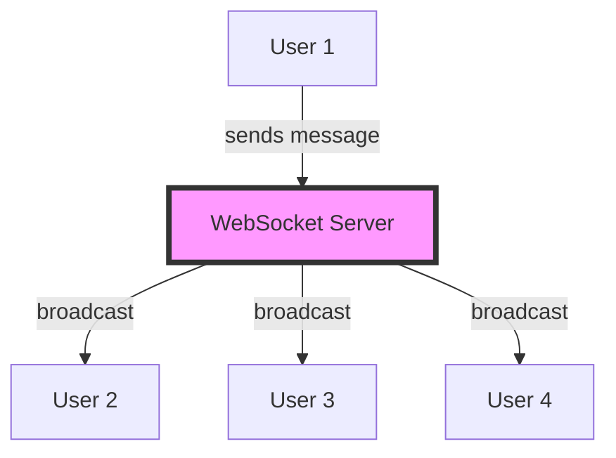

# Лабораторна робота 8 WebSocket Chat з кімнатами

## Мета

Після виконання лабораторної роботи студент зможе реалізовувати broadcasting повідомлень до групи клієнтів, створювати систему кімнат для сегментації користувачів, генерувати системні повідомлення про події в чаті, а також розробляти інтуїтивний frontend для групової комунікації.

## Завдання

Розробити WebSocket чат-застосунок з підтримкою кількох кімнат, де користувачі можуть вибирати username, приєднуватись до різних кімнат та обмінюватись повідомленнями в реальному часі. Реалізувати broadcasting повідомлень усім учасникам кімнати та генерацію системних повідомлень про події приєднання та відключення користувачів.

## Теоретичні відомості

### Broadcasting у WebSocket

Broadcasting є патерном розсилки повідомлень одночасно кільком підключеним клієнтам. На відміну від unicast комунікації, де повідомлення надсилається конкретному отримувачу, broadcasting забезпечує доставку всім учасникам групи.

У контексті чат-застосунку broadcasting використовується для розповсюдження повідомлень всім користувачам кімнати. Коли один користувач надсилає повідомлення, сервер отримує його та розсилає всім іншим підключеним клієнтам цієї кімнати.



### Архітектура кімнат

Система кімнат дозволяє сегментувати користувачів на групи з ізольованою комунікацією. Кожна кімната має унікальний ідентифікатор та власний список активних учасників.

Основні компоненти архітектури кімнат:

- Словник кімнат, де ключем є назва кімнати, а значенням список WebSocket з'єднань
- Методи для приєднання та відключення користувачів від конкретної кімнати
- Broadcast метод, який розсилає повідомлення тільки учасникам певної кімнати
- Механізм відстеження username для кожного з'єднання

### Системні повідомлення

Системні повідомлення інформують користувачів про події в чаті, такі як приєднання нових учасників або відключення існуючих. Ці повідомлення відрізняються від звичайних повідомлень користувачів та зазвичай мають спеціальне форматування на frontend.

Типові системні події включають:

- User joined - користувач приєднався до кімнати
- User left - користувач покинув кімнату
- Room created - створено нову кімнату
- Connection lost - втрачено з'єднання з сервером

### JSON структура повідомлень

Для передачі різних типів даних між клієнтом та сервером використовується JSON формат. Структуровані повідомлення дозволяють розрізняти типи подій та передавати метадані.

Приклад структури повідомлення:

```json
{
    "type": "message",
    "room": "general",
    "username": "john_doe",
    "content": "Hello everyone!",
    "timestamp": "2025-01-15T10:30:00Z"
}
```

Системне повідомлення:

```json
{
    "type": "system",
    "room": "general",
    "content": "john_doe joined the room"
}
```

## Хід роботи

### Крок 1. Підготовка проєкту

Створіть новий проєкт на базі попередньої лабораторної роботи або з нуля:

```bash
mkdir websocket-chat
cd websocket-chat
python -m venv venv
source venv/bin/activate
pip install fastapi uvicorn python-multipart
```

Структура проєкту:

```
websocket-chat/
├── main.py
├── models.py
├── static/
│   ├── index.html
│   └── style.css
├── requirements.txt
└── README.md
```

### Крок 2. Створення моделей даних

У файлі `models.py` створіть Pydantic моделі для валідації повідомлень:

```python
from pydantic import BaseModel
from typing import Literal
from datetime import datetime

class ChatMessage(BaseModel):
    type: Literal["message", "system"]
    room: str
    username: str | None = None
    content: str
    timestamp: datetime | None = None

class JoinRoom(BaseModel):
    username: str
    room: str
```

Ці моделі забезпечують типізацію та валідацію даних, що передаються між клієнтом та сервером.

### Крок 3. Розширений ConnectionManager з підтримкою кімнат

У файлі `main.py` створіть розширену версію ConnectionManager:

```python
from fastapi import FastAPI, WebSocket, WebSocketDisconnect
from typing import Dict, List
from datetime import datetime
import json
from models import ChatMessage, JoinRoom

class RoomManager:
    def __init__(self):
        # rooms: {room_name: [websockets]}
        self.rooms: Dict[str, List[WebSocket]] = {}
        # connections: {websocket: {"username": str, "room": str}}
        self.connections: Dict[WebSocket, Dict[str, str]] = {}
    
    async def connect(self, websocket: WebSocket, username: str, room: str):
        await websocket.accept()
        
        # Додаємо кімнату якщо вона не існує
        if room not in self.rooms:
            self.rooms[room] = []
        
        # Додаємо з'єднання до кімнати
        self.rooms[room].append(websocket)
        self.connections[websocket] = {"username": username, "room": room}
        
        # Системне повідомлення про приєднання
        await self.broadcast_to_room(
            room=room,
            message=f"{username} joined the room",
            message_type="system"
        )
        
        print(f"{username} joined room '{room}'. Total in room: {len(self.rooms[room])}")
    
    def disconnect(self, websocket: WebSocket):
        if websocket in self.connections:
            user_info = self.connections[websocket]
            username = user_info["username"]
            room = user_info["room"]
            
            # Видаляємо з кімнати
            if room in self.rooms:
                self.rooms[room].remove(websocket)
                
                # Видаляємо кімнату якщо порожня
                if len(self.rooms[room]) == 0:
                    del self.rooms[room]
            
            # Видаляємо з'єднання
            del self.connections[websocket]
            
            print(f"{username} left room '{room}'")
            
            return user_info
        return None
    
    async def broadcast_to_room(self, room: str, message: str, 
                               message_type: str = "message", 
                               username: str | None = None):
        if room in self.rooms:
            chat_message = ChatMessage(
                type=message_type,
                room=room,
                username=username,
                content=message,
                timestamp=datetime.now()
            )
            
            message_json = chat_message.model_dump_json()
            
            # Надсилаємо всім у кімнаті
            disconnected = []
            for connection in self.rooms[room]:
                try:
                    await connection.send_text(message_json)
                except:
                    disconnected.append(connection)
            
            # Видаляємо відключені з'єднання
            for conn in disconnected:
                self.disconnect(conn)
    
    def get_room_users(self, room: str) -> List[str]:
        if room not in self.rooms:
            return []
        
        users = []
        for websocket in self.rooms[room]:
            if websocket in self.connections:
                users.append(self.connections[websocket]["username"])
        return users
```

Ключові особливості реалізації:

- Словник `rooms` зберігає списки WebSocket з'єднань для кожної кімнати
- Словник `connections` зв'язує WebSocket з метаданими користувача
- Метод `broadcast_to_room` розсилає повідомлення тільки учасникам певної кімнати
- Автоматичне видалення порожніх кімнат для економії пам'яті

### Крок 4. WebSocket endpoints

Створіть endpoint для чату з обробкою кімнат:

```python
from fastapi.staticfiles import StaticFiles

app = FastAPI(title="WebSocket Chat with Rooms")
app.mount("/static", StaticFiles(directory="static"), name="static")

manager = RoomManager()

@app.websocket("/ws/{room}/{username}")
async def websocket_endpoint(websocket: WebSocket, room: str, username: str):
    await manager.connect(websocket, username, room)
    
    try:
        while True:
            # Отримуємо повідомлення від клієнта
            data = await websocket.receive_text()
            
            # Broadcasting повідомлення всім у кімнаті
            await manager.broadcast_to_room(
                room=room,
                message=data,
                message_type="message",
                username=username
            )
            
    except WebSocketDisconnect:
        user_info = manager.disconnect(websocket)
        if user_info:
            # Повідомлення про відключення
            await manager.broadcast_to_room(
                room=user_info["room"],
                message=f"{user_info['username']} left the room",
                message_type="system"
            )

@app.get("/rooms/{room}/users")
async def get_room_users(room: str):
    users = manager.get_room_users(room)
    return {"room": room, "users": users, "count": len(users)}

@app.get("/rooms")
async def get_rooms():
    return {"rooms": list(manager.rooms.keys())}
```

URL параметри `room` та `username` дозволяють клієнту вказати кімнату та ім'я при підключенні. Додаткові HTTP endpoints надають інформацію про активні кімнати та користувачів.

### Крок 5. Створення покращеного frontend

Створіть файл `static/index.html`:

```html
<!DOCTYPE html>
<html>
<head>
    <title>WebSocket Chat</title>
    <link rel="stylesheet" href="/static/style.css">
</head>
<body>
    <div class="container">
        <!-- Login Form -->
        <div id="loginForm" class="login-form">
            <h1>WebSocket Chat</h1>
            <input type="text" id="usernameInput" placeholder="Enter username..." />
            <input type="text" id="roomInput" placeholder="Enter room name..." value="general" />
            <button onclick="joinChat()">Join Chat</button>
        </div>
        
        <!-- Chat Interface -->
        <div id="chatInterface" class="chat-interface" style="display: none;">
            <div class="chat-header">
                <h2>Room: <span id="currentRoom"></span></h2>
                <div class="user-info">
                    <span id="currentUsername"></span>
                    <button onclick="leaveChat()">Leave</button>
                </div>
            </div>
            
            <div class="chat-sidebar">
                <h3>Online Users (<span id="userCount">0</span>)</h3>
                <div id="userList"></div>
            </div>
            
            <div class="chat-main">
                <div id="messages" class="messages"></div>
                
                <div class="message-input">
                    <input type="text" id="messageInput" placeholder="Type a message..." />
                    <button onclick="sendMessage()">Send</button>
                </div>
            </div>
        </div>
    </div>
    
    <script src="/static/chat.js"></script>
</body>
</html>
```

Створіть файл `static/style.css`:

```css
* {
    margin: 0;
    padding: 0;
    box-sizing: border-box;
}

body {
    font-family: 'Segoe UI', Tahoma, Geneva, Verdana, sans-serif;
    background: linear-gradient(135deg, #667eea 0%, #764ba2 100%);
    height: 100vh;
    display: flex;
    justify-content: center;
    align-items: center;
}

.container {
    width: 100%;
    max-width: 1200px;
    height: 90vh;
}

.login-form {
    background: white;
    padding: 40px;
    border-radius: 10px;
    box-shadow: 0 10px 40px rgba(0,0,0,0.2);
    text-align: center;
    max-width: 400px;
    margin: 0 auto;
}

.login-form h1 {
    margin-bottom: 30px;
    color: #667eea;
}

.login-form input {
    width: 100%;
    padding: 12px;
    margin: 10px 0;
    border: 2px solid #e0e0e0;
    border-radius: 5px;
    font-size: 14px;
}

.login-form button {
    width: 100%;
    padding: 12px;
    margin-top: 20px;
    background: #667eea;
    color: white;
    border: none;
    border-radius: 5px;
    font-size: 16px;
    cursor: pointer;
    transition: background 0.3s;
}

.login-form button:hover {
    background: #5568d3;
}

.chat-interface {
    display: grid;
    grid-template-rows: auto 1fr;
    grid-template-columns: 200px 1fr;
    height: 100%;
    background: white;
    border-radius: 10px;
    overflow: hidden;
    box-shadow: 0 10px 40px rgba(0,0,0,0.2);
}

.chat-header {
    grid-column: 1 / -1;
    background: #667eea;
    color: white;
    padding: 20px;
    display: flex;
    justify-content: space-between;
    align-items: center;
}

.user-info {
    display: flex;
    align-items: center;
    gap: 15px;
}

.user-info button {
    padding: 8px 16px;
    background: rgba(255,255,255,0.2);
    border: none;
    border-radius: 5px;
    color: white;
    cursor: pointer;
}

.chat-sidebar {
    background: #f5f5f5;
    padding: 20px;
    border-right: 1px solid #e0e0e0;
}

.chat-sidebar h3 {
    margin-bottom: 15px;
    font-size: 14px;
    color: #666;
}

#userList {
    font-size: 14px;
}

.user-item {
    padding: 8px;
    margin: 5px 0;
    background: white;
    border-radius: 5px;
}

.chat-main {
    display: flex;
    flex-direction: column;
}

.messages {
    flex: 1;
    overflow-y: auto;
    padding: 20px;
}

.message {
    margin: 10px 0;
    padding: 10px 15px;
    border-radius: 10px;
    max-width: 70%;
    word-wrap: break-word;
}

.message-sent {
    background: #667eea;
    color: white;
    margin-left: auto;
}

.message-received {
    background: #f0f0f0;
}

.message-system {
    background: #fff3cd;
    text-align: center;
    margin: 10px auto;
    font-style: italic;
    color: #856404;
    max-width: 80%;
}

.message-header {
    font-weight: bold;
    margin-bottom: 5px;
    font-size: 12px;
}

.message-time {
    font-size: 10px;
    opacity: 0.7;
    margin-top: 5px;
}

.message-input {
    display: flex;
    padding: 20px;
    border-top: 1px solid #e0e0e0;
    gap: 10px;
}

.message-input input {
    flex: 1;
    padding: 12px;
    border: 2px solid #e0e0e0;
    border-radius: 5px;
    font-size: 14px;
}

.message-input button {
    padding: 12px 30px;
    background: #667eea;
    color: white;
    border: none;
    border-radius: 5px;
    cursor: pointer;
    transition: background 0.3s;
}

.message-input button:hover {
    background: #5568d3;
}
```

Створіть файл `static/chat.js`:

```javascript
let ws = null;
let currentUsername = "";
let currentRoom = "";

function joinChat() {
    const username = document.getElementById("usernameInput").value.trim();
    const room = document.getElementById("roomInput").value.trim();
    
    if (!username || !room) {
        alert("Please enter username and room name");
        return;
    }
    
    currentUsername = username;
    currentRoom = room;
    
    // Connect to WebSocket
    ws = new WebSocket(`ws://localhost:8000/ws/${room}/${username}`);
    
    ws.onopen = function() {
        document.getElementById("loginForm").style.display = "none";
        document.getElementById("chatInterface").style.display = "grid";
        document.getElementById("currentRoom").textContent = room;
        document.getElementById("currentUsername").textContent = username;
        
        // Fetch users periodically
        fetchUsers();
        setInterval(fetchUsers, 5000);
    };
    
    ws.onmessage = function(event) {
        const message = JSON.parse(event.data);
        displayMessage(message);
    };
    
    ws.onclose = function() {
        addSystemMessage("Disconnected from server");
    };
    
    ws.onerror = function(error) {
        console.error("WebSocket error:", error);
        addSystemMessage("Connection error");
    };
}

function leaveChat() {
    if (ws) {
        ws.close();
    }
    
    document.getElementById("loginForm").style.display = "block";
    document.getElementById("chatInterface").style.display = "none";
    document.getElementById("messages").innerHTML = "";
}

function sendMessage() {
    const input = document.getElementById("messageInput");
    const message = input.value.trim();
    
    if (ws && ws.readyState === WebSocket.OPEN && message) {
        ws.send(message);
        input.value = "";
    }
}

function displayMessage(message) {
    const messagesDiv = document.getElementById("messages");
    const messageDiv = document.createElement("div");
    
    if (message.type === "system") {
        messageDiv.className = "message message-system";
        messageDiv.textContent = message.content;
    } else {
        const isOwn = message.username === currentUsername;
        messageDiv.className = `message ${isOwn ? 'message-sent' : 'message-received'}`;
        
        const header = document.createElement("div");
        header.className = "message-header";
        header.textContent = message.username;
        
        const content = document.createElement("div");
        content.textContent = message.content;
        
        const time = document.createElement("div");
        time.className = "message-time";
        time.textContent = new Date(message.timestamp).toLocaleTimeString();
        
        messageDiv.appendChild(header);
        messageDiv.appendChild(content);
        messageDiv.appendChild(time);
    }
    
    messagesDiv.appendChild(messageDiv);
    messagesDiv.scrollTop = messagesDiv.scrollHeight;
}

function addSystemMessage(text) {
    const messagesDiv = document.getElementById("messages");
    const messageDiv = document.createElement("div");
    messageDiv.className = "message message-system";
    messageDiv.textContent = text;
    messagesDiv.appendChild(messageDiv);
    messagesDiv.scrollTop = messagesDiv.scrollHeight;
}

async function fetchUsers() {
    try {
        const response = await fetch(`/rooms/${currentRoom}/users`);
        const data = await response.json();
        
        const userList = document.getElementById("userList");
        userList.innerHTML = "";
        
        data.users.forEach(user => {
            const userDiv = document.createElement("div");
            userDiv.className = "user-item";
            userDiv.textContent = user;
            userList.appendChild(userDiv);
        });
        
        document.getElementById("userCount").textContent = data.count;
    } catch (error) {
        console.error("Error fetching users:", error);
    }
}

// Send message on Enter
document.addEventListener("DOMContentLoaded", function() {
    const messageInput = document.getElementById("messageInput");
    if (messageInput) {
        messageInput.addEventListener("keypress", function(event) {
            if (event.key === "Enter") {
                sendMessage();
            }
        });
    }
});
```

Frontend забезпечує повноцінний досвід чату з візуальною різницею між власними повідомленнями, повідомленнями інших користувачів та системними нотифікаціями.

### Крок 6. Тестування функціональності

Запустіть сервер та виконайте комплексне тестування:

```bash
uvicorn main:app --reload
```

Сценарії тестування:

1. Відкрийте два вікна браузера та підключіться до однієї кімнати з різними username
2. Переконайтеся, що системне повідомлення про приєднання відображається в обох вікнах
3. Надішліть повідомлення з першого вікна та переконайтеся, що воно з'являється в другому
4. Створіть третє вікно з іншою кімнатою та переконайтеся в ізоляції повідомлень
5. Закрийте одне вікно та переконайтеся, що системне повідомлення про відключення з'являється в інших вікнах тієї кімнати
6. Перевірте коректність списку online користувачів у sidebar

### Крок 7. Документація проєкту

Створіть детальний `README.md`:

```markdown
    # WebSocket Chat з кімнатами
    
    ## Опис проєкту
    
    Real-time чат-застосунок на базі FastAPI WebSocket з підтримкою:
    - Множинних кімнат для сегментації користувачів
    - Broadcasting повідомлень усім учасникам кімнати
    - Системних нотифікацій про події
    - Відображення списку online користувачів
    
    ## Архітектура
    
    [Mermaid діаграма компонентів]
    
    ## Встановлення
    
    [Крок-за-кроком інструкції]
    
    ## Використання
    
    [Опис роботи з застосунком]
    
    ## Структура даних
    
    ### ChatMessage
    \`\`\`python
    {
        "type": "message" | "system",
        "room": str,
        "username": str | None,
        "content": str,
        "timestamp": datetime
    }
    \`\`\`
    
    ## Скріншоти
    
    [Скріншоти з демонстрацією всіх features]
    
    ## Виконані вимоги
    
    - [x] Broadcasting повідомлень
    - [x] Система кімнат
    - [x] Username для користувачів
    - [x] Системні повідомлення
    - [x] Покращений frontend
    
    ## Висновки
    
    [Аналіз реалізації та виклики]
```

Обов'язково включіть скріншоти:

- Форма входу з username та room
- Чат з повідомленнями від різних користувачів
- Системні повідомлення про приєднання/відключення
- Sidebar зі списком користувачів
- Робота з кількома кімнатами одночасно

## Критерії оцінювання

Максимальна кількість балів: 7

| Критерій | Бали | Опис |
|----------|------|------|
| **RoomManager реалізація** | 2 | Коректна робота з кімнатами, управління списками користувачів, broadcasting до кімнати, обробка порожніх кімнат. |
| **Broadcasting функціональність** | 1.5 | Повідомлення коректно розсилаються всім учасникам кімнати, ізоляція між різними кімнатами працює правильно. |
| **Системні повідомлення** | 1 | Генерація нотифікацій про приєднання та відключення, коректне форматування системних повідомлень. |
| **Frontend функціональність** | 1.5 | Інтуїтивний інтерфейс з формою входу, чатом, sidebar з користувачами, візуальна різниця між типами повідомлень. |
| **Документація** | 1 | README.md з описом архітектури, структури даних, скріншотами різних сценаріїв використання та висновками. |

**Додаткові бали (+1 бал):**

- Збереження історії повідомлень у базі даних
- Приватні повідомлення між користувачами
- Typing indicators (показ коли користувач друкує)

## Контрольні запитання

1. Чому використовується словник для зберігання кімнат, а не список? Які переваги цього підходу?
2. Як забезпечується ізоляція повідомлень між різними кімнатами на рівні серверної логіки?
3. Що станеться, якщо broadcasting метод спробує надіслати повідомлення відключеному клієнту? Як це обробляється?
4. Чому для збереження метаданих користувача використовується окремий словник `connections`, а не зберігання цих даних безпосередньо в об'єкті WebSocket?
5. Як на frontend відрізняються власні повідомлення від повідомлень інших користувачів? Яка логіка за цим стоїть?
6. Які потенційні проблеми можуть виникнути при масштабуванні цього рішення на тисячі користувачів? Як їх можна вирішити?
7. Чому важливо видаляти порожні кімнати? Які ресурси це економить?
