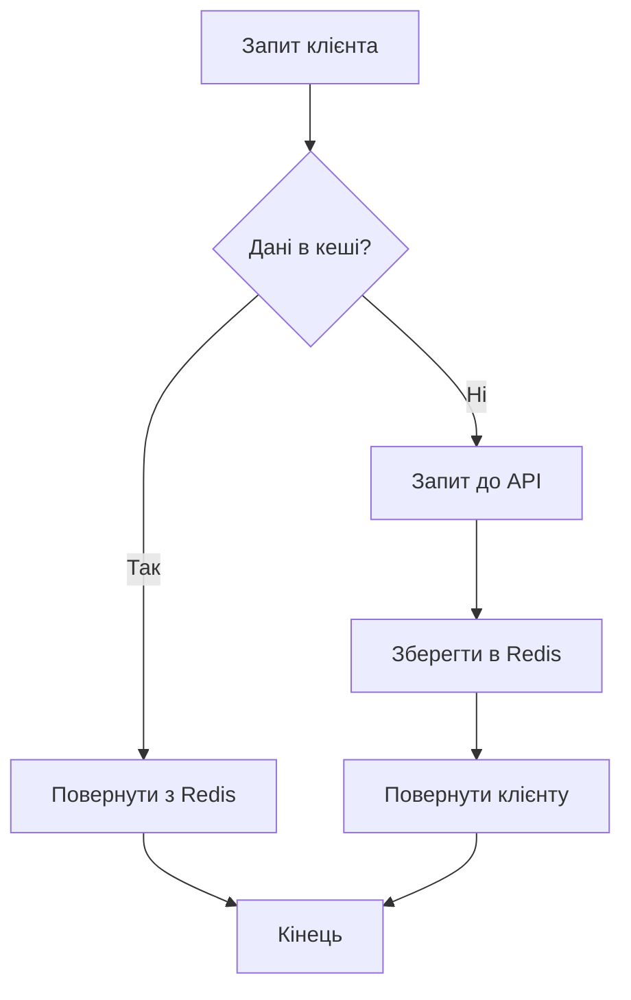

# Лабораторна робота 9 Інтеграція зовнішніх API та Webhooks

## Мета

Після виконання лабораторної роботи студент зможе інтегрувати зовнішні API у FastAPI застосунок через асинхронні HTTP запити, реалізовувати кешування для оптимізації запитів, впроваджувати retry логіку для підвищення надійності, створювати webhook endpoints для отримання подій та забезпечувати безпеку через верифікацію підписів.

## Завдання

Розробити FastAPI застосунок, який інтегрується з публічним API (OpenWeatherMap, Exchangerate-API або GitHub API), кешує відповіді у Redis для зменшення навантаження на зовнішній сервіс, реалізує retry логіку при помилках та надає webhook endpoint для прийому подій з верифікацією підпису.

## Теоретичні відомості

### HTTP клієнти у Python

Для виконання HTTP запитів у Python існують дві основні бібліотеки: requests та httpx. Бібліотека requests є синхронною та широко використовується, але не підходить для async/await патернів FastAPI. Бібліотека httpx підтримує як синхронні, так і асинхронні запити, що робить її ідеальним вибором для FastAPI застосунків.

Ключові переваги httpx:

- Нативна підтримка async/await
- HTTP/2 підтримка
- Автоматичне управління connection pooling
- Сумісний API з requests для легкої міграції
- Вбудована підтримка timeout та retry через transport layers

### Асинхронні HTTP запити

Асинхронні HTTP запити дозволяють виконувати кілька запитів одночасно без блокування, що критично важливо для продуктивності веб-застосунків. Замість очікування відповіді від зовнішнього API, сервер може обробляти інші запити.

```python
import httpx

async def fetch_data():
    async with httpx.AsyncClient() as client:
        response = await client.get("https://api.example.com/data")
        return response.json()
```

Використання context manager (`async with`) забезпечує коректне закриття з'єднань навіть у разі помилок.

### Кешування у Redis

Redis є in-memory сховищем даних типу key-value, яке ідеально підходить для кешування відповідей API. Кешування зменшує кількість запитів до зовнішніх сервісів, знижує затримки відповідей та захищає від rate limiting.

Базовий принцип роботи кешу:

1. Перевірити чи є дані в Redis за ключем
2. Якщо є - повернути з кешу
3. Якщо немає - зробити запит до API
4. Зберегти результат у Redis з TTL (Time To Live)
5. Повернути результат



### Retry логіка та Circuit Breaker

Зовнішні API можуть бути тимчасово недоступними через мережеві проблеми, перевантаження або обслуговування. Retry логіка автоматично повторює невдалі запити з експоненційною затримкою між спробами.

Експоненційна затримка означає збільшення часу очікування після кожної невдалої спроби: 1с, 2с, 4с, 8с тощо. Це запобігає перевантаженню зовнішнього сервісу повторними запитами.

Circuit Breaker патерн запобігає виконанню запитів до сервісу, який постійно падає. Після певної кількості помилок "вимикач" спрацьовує і всі запити відразу повертають помилку без реального виклику API, даючи час сервісу відновитись.

### Webhooks

Webhook є механізмом, де зовнішній сервіс надсилає HTTP POST запит на ваш endpoint при настанні певної події. На відміну від polling (періодичних запитів для перевірки оновлень), webhooks працюють за принципом push, коли дані надсилаються одразу після події.

Типові use cases для webhooks:

- Платіжні системи повідомляють про статус транзакції
- GitHub надсилає події про commits, pull requests, issues
- Системи моніторингу сигналізують про алерти
- CRM системи інформують про нові ліди

### Верифікація підпису webhook

Для забезпечення безпеки webhooks необхідно верифікувати, що запит дійсно надійшов від легітимного джерела. Більшість сервісів використовують HMAC (Hash-based Message Authentication Code) підпис.

Процес верифікації:

1. Зовнішній сервіс генерує HMAC підпис з payload та секретного ключа
2. Підпис додається до заголовка HTTP запиту
3. Ваш endpoint отримує запит та обчислює HMAC з отриманого payload
4. Порівнюється обчислений підпис з наданим у заголовку
5. Якщо збігаються - запит легітимний, якщо ні - відхиляється

## Хід роботи

### Крок 1. Підготовка середовища

Створіть новий проєкт та встановіть залежності:

```bash
mkdir api-integration
cd api-integration
python -m venv venv
source venv/bin/activate
pip install fastapi uvicorn httpx redis python-dotenv
```

Створіть структуру проєкту:

```
api-integration/
├── main.py
├── services/
│   ├── __init__.py
│   ├── external_api.py
│   └── cache.py
├── models.py
├── config.py
├── .env
├── requirements.txt
└── README.md
```

### Крок 2. Конфігурація та налаштування

Створіть файл `.env` з налаштуваннями:

```
REDIS_HOST=localhost
REDIS_PORT=6379
CACHE_TTL=600

# Для OpenWeatherMap
WEATHER_API_KEY=your_api_key_here
WEATHER_API_URL=https://api.openweathermap.org/data/2.5/weather

# Webhook secret
WEBHOOK_SECRET=your_webhook_secret_here
```

Створіть файл `config.py`:

```python
from pydantic_settings import BaseSettings

class Settings(BaseSettings):
    redis_host: str = "localhost"
    redis_port: int = 6379
    cache_ttl: int = 600
    
    weather_api_key: str
    weather_api_url: str
    
    webhook_secret: str
    
    class Config:
        env_file = ".env"

settings = Settings()
```

### Крок 3. Сервіс для роботи з Redis

Створіть файл `services/cache.py`:

```python
import redis.asyncio as redis
import json
from typing import Optional
from config import settings

class RedisCache:
    def __init__(self):
        self.redis_client: Optional[redis.Redis] = None
    
    async def connect(self):
        self.redis_client = await redis.from_url(
            f"redis://{settings.redis_host}:{settings.redis_port}",
            encoding="utf-8",
            decode_responses=True
        )
        print("Connected to Redis")
    
    async def disconnect(self):
        if self.redis_client:
            await self.redis_client.close()
            print("Disconnected from Redis")
    
    async def get(self, key: str) -> Optional[dict]:
        if not self.redis_client:
            return None
        
        value = await self.redis_client.get(key)
        if value:
            return json.loads(value)
        return None
    
    async def set(self, key: str, value: dict, ttl: int = None):
        if not self.redis_client:
            return
        
        ttl = ttl or settings.cache_ttl
        await self.redis_client.setex(
            key,
            ttl,
            json.dumps(value)
        )
    
    async def delete(self, key: str):
        if not self.redis_client:
            return
        
        await self.redis_client.delete(key)

cache = RedisCache()
```

Цей сервіс інкапсулює всю логіку роботи з Redis, надаючи простий інтерфейс для інших частин застосунку.

### Крок 4. Сервіс для роботи з зовнішнім API

Створіть файл `services/external_api.py`:

```python
import httpx
from typing import Optional, Dict
from tenacity import retry, stop_after_attempt, wait_exponential
from config import settings
from services.cache import cache

class WeatherService:
    def __init__(self):
        self.base_url = settings.weather_api_url
        self.api_key = settings.weather_api_key
    
    def _get_cache_key(self, city: str) -> str:
        return f"weather:{city.lower()}"
    
    @retry(
        stop=stop_after_attempt(3),
        wait=wait_exponential(multiplier=1, min=1, max=10)
    )
    async def _fetch_from_api(self, city: str) -> Dict:
        async with httpx.AsyncClient(timeout=10.0) as client:
            response = await client.get(
                self.base_url,
                params={
                    "q": city,
                    "appid": self.api_key,
                    "units": "metric"
                }
            )
            response.raise_for_status()
            return response.json()
    
    async def get_weather(self, city: str) -> Dict:
        # Спробувати отримати з кешу
        cache_key = self._get_cache_key(city)
        cached_data = await cache.get(cache_key)
        
        if cached_data:
            print(f"Cache hit for {city}")
            cached_data["source"] = "cache"
            return cached_data
        
        # Якщо немає в кеші - запит до API
        print(f"Cache miss for {city}, fetching from API")
        try:
            data = await self._fetch_from_api(city)
            data["source"] = "api"
            
            # Зберегти в кеш
            await cache.set(cache_key, data)
            
            return data
        except httpx.HTTPStatusError as e:
            if e.response.status_code == 404:
                return {"error": "City not found"}
            raise
        except httpx.TimeoutException:
            return {"error": "Request timeout"}
        except Exception as e:
            return {"error": str(e)}

weather_service = WeatherService()
```

Декоратор `@retry` з бібліотеки tenacity автоматично повторює виклик методу при помилках. Параметри визначають максимальну кількість спроб та стратегію затримки.

### Крок 5. Pydantic моделі

Створіть файл `models.py`:

```python
from pydantic import BaseModel
from typing import Optional

class WeatherResponse(BaseModel):
    city: str
    temperature: float
    description: str
    source: str

class WebhookPayload(BaseModel):
    event: str
    data: dict
    timestamp: str

class WebhookResponse(BaseModel):
    status: str
    message: str
```

### Крок 6. FastAPI endpoints

Створіть основний файл `main.py`:

```python
from fastapi import FastAPI, HTTPException, Header, Request
from fastapi.responses import JSONResponse
import hmac
import hashlib
from config import settings
from services.cache import cache
from services.external_api import weather_service
from models import WeatherResponse, WebhookPayload, WebhookResponse

app = FastAPI(title="API Integration Service")

@app.on_event("startup")
async def startup_event():
    await cache.connect()

@app.on_event("shutdown")
async def shutdown_event():
    await cache.disconnect()

@app.get("/weather/{city}", response_model=WeatherResponse)
async def get_weather(city: str):
    """
    Отримати погоду для міста з кешуванням
    """
    data = await weather_service.get_weather(city)
    
    if "error" in data:
        raise HTTPException(status_code=400, detail=data["error"])
    
    return WeatherResponse(
        city=data.get("name", city),
        temperature=data["main"]["temp"],
        description=data["weather"][0]["description"],
        source=data["source"]
    )

@app.delete("/cache/weather/{city}")
async def clear_weather_cache(city: str):
    """
    Очистити кеш для конкретного міста
    """
    cache_key = f"weather:{city.lower()}"
    await cache.delete(cache_key)
    return {"message": f"Cache cleared for {city}"}

def verify_webhook_signature(payload: bytes, signature: str) -> bool:
    """
    Верифікувати HMAC підпис webhook
    """
    expected_signature = hmac.new(
        settings.webhook_secret.encode(),
        payload,
        hashlib.sha256
    ).hexdigest()
    
    return hmac.compare_digest(signature, expected_signature)

@app.post("/webhooks/events", response_model=WebhookResponse)
async def receive_webhook(
    request: Request,
    x_signature: Optional[str] = Header(None)
):
    """
    Endpoint для прийому webhooks з верифікацією підпису
    """
    # Отримати raw body для верифікації
    body = await request.body()
    
    # Верифікувати підпис
    if not x_signature:
        raise HTTPException(status_code=400, detail="Missing signature header")
    
    if not verify_webhook_signature(body, x_signature):
        raise HTTPException(status_code=403, detail="Invalid signature")
    
    # Парсити payload
    try:
        payload = await request.json()
        webhook_data = WebhookPayload(**payload)
    except Exception as e:
        raise HTTPException(status_code=400, detail=f"Invalid payload: {str(e)}")
    
    # Обробити webhook (тут можна додати свою логіку)
    print(f"Received webhook: {webhook_data.event}")
    print(f"Data: {webhook_data.data}")
    
    # TODO: Додати обробку події (наприклад, зберегти в БД)
    
    return WebhookResponse(
        status="success",
        message=f"Webhook {webhook_data.event} processed"
    )

@app.get("/health")
async def health_check():
    """
    Перевірка здоров'я сервісу
    """
    redis_status = "connected" if cache.redis_client else "disconnected"
    return {
        "status": "healthy",
        "redis": redis_status
    }
```

### Крок 7. Створення тестового скрипту для webhook

Створіть файл `test_webhook.py` для тестування webhook endpoint:

```python
import httpx
import hmac
import hashlib
import json
from datetime import datetime

WEBHOOK_URL = "http://localhost:8000/webhooks/events"
WEBHOOK_SECRET = "your_webhook_secret_here"

def generate_signature(payload: str) -> str:
    return hmac.new(
        WEBHOOK_SECRET.encode(),
        payload.encode(),
        hashlib.sha256
    ).hexdigest()

async def send_test_webhook():
    payload = {
        "event": "user.created",
        "data": {
            "user_id": 12345,
            "email": "test@example.com"
        },
        "timestamp": datetime.now().isoformat()
    }
    
    payload_str = json.dumps(payload)
    signature = generate_signature(payload_str)
    
    async with httpx.AsyncClient() as client:
        response = await client.post(
            WEBHOOK_URL,
            json=payload,
            headers={"X-Signature": signature}
        )
        
        print(f"Status: {response.status_code}")
        print(f"Response: {response.json()}")

if __name__ == "__main__":
    import asyncio
    asyncio.run(send_test_webhook())
```

### Крок 8. Тестування

Запустіть Redis локально:

```bash
docker run -d -p 6379:6379 redis:latest
```

Запустіть FastAPI застосунок:

```bash
uvicorn main:app --reload
```

Виконайте тестування:

1. Отримайте API ключ від OpenWeatherMap та додайте до `.env`
2. Зробіть запит до `/weather/London` та перевірте відповідь
3. Повторіть запит та переконайтеся, що дані приходять з кешу (source: "cache")
4. Очистіть кеш через `/cache/weather/London`
5. Запустіть `test_webhook.py` для тестування webhook endpoint
6. Спробуйте надіслати webhook з невірним підписом та переконайтеся в відхиленні

### Крок 9. Документація

Створіть детальний `README.md` з наступними розділами:

- Опис функціональності
- Архітектурна діаграма Mermaid
- Інструкції з встановлення Redis
- Отримання API ключів
- Приклади використання endpoints
- Скріншоти Swagger UI
- Приклад роботи кешування
- Демонстрація webhook верифікації
- Висновки про виклики та рішення

Обов'язкові скріншоти:

- Swagger UI з усіма endpoints
- Відповідь з API (source: "api")
- Відповідь з кешу (source: "cache")
- Успішна обробка webhook
- Відхилення webhook з невірним підписом
- Redis з даними кешу

## Критерії оцінювання

Максимальна кількість балів: 7

| Критерій | Бали | Опис |
|----------|------|------|
| **Інтеграція зовнішнього API** | 2 | Коректна робота з httpx, асинхронні запити, обробка помилок HTTP, правильні query параметри. |
| **Кешування у Redis** | 1.5 | Реалізація cache layer, перевірка наявності даних, збереження з TTL, очищення кешу. |
| **Retry логіка** | 1 | Використання tenacity для повторних спроб, експоненційна затримка, обробка timeout. |
| **Webhook endpoint** | 1.5 | Прийом POST запитів, парсинг payload, верифікація HMAC підпису, коректна обробка. |
| **Документація** | 1 | README.md з архітектурою, прикладами використання, скріншотами різних сценаріїв та висновками. |

**Додаткові бали (+1 бал):**

- Реалізація Circuit Breaker патерну для захисту від каскадних відмов
- Metrics та logging для моніторингу API calls
- Інтеграція з двома різними зовнішніми API

## Контрольні запитання

1. Чому httpx краще підходить для FastAPI порівняно з requests? Які ключові переваги асинхронних HTTP запитів?
2. Як працює TTL (Time To Live) у Redis? Що відбувається з даними після закінчення TTL?
3. Поясніть принцип роботи експоненційної затримки у retry логіці. Чому це краще за фіксовану затримку?
4. Що таке HMAC і чому він використовується для верифікації webhooks? Чи можна використовувати звичайний hash?
5. Яка різниця між polling та webhooks? Коли краще використовувати кожен підхід?
6. Чому важливо використовувати `hmac.compare_digest()` замість звичайного порівняння рядків при верифікації підписів?
7. Як би ви обробляли ситуацію, коли зовнішній API повертає помилку 429 (Too Many Requests)? Які стратегії можна застосувати?
