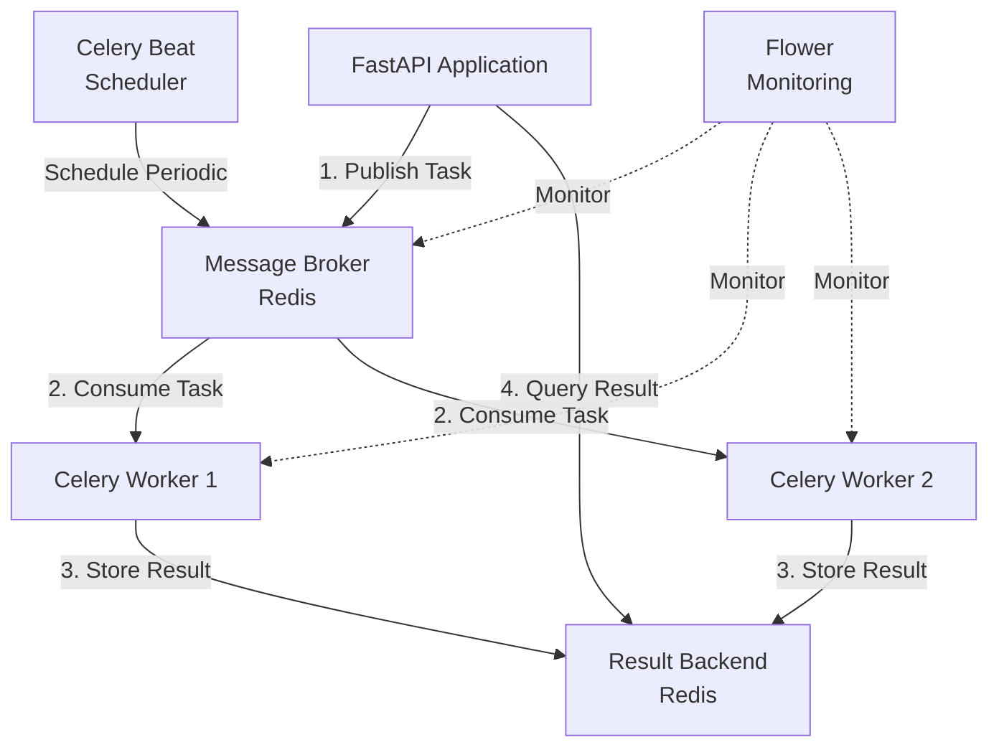

# Лабораторна робота 10 Background Tasks з Celery

## Мета

Після виконання лабораторної роботи студент зможе інтегрувати Celery у FastAPI застосунок, створювати асинхронні задачі для довготривалих операцій, впроваджувати retry логіку для підвищення надійності, налаштовувати periodic tasks через Celery Beat та моніторити виконання задач через Flower dashboard.

## Завдання

Розробити систему з фоновою обробкою задач, де FastAPI приймає запити та делегує довготривалі операції (відправка email, обробка даних) у Celery workers. Реалізувати endpoints для створення задач та перевірки їх статусу. На вибір додати periodic tasks або Flower моніторинг для отримання додаткових балів.

## Теоретичні відомості

### Обмеження FastAPI Background Tasks

FastAPI має вбудовану можливість background tasks через клас `BackgroundTasks`, але вона має суттєві обмеження для production використання:

Задачі виконуються в тому самому process що і API server, тому вони споживають ресурси основного застосунку. При рестарті сервера всі задачі що виконуються втрачаються без можливості відновлення. Відсутній вбудований механізм retry при помилках, що критично для операцій які можуть тимчасово падати. Неможливо масштабувати обробку задач незалежно від API сервера. Немає можливості створювати scheduled tasks для періодичного виконання.

Для production систем з серйозною фоновою обробкою необхідно використовувати спеціалізовані інструменти як Celery, які вирішують всі ці проблеми.

### Celery Architecture

Celery є розподіленою системою обробки задач на основі message passing. Архітектура складається з кількох ключових компонентів, які працюють незалежно один від одного.



**Producer** - це ваш FastAPI application, який створює та публікує задачі до черги. Producer не виконує задачі, а лише надсилає їх на обробку.

**Message Broker** - система черг повідомлень, зазвичай Redis або RabbitMQ. Broker зберігає задачі до їх обробки та забезпечує надійну доставку до workers. Redis є простішим варіантом для початку, RabbitMQ надає більше можливостей для складних сценаріїв.

**Worker** - окремий процес що виконує задачі. Можна запускати кілька workers для паралельної обробки. Workers отримують задачі з broker, виконують їх та зберігають результати.

**Result Backend** - зберігає результати виконання задач. Також зазвичай Redis, але може бути база даних. Дозволяє producer запитувати статус та результат задачі.

**Beat Scheduler** - опціональний компонент для periodic tasks. Працює як cron, але інтегрований з Celery.

**Flower** - веб-інтерфейс для моніторингу Celery. Показує активні задачі, статистику workers, історію виконання.

### Message Queue Patterns

Celery підтримує різні патерни організації черг задач, що дозволяє оптимізувати обробку під конкретні потреби.

**Basic Queue** використовує принцип FIFO - First In, First Out. Задачі обробляються в порядку їх додавання до черги. Це найпростіший та найчастіше використовуваний патерн.

**Priority Queue** дозволяє встановлювати різні пріоритети для задач. Високопріоритетні задачі обробляються першими, навіть якщо вони додані пізніше. Корисно для критичних операцій.

**Delayed Tasks** дають можливість відкласти виконання задачі на певний час або до конкретного моменту. Наприклад, надіслати email через 1 годину після реєстрації.

**Retry with Exponential Backoff** автоматично повторює невдалі задачі з збільшенням затримки між спробами. Перша спроба через 1 секунду, друга через 2, третя через 4 тощо. Це запобігає перевантаженню зовнішніх сервісів.

### Task States у Celery

Кожна задача в Celery проходить через різні стани під час свого життєвого циклу:

**PENDING** - задача створена, але ще не отримана worker. Початковий стан всіх задач.

**STARTED** - worker почав виконання задачі. Не всі tasks мають цей стан, потрібна спеціальна конфігурація.

**RETRY** - задача не виконалась і буде повторена. Зберігається інформація про помилку та час наступної спроби.

**FAILURE** - задача завершилась з помилкою після всіх retry спроб. Зберігається traceback помилки.

**SUCCESS** - задача успішно завершилась. Результат зберігається в result backend.

**REVOKED** - задача була скасована до або під час виконання.

### Idempotency у контексті Celery

Idempotency означає, що задача може бути виконана кілька разів з тим самим результатом. Це критично важлива властивість для retry логіки.

Уявіть задачу відправки email. Якщо задача падає після відправки email, але перед збереженням результату, retry виконає відправку повторно. Користувач отримає два однакові emails.

Idempotent реалізація перевіряє чи email вже був відправлений перед відправкою. Можна зберігати hash повідомлення в Redis з TTL та перевіряти його перед кожною відправкою. Або використовувати unique message ID який зовнішній сервіс дедуплікує.

```python
@celery_app.task(bind=True, max_retries=3)
def send_email_idempotent(self, email, subject, body):
    # Створюємо унікальний ключ для цього email
    email_hash = hashlib.md5(f"{email}{subject}{body}".encode()).hexdigest()
    cache_key = f"email_sent:{email_hash}"
    
    # Перевіряємо чи вже надсилали
    if redis_client.exists(cache_key):
        return {"status": "already_sent", "hash": email_hash}
    
    # Надсилаємо email
    send_email(email, subject, body)
    
    # Зберігаємо факт відправки на 24 години
    redis_client.setex(cache_key, 86400, "1")
    
    return {"status": "sent", "hash": email_hash}
```

## Хід роботи

### Крок 1. Підготовка середовища

Створіть новий проєкт та встановіть необхідні залежності:

```bash
mkdir celery-tasks
cd celery-tasks
python -m venv venv
source venv/bin/activate  # для Windows: venv\Scripts\activate
pip install fastapi uvicorn celery redis flower
```

Створіть структуру проєкту:

```
celery-tasks/
├── main.py
├── celery_app.py
├── tasks/
│   ├── __init__.py
│   └── worker_tasks.py
├── config.py
├── requirements.txt
└── README.md
```

Створіть файл `requirements.txt`:

```
fastapi==0.104.1
uvicorn==0.24.0
celery==5.3.4
redis==5.0.1
flower==2.0.1
```

### Крок 2. Конфігурація застосунку

Створіть файл `config.py` з налаштуваннями:

```python
from pydantic_settings import BaseSettings

class Settings(BaseSettings):
    redis_url: str = "redis://localhost:6379"
    celery_broker_url: str = "redis://localhost:6379/0"
    celery_result_backend: str = "redis://localhost:6379/1"
    
    class Config:
        env_file = ".env"

settings = Settings()
```

Цей файл централізує всі налаштування та дозволяє легко змінювати конфігурацію через environment variables.

### Крок 3. Налаштування Celery

Створіть файл `celery_app.py` з конфігурацією Celery:

```python
from celery import Celery
from config import settings

celery_app = Celery(
    "tasks",
    broker=settings.celery_broker_url,
    backend=settings.celery_result_backend,
    include=["tasks.worker_tasks"]
)

# Конфігурація Celery
celery_app.conf.update(
    task_serializer="json",
    accept_content=["json"],
    result_serializer="json",
    timezone="Europe/Kiev",
    enable_utc=True,
    task_track_started=True,
    task_time_limit=30 * 60,
    result_expires=3600,
)

@celery_app.task(bind=True)
def debug_task(self):
    print(f"Request: {self.request!r}")
```

Розглянемо важливі параметри конфігурації:

`task_serializer` визначає формат серіалізації задач. JSON є безпечним та універсальним форматом.

`task_track_started=True` дозволяє відстежувати момент початку виконання задачі, не лише момент завершення.

`task_time_limit` встановлює максимальний час виконання задачі в секундах. Після цього worker припинить виконання.

`result_expires` визначає час зберігання результатів в секундах. Після 3600 секунд результати автоматично видаляються.

### Крок 4. Створення Celery tasks

Створіть файл `tasks/worker_tasks.py` з різними типами задач:

```python
import time
from celery import Task
from celery_app import celery_app
from datetime import datetime
import random

class CallbackTask(Task):
    """
    Базовий клас task з callbacks для логування
    """
    
    def on_failure(self, exc, task_id, args, kwargs, einfo):
        print(f"Task {task_id} failed: {exc}")
        print(f"Error info: {einfo}")
    
    def on_success(self, retval, task_id, args, kwargs):
        print(f"Task {task_id} succeeded with result: {retval}")
    
    def on_retry(self, exc, task_id, args, kwargs, einfo):
        print(f"Task {task_id} retrying due to: {exc}")

@celery_app.task(
    base=CallbackTask,
    bind=True,
    max_retries=3,
    default_retry_delay=10
)
def send_email_task(self, email: str, subject: str, body: str):
    """
    Симуляція відправки email з retry логікою
    
    Args:
        email: Email адреса отримувача
        subject: Тема листа
        body: Тіло листа
    
    Returns:
        dict: Статус відправки та метадані
    """
    try:
        print(f"Attempting to send email to {email}")
        print(f"Subject: {subject}")
        
        # Симуляція тривалої операції
        time.sleep(3)
        
        # Симуляція випадкової помилки для демонстрації retry
        if random.random() < 0.3:
            raise Exception("Temporary email service failure")
        
        return {
            "status": "sent",
            "email": email,
            "subject": subject,
            "sent_at": datetime.now().isoformat(),
            "attempt": self.request.retries + 1
        }
    except Exception as exc:
        # Спроба retry з експоненційною затримкою
        retry_delay = 10 * (2 ** self.request.retries)
        raise self.retry(exc=exc, countdown=retry_delay)

@celery_app.task(bind=True)
def process_data_task(self, data: dict):
    """
    Симуляція обробки даних
    
    Args:
        data: Словник з даними для обробки
    
    Returns:
        dict: Результати обробки
    """
    print(f"Processing data: {data}")
    
    # Симуляція складної обробки
    total_steps = 10
    for i in range(total_steps):
        time.sleep(1)
        
        # Оновлюємо стан задачі для tracking прогресу
        self.update_state(
            state="PROGRESS",
            meta={
                "current": i + 1,
                "total": total_steps,
                "status": f"Processing step {i + 1}/{total_steps}"
            }
        )
    
    # Симуляція результатів обробки
    result = {
        "status": "completed",
        "records_processed": data.get("records", 0),
        "processing_time": total_steps,
        "completed_at": datetime.now().isoformat()
    }
    
    return result

@celery_app.task
def generate_report_task(report_type: str, params: dict):
    """
    Симуляція генерації звіту
    
    Args:
        report_type: Тип звіту
        params: Параметри генерації
    
    Returns:
        dict: Інформація про згенерований звіт
    """
    print(f"Generating {report_type} report with params: {params}")
    
    # Симуляція тривалої генерації
    time.sleep(5)
    
    report_url = f"/reports/{report_type}_{datetime.now().timestamp()}.pdf"
    
    return {
        "status": "generated",
        "report_type": report_type,
        "report_url": report_url,
        "generated_at": datetime.now().isoformat()
    }

@celery_app.task
def cleanup_task():
    """
    Periodic task для очищення старих даних
    """
    print("Running cleanup task")
    
    # Симуляція очищення
    cleaned_records = random.randint(10, 100)
    
    return {
        "status": "completed",
        "cleaned_records": cleaned_records,
        "timestamp": datetime.now().isoformat()
    }
```

Зверніть увагу на різні підходи до створення tasks:

Task `send_email_task` використовує `bind=True` для доступу до `self` та retry логіки. Параметр `max_retries=3` обмежує кількість спроб, а `default_retry_delay=10` встановлює базову затримку.

Task `process_data_task` демонструє tracking прогресу через `update_state`. Це дозволяє клієнту відображати progress bar.

Task `generate_report_task` є простою задачею без bind, яка виконує операцію та повертає результат.

### Крок 5. FastAPI інтеграція

Створіть файл `main.py` з FastAPI endpoints:

```python
from fastapi import FastAPI, HTTPException
from pydantic import BaseModel, EmailStr
from celery.result import AsyncResult
from typing import Optional
from celery_app import celery_app
from tasks.worker_tasks import (
    send_email_task,
    process_data_task,
    generate_report_task
)

app = FastAPI(
    title="Celery Task Service",
    description="Асинхронна обробка задач через Celery",
    version="1.0.0"
)

# Pydantic models для валідації
class EmailRequest(BaseModel):
    email: EmailStr
    subject: str
    body: str

class DataProcessRequest(BaseModel):
    data: dict
    description: Optional[str] = None

class ReportRequest(BaseModel):
    report_type: str
    params: dict

class TaskResponse(BaseModel):
    task_id: str
    status: str
    message: str

class TaskStatusResponse(BaseModel):
    task_id: str
    status: str
    result: Optional[dict] = None
    error: Optional[str] = None

@app.get("/")
async def root():
    return {
        "message": "Celery Task Service",
        "endpoints": {
            "create_email_task": "POST /tasks/email",
            "create_process_task": "POST /tasks/process",
            "create_report_task": "POST /tasks/report",
            "get_task_status": "GET /tasks/{task_id}",
            "cancel_task": "DELETE /tasks/{task_id}",
            "list_active_tasks": "GET /tasks/active"
        }
    }

@app.post("/tasks/email", response_model=TaskResponse, tags=["Tasks"])
async def create_email_task(request: EmailRequest):
    """
    Створити задачу відправки email
    
    Задача буде оброблена асинхронно Celery worker.
    Використовується retry логіка при тимчасових помилках.
    """
    task = send_email_task.delay(
        request.email,
        request.subject,
        request.body
    )
    
    return TaskResponse(
        task_id=task.id,
        status="queued",
        message=f"Email task created with ID: {task.id}"
    )

@app.post("/tasks/process", response_model=TaskResponse, tags=["Tasks"])
async def create_process_task(request: DataProcessRequest):
    """
    Створити задачу обробки даних
    
    Задача підтримує tracking прогресу.
    """
    task = process_data_task.delay(request.data)
    
    return TaskResponse(
        task_id=task.id,
        status="queued",
        message=f"Data processing task created with ID: {task.id}"
    )

@app.post("/tasks/report", response_model=TaskResponse, tags=["Tasks"])
async def create_report_task(request: ReportRequest):
    """
    Створити задачу генерації звіту
    """
    task = generate_report_task.delay(
        request.report_type,
        request.params
    )
    
    return TaskResponse(
        task_id=task.id,
        status="queued",
        message=f"Report generation task created with ID: {task.id}"
    )

@app.get("/tasks/{task_id}", response_model=TaskStatusResponse, tags=["Tasks"])
async def get_task_status(task_id: str):
    """
    Отримати статус та результат задачі
    
    Можливі статуси:
    - PENDING: задача в черзі
    - STARTED: задача виконується
    - PROGRESS: задача в процесі (з метаданими прогресу)
    - SUCCESS: задача успішно завершена
    - FAILURE: задача завершилась з помилкою
    - RETRY: задача буде повторена
    """
    task_result = AsyncResult(task_id, app=celery_app)
    
    response = TaskStatusResponse(
        task_id=task_id,
        status=task_result.status,
        result=None,
        error=None
    )
    
    if task_result.successful():
        response.result = task_result.result
    elif task_result.failed():
        response.error = str(task_result.info)
    elif task_result.status == "PROGRESS":
        response.result = task_result.info
    
    return response

@app.delete("/tasks/{task_id}", tags=["Tasks"])
async def cancel_task(task_id: str):
    """
    Скасувати задачу
    
    Увага: задача буде скасована тільки якщо вона ще не почала виконуватись.
    """
    task_result = AsyncResult(task_id, app=celery_app)
    
    if task_result.status in ["PENDING", "RETRY"]:
        task_result.revoke(terminate=True)
        return {
            "message": f"Task {task_id} cancelled",
            "previous_status": task_result.status
        }
    else:
        raise HTTPException(
            status_code=400,
            detail=f"Cannot cancel task in status: {task_result.status}"
        )

@app.get("/tasks/active/list", tags=["Monitoring"])
async def list_active_tasks():
    """
    Список активних задач з усіх workers
    """
    inspect = celery_app.control.inspect()
    
    active = inspect.active()
    scheduled = inspect.scheduled()
    reserved = inspect.reserved()
    
    return {
        "active": active or {},
        "scheduled": scheduled or {},
        "reserved": reserved or {}
    }

@app.get("/health", tags=["Monitoring"])
async def health_check():
    """
    Перевірка здоров'я сервісу
    
    Перевіряє доступність Celery workers
    """
    try:
        inspect = celery_app.control.inspect()
        stats = inspect.stats()
        
        worker_available = stats is not None and len(stats) > 0
        
        return {
            "status": "healthy" if worker_available else "degraded",
            "api": "running",
            "workers": len(stats) if stats else 0,
            "worker_details": stats
        }
    except Exception as e:
        return {
            "status": "unhealthy",
            "api": "running",
            "workers": 0,
            "error": str(e)
        }
```

Endpoint `/tasks/{task_id}` використовує `AsyncResult` для запиту статусу задачі. Важливо розуміти, що це не блокуючий запит - він просто перевіряє поточний стан в result backend.

### Крок 6. Налаштування Celery Beat (опціонально)

Якщо обираєте реалізацію periodic tasks, додайте до `celery_app.py`:

```python
from celery.schedules import crontab

# Додати після основної конфігурації
celery_app.conf.beat_schedule = {
    "cleanup-every-hour": {
        "task": "tasks.worker_tasks.cleanup_task",
        "schedule": crontab(minute=0),  # Кожну годину
    },
    "daily-report": {
        "task": "tasks.worker_tasks.generate_report_task",
        "schedule": crontab(hour=9, minute=0),  # Щодня о 9:00
        "args": ("daily", {"auto": True}),
    },
}
```

Crontab синтаксис:
- `crontab(minute=0)` - кожну годину
- `crontab(hour=9, minute=30)` - щодня о 9:30
- `crontab(hour=0, minute=0, day_of_week=1)` - кожного понеділка о півночі
- `crontab(minute='*/15')` - кожні 15 хвилин

### Крок 7. Запуск системи

Для локального запуску потрібно 3-4 окна терміналу:

**Термінал 1 - Redis:**
```bash
docker run -d -p 6379:6379 redis:latest
# або якщо Redis встановлений локально
redis-server
```

**Термінал 2 - Celery Worker:**
```bash
celery -A celery_app worker --loglevel=info
```

**Термінал 3 - FastAPI:**
```bash
uvicorn main:app --reload --port 8000
```

**Термінал 4 - Celery Beat (якщо використовуєте periodic tasks):**
```bash
celery -A celery_app beat --loglevel=info
```

**Термінал 5 - Flower (якщо використовуєте моніторинг):**
```bash
celery -A celery_app flower --port=5555
```

### Крок 8. Тестування функціональності

Відкрийте Swagger UI на `http://localhost:8000/docs` та виконайте наступні тести:

**Тест 1: Створення email task**

POST `/tasks/email` з body:
```json
{
  "email": "test@example.com",
  "subject": "Test Email",
  "body": "This is a test message"
}
```

Збережіть отриманий `task_id`. Спостерігайте в логах Celery worker як задача виконується.

**Тест 2: Перевірка статусу задачі**

GET `/tasks/{task_id}` - спочатку статус буде PENDING, потім STARTED, потім SUCCESS або FAILURE.

**Тест 3: Задача з прогресом**

POST `/tasks/process` з body:
```json
{
  "data": {"records": 1000},
  "description": "Processing user data"
}
```

Періодично викликайте GET `/tasks/{task_id}` і спостерігайте прогрес від 1/10 до 10/10.

**Тест 4: Retry логіка**

Створіть кілька email tasks і спостерігайте в логах як деякі падають та автоматично повторюються.

**Тест 5: Скасування задачі**

Створіть процес обробки даних та швидко викличте DELETE `/tasks/{task_id}` до початку виконання.

**Тест 6: Flower моніторинг (якщо встановлено)**

Відкрийте `http://localhost:5555` та:
- Перегляньте список workers
- Спостерігайте активні задачі
- Перегляньте статистику виконання
- Перегляньте графіки з метриками

### Крок 9. Документація проєкту

Створіть детальний `README.md`:

````markdown
    # Celery Background Tasks Service
    
    ## Опис проєкту
    
    Система асинхронної обробки задач на базі FastAPI та Celery. Реалізує фонову обробку довготривалих операцій з підтримкою retry логіки, tracking прогресу та моніторингу виконання.
    
    ## Функціональність
    
    - ✅ Асинхронна відправка email з retry логікою
    - ✅ Обробка даних з tracking прогресу
    - ✅ Генерація звітів
    - ✅ Перевірка статусу задач
    - ✅ Скасування задач
    - ✅ [Опціонально] Periodic tasks через Celery Beat
    - ✅ [Опціонально] Моніторинг через Flower
    
    ## Архітектура
    
    ```mermaid
    graph TB
        A[Client] -->|HTTP Request| B[FastAPI API]
        B -->|Create Task| C[Redis Broker]
        C -->|Consume| D[Celery Worker]
        D -->|Store Result| E[Redis Backend]
        B -->|Query Status| E
        F[Celery Beat] -.Schedule.-> C
        G[Flower] -.Monitor.-> C
        G -.Monitor.-> D
    ```
    
    ## Технології
    
    - **FastAPI** - веб-фреймворк для API
    - **Celery** - розподілена система обробки задач
    - **Redis** - message broker та result backend
    - **Flower** - веб-інтерфейс моніторингу (опціонально)
    - **Uvicorn** - ASGI сервер
    
    ## Встановлення
    
    ### 1. Клонування репозиторію
    
    ```bash
    git clone <repository-url>
    cd celery-tasks
    ```
    
    ### 2. Створення віртуального середовища
    
    ```bash
    python -m venv venv
    source venv/bin/activate  # Linux/Mac
    venv\Scripts\activate     # Windows
    ```
    
    ### 3. Встановлення залежностей
    
    ```bash
    pip install -r requirements.txt
    ```
    
    ### 4. Запуск Redis
    
    ```bash
    docker run -d -p 6379:6379 redis:latest
    ```
    
    ## Запуск
    
    ### Варіант 1: Локальний запуск
    
    Відкрийте 3-5 терміналів:
    
    **Термінал 1 - Celery Worker:**
    ```bash
    celery -A celery_app worker --loglevel=info
    ```
    
    **Термінал 2 - FastAPI:**
    ```bash
    uvicorn main:app --reload
    ```
    
    **Термінал 3 - Celery Beat (опціонально):**
    ```bash
    celery -A celery_app beat --loglevel=info
    ```
    
    **Термінал 4 - Flower (опціонально):**
    ```bash
    celery -A celery_app flower
    ```
    
    ### Варіант 2: Docker Compose (рекомендовано)
    
    ```bash
    docker-compose up -d
    ```
    
    ## Структура проєкту
    
    ```
    celery-tasks/
    ├── main.py              # FastAPI application
    ├── celery_app.py        # Celery конфігурація
    ├── config.py            # Налаштування
    ├── tasks/
    │   ├── __init__.py
    │   └── worker_tasks.py  # Celery tasks
    ├── requirements.txt     # Залежності
    └── README.md
    ```
    
    ## API Endpoints
    
    ### Створення задач
    
    #### POST /tasks/email
    Створити задачу відправки email
    
    **Request:**
    ```json
    {
      "email": "user@example.com",
      "subject": "Test Email",
      "body": "Email content"
    }
    ```
    
    **Response:**
    ```json
    {
      "task_id": "abc-123-def",
      "status": "queued",
      "message": "Email task created with ID: abc-123-def"
    }
    ```
    
    #### POST /tasks/process
    Створити задачу обробки даних з tracking прогресу
    
    **Request:**
    ```json
    {
      "data": {"records": 1000},
      "description": "Processing user data"
    }
    ```
    
    #### POST /tasks/report
    Створити задачу генерації звіту
    
    **Request:**
    ```json
    {
      "report_type": "monthly",
      "params": {"month": 11, "year": 2024}
    }
    ```
    
    ### Моніторинг задач
    
    #### GET /tasks/{task_id}
    Отримати статус та результат задачі
    
    **Response для SUCCESS:**
    ```json
    {
      "task_id": "abc-123-def",
      "status": "SUCCESS",
      "result": {
        "status": "sent",
        "email": "user@example.com",
        "sent_at": "2025-01-15T10:30:00"
      }
    }
    ```
    
    **Response для PROGRESS:**
    ```json
    {
      "task_id": "abc-123-def",
      "status": "PROGRESS",
      "result": {
        "current": 5,
        "total": 10,
        "status": "Processing step 5/10"
      }
    }
    ```
    
    #### DELETE /tasks/{task_id}
    Скасувати задачу (працює тільки для PENDING tasks)
    
    #### GET /tasks/active/list
    Список всіх активних задач
    
    #### GET /health
    Health check endpoint
    
    ## Тестування
    
    ### Сценарій 1: Базова відправка email
    
    1. Створити email task через POST /tasks/email
    2. Зберегти task_id з відповіді
    3. Періодично запитувати GET /tasks/{task_id}
    4. Спостерігати зміну статусу: PENDING → STARTED → SUCCESS
    
    [Скріншот: Swagger UI з створенням task]
    [Скріншот: Статус SUCCESS з результатом]
    
    ### Сценарій 2: Tracking прогресу
    
    1. Створити process task через POST /tasks/process
    2. Кожні 2 секунди запитувати статус
    3. Спостерігати прогрес від 1/10 до 10/10
    
    [Скріншот: Статус PROGRESS з метаданими]
    
    ### Сценарій 3: Retry логіка
    
    1. Створити кілька email tasks
    2. Спостерігати в логах Celery worker
    3. Деякі tasks падають та автоматично повторюються
    
    [Скріншот: Логи worker з retry]
    
    ### Сценарій 4: Flower моніторинг (якщо встановлено)
    
    1. Відкрити http://localhost:5555
    2. Переглянути активні tasks
    3. Перевірити статистику workers
    
    [Скріншот: Flower dashboard]
    [Скріншот: Task details у Flower]
    
    ## Виконані вимоги
    
    ### Обов'язкові (5 балів)
    - [x] Налаштування Celery з Redis broker
    - [x] Email task з retry логікою
    - [x] Data processing task
    - [x] FastAPI endpoints для створення та перевірки задач
    - [x] Health check endpoint
    
    ### На вибір (2 бали)
    - [x] Periodic tasks через Celery Beat
    - [x] Flower моніторинг
    - [ ] Task progress tracking (реалізовано у process task)
    
    ## Виклики та рішення
    
    ### Виклик 1: Retry з експоненційною затримкою
    
    **Проблема:** Базовий retry з фіксованою затримкою може перевантажити зовнішній сервіс.
    
    **Рішення:** Реалізовано експоненційну затримку через `countdown` параметр:
    ```python
    retry_delay = 10 * (2 ** self.request.retries)
    raise self.retry(exc=exc, countdown=retry_delay)
    ```
    
    ### Виклик 2: Tracking прогресу задачі
    
    **Проблема:** Клієнт не бачить прогрес довготривалих задач.
    
    **Рішення:** Використано `update_state` для періодичного оновлення статусу:
    ```python
    self.update_state(
        state="PROGRESS",
        meta={"current": i, "total": total}
    )
    ```
    
    ## Висновки
    
    Під час виконання лабораторної роботи було:
    - Налаштовано Celery з Redis для асинхронної обробки задач
    - Реалізовано різні типи tasks з retry логікою
    - Інтегровано Celery з FastAPI
    - [Опціонально] Налаштовано Flower для моніторингу
    
    Отримані навички застосовні для реальних проєктів де потрібна фонова обробка: відправка email, генерація звітів, обробка файлів, інтеграція з зовнішніми API.
    
    ## Автор
    
    [Ваше ім'я]
    Група: [Номер групи]
    Дата: [Дата здачі]
````

## Критерії оцінювання

Максимальна кількість балів: 7

| Критерій | Бали | Опис |
|----------|------|------|
| **Celery конфігурація** | 1.5 | Коректне налаштування celery_app, підключення broker та backend, proper serialization settings, включення tasks модулів. |
| **Worker tasks реалізація** | 2 | Мінімум 2 різні types tasks (email + data processing), bind=True для retry, використання callbacks, proper error handling. |
| **FastAPI інтеграція** | 1.5 | Endpoints для створення tasks через delay(), перевірки статусу через AsyncResult, health check з inspect, proper response models. |
| **Retry логіка** | 1 | Реалізація max_retries, exponential backoff через countdown, обробка виключень, демонстрація роботи. |
| **Документація** | 1 | README.md з архітектурною діаграмою, інструкціями запуску, описом API, скріншотами тестування та висновками. |

**Додаткові бали (виберіть 1-2 опції, максимум +2 бали):**

- **Periodic tasks (+1 бал):** Налаштування Celery Beat, створення scheduled tasks, crontab конфігурація, демонстрація роботи через логи
- **Flower моніторинг (+1 бал):** Налаштування Flower, скріншоти dashboard, task details, worker stats
- **Task chaining (+1 бал):** Використання chain, group, chord для складних workflow

## Контрольні запитання

1. У чому різниця між `task.delay()` та `task.apply_async()`? Коли використовувати кожен метод?
2. Що таке idempotency у контексті Celery tasks? Чому це важливо для retry логіки?
3. Яка роль message broker (Redis) у архітектурі Celery? Чи можна обійтись без result backend?
4. Як працює Celery Beat scheduler? Чим він відрізняється від звичайного cron?
5. Що станеться з задачами, які виконуються, якщо зупинити Celery worker? Як це обробити коректно?
6. Поясніть різницю між `revoke()` з параметром `terminate=True` та `terminate=False`.
7. Які стратегії можна використати для обробки довготривалих задач, які можуть перевищити `task_time_limit`?
8. Чому важливо використовувати `bind=True` для tasks з retry логікою? Що дає доступ до `self`?
9. Як масштабувати Celery систему при зростанні навантаження? Які компоненти потрібно масштабувати?
10. Яка різниця між stateless та stateful tasks? Які рекомендації для кожного типу?
