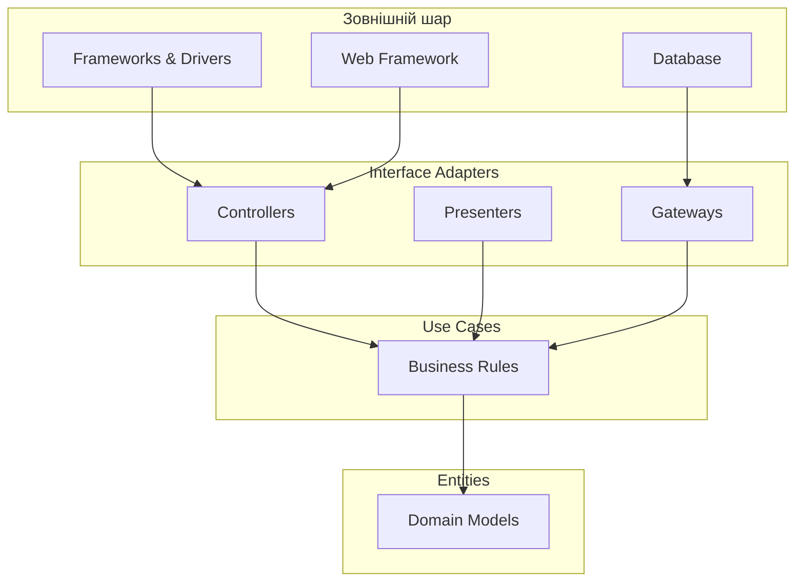
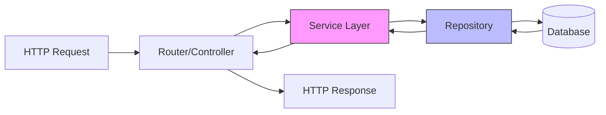
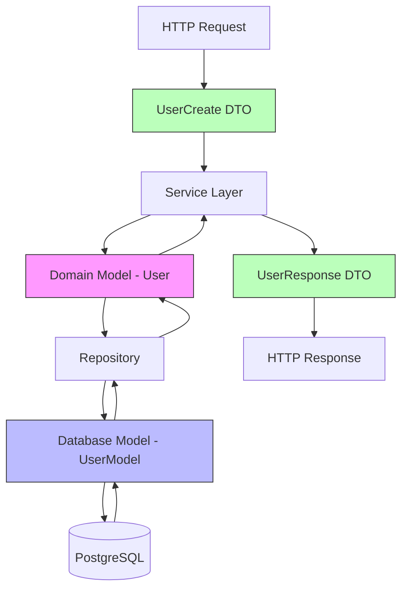
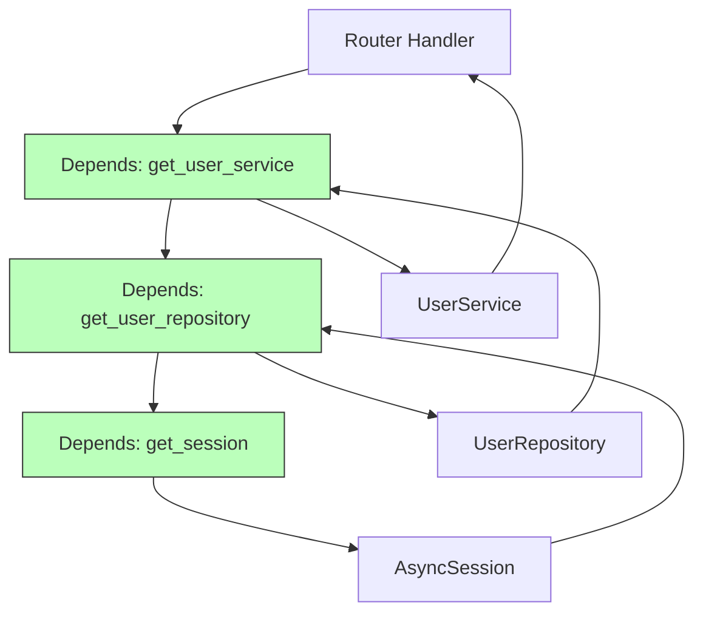

# Лекція 4. Архітектурні патерни та Clean Architecture

## Вступ

Розробка сучасних вебдодатків вимагає продуманої архітектури, яка забезпечить підтримуваність, масштабованість та тестованість коду. У цій лекції ми розглянемо принципи Clean Architecture та їх застосування у FastAPI проєктах, вивчимо архітектурні патерни, які допомагають організувати код, та познайомимося з принципами SOLID, які є фундаментом якісного об'єктно-орієнтованого дизайну.

## Що таке Clean Architecture

Clean Architecture, запропонована Робертом Мартіном (Uncle Bob), представляє собою підхід до проєктування програмного забезпечення, який ставить бізнес-логіку в центр системи та забезпечує її незалежність від зовнішніх деталей реалізації. Основна ідея полягає в тому, щоб створити систему, де бізнес-правила не залежать від фреймворків, баз даних, інтерфейсів користувача чи інших зовнішніх агентів.

Архітектура організована у вигляді концентричних кіл, де внутрішні кола представляють бізнес-логіку, а зовнішні - механізми реалізації. Залежності можуть бути спрямовані лише всередину, від зовнішніх шарів до внутрішніх, але ніколи навпаки. Це досягається через використання абстракцій та інверсії залежностей.



У контексті FastAPI додатків Clean Architecture означає, що наша бізнес-логіка не повинна знати про те, що вона працює у вебсередовищі, не повинна залежати від FastAPI, SQLAlchemy чи будь-яких інших конкретних технологій. Це дозволяє легко змінювати технології, тестувати код ізольовано та підтримувати проєкт протягом тривалого часу.

## Layered Architecture

Шарова архітектура є одним з найпопулярніших підходів до організації коду. Вона розділяє додаток на кілька горизонтальних шарів, кожен з яких виконує певну роль та має чітко визначені відповідальності.

### Presentation Layer

Презентаційний шар відповідає за взаємодію з користувачем або зовнішніми системами. У FastAPI це роутери, контролери та залежності, які обробляють HTTP запити та формують відповіді. Цей шар не містить бізнес-логіки, а лише перетворює дані з формату HTTP у формат, зручний для внутрішніх шарів, та навпаки.

```python
from fastapi import APIRouter, Depends, HTTPException
from typing import List

from app.schemas.user import UserCreate, UserResponse
from app.services.user_service import UserService
from app.dependencies import get_user_service

router = APIRouter(prefix="/users", tags=["users"])

@router.post("/", response_model=UserResponse, status_code=201)
async def create_user(
    user_data: UserCreate,
    user_service: UserService = Depends(get_user_service)
):
    """Створення нового користувача"""
    try:
        user = await user_service.create_user(user_data)
        return user
    except ValueError as e:
        raise HTTPException(status_code=400, detail=str(e))

@router.get("/", response_model=List[UserResponse])
async def list_users(
    user_service: UserService = Depends(get_user_service)
):
    """Отримання списку користувачів"""
    users = await user_service.get_all_users()
    return users
```

У цьому прикладі роутер лише приймає запити, викликає відповідні методи сервісу та перетворює результати у HTTP відповіді. Вся бізнес-логіка винесена у сервісний шар.

### Business Layer

Бізнес-шар містить логіку, яка реалізує правила предметної області. Це серце додатку, де відбувається обробка даних згідно з бізнес-вимогами. Цей шар не залежить від способу доставки даних (HTTP, CLI, Message Queue) та не знає про деталі збереження даних.

```python
from typing import List, Optional
from app.models.domain import User
from app.repositories.user_repository import UserRepository
from app.schemas.user import UserCreate

class UserService:
    """Сервіс для роботи з користувачами"""

    def __init__(self, user_repository: UserRepository):
        self._repository = user_repository

    async def create_user(self, user_data: UserCreate) -> User:
        """Створення користувача з валідацією бізнес-правил"""
        existing_user = await self._repository.get_by_email(user_data.email)
        if existing_user:
            raise ValueError(f"Користувач з email {user_data.email} вже існує")

        if len(user_data.username) < 3:
            raise ValueError("Ім'я користувача має містити щонайменше 3 символи")

        user = User(
            username=user_data.username,
            email=user_data.email,
            full_name=user_data.full_name
        )

        return await self._repository.create(user)

    async def get_all_users(self) -> List[User]:
        """Отримання всіх користувачів"""
        return await self._repository.get_all()
```

Сервіс містить бізнес-логіку валідації та обробки даних, але не знає про те, як саме дані зберігаються чи звідки вони приходять.

### Data Layer

Шар даних відповідає за взаємодію з базою даних та іншими сховищами інформації. Він інкапсулює всю логіку роботи з базою даних, забезпечуючи уніфікований інтерфейс для доступу до даних.

```python
from typing import List, Optional
from sqlalchemy import select
from sqlalchemy.ext.asyncio import AsyncSession

from app.models.database import UserModel
from app.models.domain import User

class UserRepository:
    """Репозиторій для роботи з користувачами"""

    def __init__(self, session: AsyncSession):
        self._session = session

    async def create(self, user: User) -> User:
        """Створення користувача в базі даних"""
        db_user = UserModel(
            username=user.username,
            email=user.email,
            full_name=user.full_name
        )
        self._session.add(db_user)
        await self._session.commit()
        await self._session.refresh(db_user)

        return self._to_domain(db_user)

    async def get_by_email(self, email: str) -> Optional[User]:
        """Пошук користувача за email"""
        result = await self._session.execute(
            select(UserModel).where(UserModel.email == email)
        )
        db_user = result.scalar_one_or_none()
        return self._to_domain(db_user) if db_user else None

    async def get_all(self) -> List[User]:
        """Отримання всіх користувачів"""
        result = await self._session.execute(select(UserModel))
        db_users = result.scalars().all()
        return [self._to_domain(db_user) for db_user in db_users]

    def _to_domain(self, db_user: UserModel) -> User:
        """Перетворення моделі бази даних у доменну модель"""
        return User(
            id=db_user.id,
            username=db_user.username,
            email=db_user.email,
            full_name=db_user.full_name,
            created_at=db_user.created_at
        )
```

Репозиторій приховує деталі роботи з SQLAlchemy та забезпечує перетворення між моделями бази даних та доменними моделями.



## Domain Model vs Database Model vs DTO

У добре спроєктованому додатку важливо розрізняти три типи моделей даних, кожна з яких має свою мету та область застосування.

### Domain Model

Доменна модель представляє бізнес-сутності вашої системи та їх поведінку. Це чисті Python класи, які не залежать від фреймворків та баз даних. Вони містять бізнес-логіку та правила предметної області.

```python
from datetime import datetime
from typing import Optional

class User:
    """Доменна модель користувача"""

    def __init__(
        self,
        username: str,
        email: str,
        full_name: str,
        id: Optional[int] = None,
        created_at: Optional[datetime] = None,
        is_active: bool = True
    ):
        self.id = id
        self.username = username
        self.email = email
        self.full_name = full_name
        self.created_at = created_at or datetime.now()
        self.is_active = is_active

    def deactivate(self) -> None:
        """Деактивація користувача"""
        if not self.is_active:
            raise ValueError("Користувач вже деактивований")
        self.is_active = False

    def update_profile(self, full_name: Optional[str] = None) -> None:
        """Оновлення профілю користувача"""
        if full_name is not None:
            if len(full_name.strip()) == 0:
                raise ValueError("Повне ім'я не може бути порожнім")
            self.full_name = full_name

    @property
    def display_name(self) -> str:
        """Відображуване ім'я користувача"""
        return self.full_name or self.username
```

Доменна модель містить методи, які реалізують бізнес-логіку. Вона не знає про базу даних та не залежить від SQLAlchemy.

### Database Model

Модель бази даних описує структуру таблиць та їх зв'язки. Це SQLAlchemy моделі, які використовуються лише у шарі даних.

```python
from sqlalchemy import Column, Integer, String, DateTime, Boolean
from sqlalchemy.sql import func
from app.database import Base

class UserModel(Base):
    """SQLAlchemy модель для таблиці користувачів"""
    __tablename__ = "users"

    id = Column(Integer, primary_key=True, index=True)
    username = Column(String(50), unique=True, nullable=False, index=True)
    email = Column(String(100), unique=True, nullable=False, index=True)
    full_name = Column(String(100), nullable=False)
    is_active = Column(Boolean, default=True, nullable=False)
    created_at = Column(DateTime(timezone=True), server_default=func.now())
    updated_at = Column(
        DateTime(timezone=True),
        server_default=func.now(),
        onupdate=func.now()
    )
```

Модель бази даних не містить бізнес-логіки та використовується лише для взаємодії з базою даних через ORM.

### Data Transfer Object

DTO використовуються для передачі даних між шарами та для валідації вхідних даних. У FastAPI ми використовуємо Pydantic моделі як DTO.

```python
from pydantic import BaseModel, EmailStr, Field
from datetime import datetime
from typing import Optional

class UserCreate(BaseModel):
    """DTO для створення користувача"""
    username: str = Field(..., min_length=3, max_length=50)
    email: EmailStr
    full_name: str = Field(..., min_length=1, max_length=100)

class UserUpdate(BaseModel):
    """DTO для оновлення користувача"""
    full_name: Optional[str] = Field(None, min_length=1, max_length=100)

class UserResponse(BaseModel):
    """DTO для відповіді з даними користувача"""
    id: int
    username: str
    email: str
    full_name: str
    is_active: bool
    created_at: datetime

    class Config:
        from_attributes = True
```

DTO забезпечують валідацію даних на вході та серіалізацію на виході, але не містять бізнес-логіки.



## Service Layer Pattern

Патерн Service Layer інкапсулює бізнес-логіку додатку у окремому шарі. Сервіси координують роботу між різними компонентами системи та реалізують складні операції, які можуть включати взаємодію з кількома репозиторіями.

```python
from typing import List, Optional
from app.models.domain import User, Order
from app.repositories.user_repository import UserRepository
from app.repositories.order_repository import OrderRepository
from app.schemas.order import OrderCreate

class OrderService:
    """Сервіс для роботи із замовленнями"""

    def __init__(
        self,
        order_repository: OrderRepository,
        user_repository: UserRepository
    ):
        self._order_repo = order_repository
        self._user_repo = user_repository

    async def create_order(
        self,
        user_id: int,
        order_data: OrderCreate
    ) -> Order:
        """Створення замовлення з перевіркою користувача"""
        user = await self._user_repo.get_by_id(user_id)
        if not user:
            raise ValueError(f"Користувача з ID {user_id} не знайдено")

        if not user.is_active:
            raise ValueError("Неактивний користувач не може створювати замовлення")

        if order_data.total_amount <= 0:
            raise ValueError("Сума замовлення має бути додатною")

        order = Order(
            user_id=user_id,
            items=order_data.items,
            total_amount=order_data.total_amount,
            status="pending"
        )

        created_order = await self._order_repo.create(order)
        return created_order

    async def get_user_orders(self, user_id: int) -> List[Order]:
        """Отримання всіх замовлень користувача"""
        user = await self._user_repo.get_by_id(user_id)
        if not user:
            raise ValueError(f"Користувача з ID {user_id} не знайдено")

        orders = await self._order_repo.get_by_user_id(user_id)
        return orders
```

Сервіс координує роботу з кількома репозиторіями та забезпечує виконання бізнес-правил перед збереженням даних.

## Unit of Work Pattern

Патерн Unit of Work відстежує всі зміни об'єктів під час бізнес-транзакції та координує запис змін до бази даних. Він забезпечує атомарність операцій та спрощує управління транзакціями.

```python
from typing import Optional
from sqlalchemy.ext.asyncio import AsyncSession
from app.repositories.user_repository import UserRepository
from app.repositories.order_repository import OrderRepository

class UnitOfWork:
    """Unit of Work для управління транзакціями"""

    def __init__(self, session: AsyncSession):
        self._session = session
        self._user_repository: Optional[UserRepository] = None
        self._order_repository: Optional[OrderRepository] = None

    @property
    def users(self) -> UserRepository:
        """Доступ до репозиторію користувачів"""
        if self._user_repository is None:
            self._user_repository = UserRepository(self._session)
        return self._user_repository

    @property
    def orders(self) -> OrderRepository:
        """Доступ до репозиторію замовлень"""
        if self._order_repository is None:
            self._order_repository = OrderRepository(self._session)
        return self._order_repository

    async def commit(self) -> None:
        """Фіксація всіх змін у базі даних"""
        await self._session.commit()

    async def rollback(self) -> None:
        """Відкат всіх змін"""
        await self._session.rollback()

    async def __aenter__(self):
        return self

    async def __aexit__(self, exc_type, exc_val, exc_tb):
        if exc_type is not None:
            await self.rollback()
        await self._session.close()
```

Використання Unit of Work у сервісах:

```python
class ComplexOrderService:
    """Сервіс для складних операцій із замовленнями"""

    def __init__(self, uow: UnitOfWork):
        self._uow = uow

    async def process_order_with_loyalty(
        self,
        user_id: int,
        order_data: OrderCreate
    ) -> Order:
        """Обробка замовлення з нарахуванням бонусів"""
        try:
            user = await self._uow.users.get_by_id(user_id)
            if not user:
                raise ValueError(f"Користувача не знайдено")

            order = Order(
                user_id=user_id,
                items=order_data.items,
                total_amount=order_data.total_amount,
                status="pending"
            )
            created_order = await self._uow.orders.create(order)

            loyalty_points = int(order_data.total_amount * 0.1)
            user.loyalty_points += loyalty_points
            await self._uow.users.update(user)

            await self._uow.commit()
            return created_order

        except Exception:
            await self._uow.rollback()
            raise
```

Unit of Work забезпечує, що всі зміни або застосовуються разом, або відкочуються у випадку помилки.

## SOLID Principles у Python

SOLID - це п'ять принципів об'єктно-орієнтованого програмування, які допомагають створювати гнучкий та підтримуваний код.

### Single Responsibility Principle

Принцип єдиної відповідальності стверджує, що клас має мати лише одну причину для зміни. Кожен клас повинен виконувати одну чітко визначену функцію.

```python
# Порушення SRP
class UserManager:
    """Клас з кількома відповідальностями"""

    def create_user(self, data):
        # Валідація даних
        if not self._validate_email(data.email):
            raise ValueError("Невалідний email")

        # Збереження в базу даних
        user = UserModel(**data.dict())
        session.add(user)
        session.commit()

        # Відправлення email
        self._send_welcome_email(data.email)

        return user

# Дотримання SRP
class UserValidator:
    """Клас для валідації даних користувача"""

    def validate(self, user_data: UserCreate) -> None:
        if not self._is_valid_email(user_data.email):
            raise ValueError("Невалідний email")
        if len(user_data.username) < 3:
            raise ValueError("Занадто коротке ім'я користувача")

class UserRepository:
    """Клас для роботи з базою даних"""

    async def create(self, user: User) -> User:
        db_user = UserModel(**user.__dict__)
        self._session.add(db_user)
        await self._session.commit()
        return user

class EmailService:
    """Клас для відправлення email"""

    async def send_welcome_email(self, email: str) -> None:
        # Логіка відправлення email
        pass

class UserService:
    """Сервіс, який координує роботу"""

    def __init__(
        self,
        validator: UserValidator,
        repository: UserRepository,
        email_service: EmailService
    ):
        self._validator = validator
        self._repository = repository
        self._email_service = email_service

    async def create_user(self, user_data: UserCreate) -> User:
        self._validator.validate(user_data)
        user = await self._repository.create(User(**user_data.dict()))
        await self._email_service.send_welcome_email(user.email)
        return user
```

### Open/Closed Principle

Принцип відкритості/закритості говорить, що класи мають бути відкритими для розширення, але закритими для модифікації.

```python
from abc import ABC, abstractmethod

# Базовий інтерфейс
class PaymentProcessor(ABC):
    """Абстрактний обробник платежів"""

    @abstractmethod
    async def process_payment(self, amount: float, details: dict) -> bool:
        pass

# Конкретні реалізації
class CreditCardProcessor(PaymentProcessor):
    """Обробка платежів кредитною карткою"""

    async def process_payment(self, amount: float, details: dict) -> bool:
        card_number = details.get("card_number")
        # Логіка обробки платежу карткою
        return True

class PayPalProcessor(PaymentProcessor):
    """Обробка платежів через PayPal"""

    async def process_payment(self, amount: float, details: dict) -> bool:
        paypal_account = details.get("paypal_account")
        # Логіка обробки платежу через PayPal
        return True

# Сервіс, який використовує абстракцію
class OrderPaymentService:
    """Сервіс обробки оплати замовлень"""

    def __init__(self, payment_processor: PaymentProcessor):
        self._processor = payment_processor

    async def pay_for_order(self, order: Order, payment_details: dict) -> bool:
        return await self._processor.process_payment(
            order.total_amount,
            payment_details
        )
```

Тепер ми можемо додавати нові способи оплати без зміни існуючого коду, просто створюючи нові класи, які реалізують PaymentProcessor.

### Liskov Substitution Principle

Принцип підстановки Лісков стверджує, що об'єкти підкласів повинні мати можливість замінювати об'єкти базових класів без порушення правильності програми.

```python
class Storage(ABC):
    """Абстрактне сховище файлів"""

    @abstractmethod
    async def save(self, filename: str, content: bytes) -> str:
        """Зберігає файл та повертає його URL"""
        pass

    @abstractmethod
    async def delete(self, filename: str) -> None:
        """Видаляє файл"""
        pass

class LocalStorage(Storage):
    """Локальне файлове сховище"""

    def __init__(self, base_path: str):
        self._base_path = base_path

    async def save(self, filename: str, content: bytes) -> str:
        filepath = f"{self._base_path}/{filename}"
        with open(filepath, "wb") as f:
            f.write(content)
        return f"file://{filepath}"

    async def delete(self, filename: str) -> None:
        filepath = f"{self._base_path}/{filename}"
        os.remove(filepath)

class S3Storage(Storage):
    """Сховище у Amazon S3"""

    def __init__(self, bucket_name: str):
        self._bucket = bucket_name

    async def save(self, filename: str, content: bytes) -> str:
        # Логіка збереження у S3
        return f"https://{self._bucket}.s3.amazonaws.com/{filename}"

    async def delete(self, filename: str) -> None:
        # Логіка видалення з S3
        pass

class FileService:
    """Сервіс роботи з файлами"""

    def __init__(self, storage: Storage):
        self._storage = storage

    async def upload_file(self, filename: str, content: bytes) -> str:
        return await self._storage.save(filename, content)
```

Обидві реалізації Storage можна використовувати взаємозамінно без зміни FileService.

### Interface Segregation Principle

Принцип розділення інтерфейсів говорить, що клієнти не повинні залежати від інтерфейсів, які вони не використовують.

```python
# Порушення ISP
class Repository(ABC):
    """Надто широкий інтерфейс"""

    @abstractmethod
    async def create(self, entity): pass

    @abstractmethod
    async def update(self, entity): pass

    @abstractmethod
    async def delete(self, id: int): pass

    @abstractmethod
    async def get_by_id(self, id: int): pass

    @abstractmethod
    async def search(self, criteria): pass

    @abstractmethod
    async def export_to_csv(self): pass

# Дотримання ISP
class ReadRepository(ABC):
    """Інтерфейс для читання"""

    @abstractmethod
    async def get_by_id(self, id: int): pass

    @abstractmethod
    async def search(self, criteria): pass

class WriteRepository(ABC):
    """Інтерфейс для запису"""

    @abstractmethod
    async def create(self, entity): pass

    @abstractmethod
    async def update(self, entity): pass

    @abstractmethod
    async def delete(self, id: int): pass

class ExportableRepository(ABC):
    """Інтерфейс для експорту"""

    @abstractmethod
    async def export_to_csv(self): pass

# Конкретна реалізація може комбінувати потрібні інтерфейси
class UserRepository(ReadRepository, WriteRepository):
    """Репозиторій користувачів"""

    async def get_by_id(self, id: int): pass
    async def search(self, criteria): pass
    async def create(self, entity): pass
    async def update(self, entity): pass
    async def delete(self, id: int): pass
```

### Dependency Inversion Principle

Принцип інверсії залежностей стверджує, що модулі високого рівня не повинні залежати від модулів низького рівня, обидва типи модулів повинні залежати від абстракцій.

```python
# Порушення DIP
class EmailSender:
    """Конкретна реалізація відправлення email"""

    def send(self, to: str, subject: str, body: str) -> None:
        # Логіка відправлення email через SMTP
        pass

class UserService:
    """Сервіс залежить від конкретної реалізації"""

    def __init__(self):
        self._email_sender = EmailSender()  # Жорстка залежність

    async def register_user(self, user_data: UserCreate) -> User:
        user = await self._create_user(user_data)
        self._email_sender.send(
            user.email,
            "Вітаємо!",
            "Дякуємо за реєстрацію"
        )
        return user

# Дотримання DIP
class NotificationSender(ABC):
    """Абстракція для відправлення повідомлень"""

    @abstractmethod
    async def send(self, recipient: str, subject: str, message: str) -> None:
        pass

class EmailNotificationSender(NotificationSender):
    """Реалізація через email"""

    async def send(self, recipient: str, subject: str, message: str) -> None:
        # Логіка відправлення email
        pass

class SMSNotificationSender(NotificationSender):
    """Реалізація через SMS"""

    async def send(self, recipient: str, subject: str, message: str) -> None:
        # Логіка відправлення SMS
        pass

class UserService:
    """Сервіс залежить від абстракції"""

    def __init__(self, notification_sender: NotificationSender):
        self._notification_sender = notification_sender

    async def register_user(self, user_data: UserCreate) -> User:
        user = await self._create_user(user_data)
        await self._notification_sender.send(
            user.email,
            "Вітаємо!",
            "Дякуємо за реєстрацію"
        )
        return user
```

## Dependency Injection у FastAPI

Dependency Injection - це техніка, яка дозволяє класам отримувати свої залежності ззовні замість того, щоб створювати їх самостійно. FastAPI має вбудовану систему для управління залежностями.

```python
from fastapi import Depends
from sqlalchemy.ext.asyncio import AsyncSession
from typing import AsyncGenerator

# Функція для отримання сесії бази даних
async def get_session() -> AsyncGenerator[AsyncSession, None]:
    """Залежність для отримання сесії бази даних"""
    async with AsyncSessionLocal() as session:
        yield session

# Функція для отримання репозиторію
async def get_user_repository(
    session: AsyncSession = Depends(get_session)
) -> UserRepository:
    """Залежність для отримання репозиторію користувачів"""
    return UserRepository(session)

# Функція для отримання сервісу
async def get_user_service(
    user_repository: UserRepository = Depends(get_user_repository)
) -> UserService:
    """Залежність для отримання сервісу користувачів"""
    return UserService(user_repository)

# Використання в роутері
@router.post("/users/", response_model=UserResponse)
async def create_user(
    user_data: UserCreate,
    user_service: UserService = Depends(get_user_service)
):
    """Створення користувача з автоматичним впровадженням залежностей"""
    return await user_service.create_user(user_data)
```

Система залежностей FastAPI автоматично створює та передає всі необхідні об'єкти, формуючи правильний ланцюжок залежностей.



Для більш складних випадків можна використовувати класи як залежності:

```python
from typing import Optional

class Pagination:
    """Клас для пагінації"""

    def __init__(
        self,
        skip: int = 0,
        limit: int = 100,
        max_limit: int = 1000
    ):
        self.skip = skip
        self.limit = min(limit, max_limit)

class AuthenticatedUser:
    """Клас для автентифікованого користувача"""

    def __init__(
        self,
        token: str = Header(..., alias="Authorization")
    ):
        # Валідація токену та отримання даних користувача
        self.user_id = self._decode_token(token)

    def _decode_token(self, token: str) -> int:
        # Логіка декодування JWT токену
        return 1

@router.get("/orders/")
async def list_orders(
    pagination: Pagination = Depends(),
    user: AuthenticatedUser = Depends(),
    order_service: OrderService = Depends(get_order_service)
):
    """Отримання замовлень з пагінацією та автентифікацією"""
    orders = await order_service.get_user_orders(
        user.user_id,
        skip=pagination.skip,
        limit=pagination.limit
    )
    return orders
```

## Тестування різних шарів

Чітке розділення на шари дозволяє ізольовано тестувати кожен компонент системи.

### Тестування доменних моделей

```python
import pytest
from app.models.domain import User

def test_user_deactivation():
    """Тест деактивації користувача"""
    user = User(
        username="testuser",
        email="test@example.com",
        full_name="Test User"
    )

    assert user.is_active is True
    user.deactivate()
    assert user.is_active is False

def test_user_cannot_deactivate_twice():
    """Тест повторної деактивації"""
    user = User(
        username="testuser",
        email="test@example.com",
        full_name="Test User"
    )
    user.deactivate()

    with pytest.raises(ValueError, match="вже деактивований"):
        user.deactivate()
```

### Тестування репозиторіїв

```python
import pytest
from sqlalchemy.ext.asyncio import AsyncSession, create_async_engine
from sqlalchemy.orm import sessionmaker

@pytest.fixture
async def session():
    """Фікстура для тестової сесії бази даних"""
    engine = create_async_engine("sqlite+aiosqlite:///:memory:")
    async_session = sessionmaker(
        engine, class_=AsyncSession, expire_on_commit=False
    )

    async with engine.begin() as conn:
        await conn.run_sync(Base.metadata.create_all)

    async with async_session() as session:
        yield session

    await engine.dispose()

@pytest.mark.asyncio
async def test_create_user(session: AsyncSession):
    """Тест створення користувача в репозиторії"""
    repository = UserRepository(session)

    user = User(
        username="testuser",
        email="test@example.com",
        full_name="Test User"
    )

    created_user = await repository.create(user)

    assert created_user.id is not None
    assert created_user.username == "testuser"
    assert created_user.email == "test@example.com"
```

### Тестування сервісів з моками

```python
from unittest.mock import AsyncMock, Mock
import pytest

@pytest.mark.asyncio
async def test_create_user_service():
    """Тест сервісу створення користувача з моком репозиторію"""
    mock_repository = AsyncMock(spec=UserRepository)
    mock_repository.get_by_email.return_value = None
    mock_repository.create.return_value = User(
        id=1,
        username="testuser",
        email="test@example.com",
        full_name="Test User"
    )

    service = UserService(mock_repository)
    user_data = UserCreate(
        username="testuser",
        email="test@example.com",
        full_name="Test User"
    )

    result = await service.create_user(user_data)

    assert result.id == 1
    assert result.username == "testuser"
    mock_repository.get_by_email.assert_called_once_with("test@example.com")
    mock_repository.create.assert_called_once()

@pytest.mark.asyncio
async def test_create_duplicate_user():
    """Тест створення користувача з існуючим email"""
    mock_repository = AsyncMock(spec=UserRepository)
    mock_repository.get_by_email.return_value = User(
        id=1,
        username="existing",
        email="test@example.com",
        full_name="Existing User"
    )

    service = UserService(mock_repository)
    user_data = UserCreate(
        username="testuser",
        email="test@example.com",
        full_name="Test User"
    )

    with pytest.raises(ValueError, match="вже існує"):
        await service.create_user(user_data)
```

### Інтеграційні тести роутерів

```python
from fastapi.testclient import TestClient
from app.main import app

client = TestClient(app)

def test_create_user_endpoint():
    """Інтеграційний тест endpoint створення користувача"""
    response = client.post(
        "/users/",
        json={
            "username": "testuser",
            "email": "test@example.com",
            "full_name": "Test User"
        }
    )

    assert response.status_code == 201
    data = response.json()
    assert data["username"] == "testuser"
    assert data["email"] == "test@example.com"
    assert "id" in data

def test_create_user_invalid_data():
    """Тест endpoint з невалідними даними"""
    response = client.post(
        "/users/",
        json={
            "username": "ab",
            "email": "invalid-email",
            "full_name": ""
        }
    )

    assert response.status_code == 422
```

## Висновки

Clean Architecture та архітектурні патерни дозволяють створювати FastAPI додатки, які легко підтримувати, тестувати та масштабувати. Розділення коду на шари з чіткими відповідальностями, використання різних типів моделей для різних цілей та дотримання принципів SOLID забезпечують гнучкість та можливість еволюції системи без великих змін у існуючому коді. Dependency Injection у FastAPI спрощує управління залежностями та робить код більш тестованим. Правильна архітектура на початку проєкту економить значні ресурси у довгостроковій перспективі.
