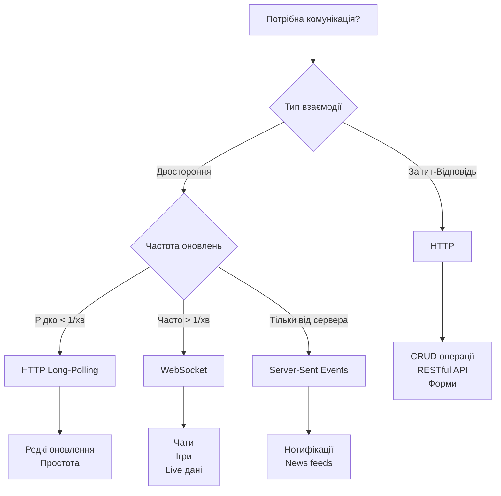
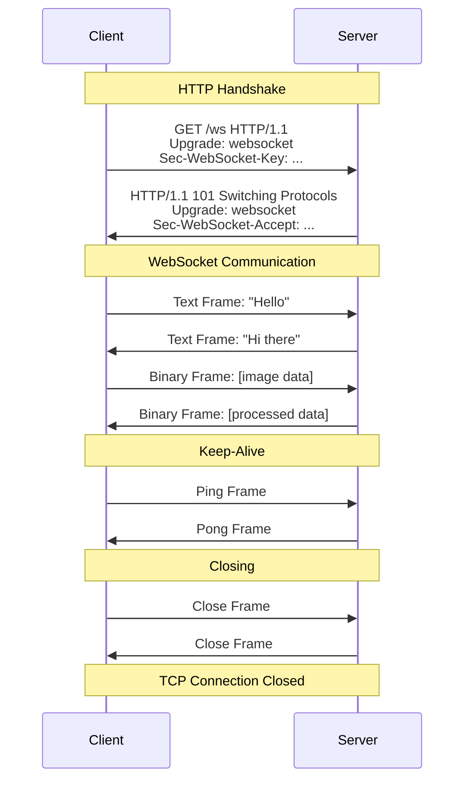
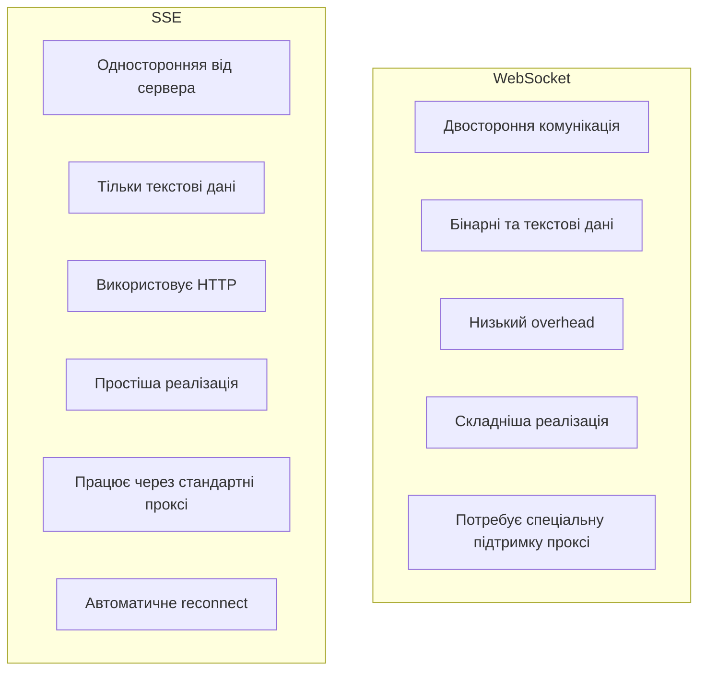
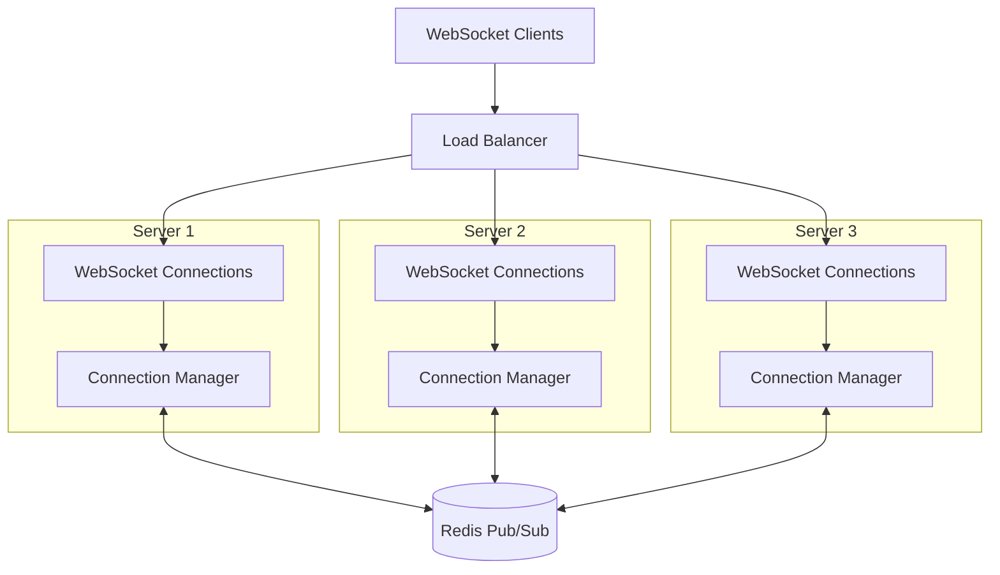

# Лекція 5 WebSocket та real-time комунікація


## 1. HTTP vs WebSocket: коли використовувати кожен

### 1.1. Обмеження HTTP для real-time комунікації

HTTP протокол побудований на моделі запит-відповідь, що створює певні обмеження для застосунків реального часу. Кожне з'єднання HTTP є короткочасним: клієнт відправляє запит, сервер обробляє його та надсилає відповідь, після чого з'єднання закривається або повертається до пулу для повторного використання.

Цей підхід добре працює для традиційних вебдодатків, де користувач ініціює дію через браузер, але стає неефективним, коли потрібна постійна двостороння комунікація. Для імітації real-time поведінки з HTTP зазвичай використовують техніки polling або long-polling.

**Polling** передбачає періодичне надсилання HTTP запитів від клієнта до сервера для перевірки наявності нових даних. Наприклад, клієнт може запитувати сервер кожні 5 секунд про нові повідомлення. Основні недоліки цього підходу включають високе навантаження на сервер через постійні запити, значну затримку між моментом появи даних на сервері та їх отриманням клієнтом, а також неефективне використання мережевих ресурсів через передачу великої кількості заголовків HTTP з кожним запитом.

**Long-polling** покращує ситуацію, дозволяючи серверу утримувати з'єднання відкритим до появи нових даних. Клієнт відправляє запит, сервер не відповідає одразу, а чекає події. Коли подія відбувається, сервер відповідає, після чого клієнт негайно ініціює новий запит. Це зменшує затримку, але все одно вимагає постійного встановлення нових HTTP з'єднань, що додає overhead у вигляді TCP handshake та HTTP заголовків.

### 1.2. Переваги WebSocket протоколу

WebSocket вирішує ці проблеми, встановлюючи постійне двостороннє з'єднання між клієнтом та сервером. Після початкового handshake через HTTP, з'єднання переходить на WebSocket протокол, який дозволяє обом сторонам надсилати дані в будь-який момент без додаткових запитів.

Основні переваги WebSocket включають низьку затримку через відсутність overhead від повторних HTTP запитів, ефективність використання ресурсів завдяки одному постійному з'єднанню замість багатьох короткочасних, справжню двосторонню комунікацію без імітації через polling, а також зменшене навантаження на сервер через відсутність необхідності обробляти тисячі повторюваних запитів.

### 1.3. Коли використовувати HTTP

HTTP залишається оптимальним вибором для багатьох сценаріїв. Його варто використовувати для традиційних CRUD операцій, де клієнт ініціює дію та очікує на відповідь. Приклади включають створення нового користувача, отримання списку продуктів, оновлення профілю або видалення запису.

HTTP добре підходить для операцій, де не потрібна негайна відповідь, як от завантаження файлів великого розміру, генерація звітів або обробка платежів. Також HTTP є природним вибором для RESTful API, де важливі такі аспекти як кешування відповідей, використання HTTP методів для семантичного позначення операцій, stateless архітектура та можливість горизонтального масштабування без додаткових складнощів.

Для простих форм зворотного зв'язку, реєстрації користувачів, пошуку по каталогу або відображення статичного контенту HTTP є надійним та перевіреним рішенням.

### 1.4. Коли використовувати WebSocket

WebSocket стає необхідним для застосунків, які потребують справжньої real-time комунікації. Чат-додатки є класичним прикладом, де користувачі очікують негайного отримання повідомлень без затримки. Коли один користувач надсилає повідомлення, воно має з'являтися у всіх інших учасників розмови практично миттєво.

Онлайн ігри та колаборативні інструменти також вимагають WebSocket. У грі позиція іншого гравця має оновлюватися плавно без помітних затримок. В інструментах типу Google Docs, коли один користувач редагує документ, зміни мають відображатися у всіх інших одразу.

Live dashboard та моніторинг систем отримують переваги від WebSocket, коли дані оновлюються постійно. Це може бути моніторинг серверів, де статус змінюється щосекунди, фінансові дашборди з котируваннями в реальному часі або системи відстеження доставки.

Системи нотифікацій, особливо коли повідомлення мають приходити негайно, теж краще реалізовувати через WebSocket. Це стосується push-повідомлень у вебдодатках, оповіщень про нові події або алертів про важливі зміни в системі.

### 1.5. Порівняльна таблиця



## 2. WebSocket protocol: handshake, frames, closing

### 2.1. Встановлення з'єднання через HTTP Upgrade

WebSocket з'єднання завжди починається як звичайний HTTP запит. Клієнт надсилає спеціальний HTTP запит з заголовками, які сигналізують про бажання перейти на WebSocket протокол. Цей процес називається handshake.

Клієнт відправляє GET запит до сервера з наступними обов'язковими заголовками. Заголовок `Upgrade: websocket` вказує, що клієнт хоче перейти на WebSocket протокол. Заголовок `Connection: Upgrade` інформує, що це запит на зміну протоколу. `Sec-WebSocket-Key` містить випадково згенерований ключ у форматі base64, який використовується для підтвердження handshake. `Sec-WebSocket-Version: 13` вказує версію WebSocket протоколу.

Приклад HTTP запиту від клієнта:

```
GET /ws/chat HTTP/1.1
Host: example.com
Upgrade: websocket
Connection: Upgrade
Sec-WebSocket-Key: dGhlIHNhbXBsZSBub25jZQ==
Sec-WebSocket-Version: 13
Origin: http://example.com
```

Якщо сервер підтримує WebSocket та готовий встановити з'єднання, він відповідає статусом 101 Switching Protocols. У відповіді сервер також включає заголовок `Upgrade: websocket` для підтвердження переходу та `Sec-WebSocket-Accept`, який містить хеш від ключа клієнта. Це підтверджує, що сервер коректно обробив запит і готовий до WebSocket комунікації.

```
HTTP/1.1 101 Switching Protocols
Upgrade: websocket
Connection: Upgrade
Sec-WebSocket-Accept: s3pPLMBiTxaQ9kYGzzhZRbK+xOo=
```

Після цього обміну TCP з'єднання залишається відкритим, але тепер працює за WebSocket протоколом замість HTTP.

### 2.2. Структура WebSocket frames

Після встановлення з'єднання вся комунікація відбувається через frames. WebSocket frame це мінімальна одиниця передачі даних у протоколі. Кожен frame має заголовок, який містить метадані про frame, та payload з самими даними.

Заголовок frame містить кілька важливих полів. Біт FIN вказує, чи це останній фрагмент повідомлення. Повідомлення може бути розділене на кілька frames для передачі великих обсягів даних. Поле opcode визначає тип frame: текстовий, бінарний, close, ping або pong.

Біт MASK вказує, чи замасковані дані. За специфікацією WebSocket, всі дані від клієнта до сервера мають бути замасковані для безпеки, але дані від сервера до клієнта зазвичай не маскуються. Поле Payload length вказує розмір даних у байтах.

Існує кілька типів frames за призначенням. Text frame використовується для передачі текстових повідомлень у форматі UTF-8. Binary frame застосовується для бінарних даних, таких як зображення або файли. Close frame сигналізує про закриття з'єднання. Ping та Pong frames використовуються для перевірки активності з'єднання.



### 2.3. Коректне закриття з'єднання

Закриття WebSocket з'єднання є двостороннім процесом, який забезпечує, що обидві сторони знають про завершення комунікації. Будь-яка сторона може ініціювати закриття, надіславши Close frame. Ця рамка може містити код причини та текстове пояснення.

Коли одна сторона отримує Close frame, вона має відповісти своїм Close frame та закрити TCP з'єднання. Це називається clean shutdown та забезпечує, що не втрачаються дані та обидві сторони можуть коректно звільнити ресурси.

Стандартні коди закриття включають 1000 для нормального закриття, коли з'єднання виконало свою задачу. Код 1001 означає, що endpoint йде офлайн, наприклад, сервер вимикається. Код 1002 вказує на помилку протоколу. Код 1003 означає отримання неприйнятного типу даних. Коди 1006 та 1015 зарезервовані для аномальних закриттів без Close frame.

Важливо завжди обробляти закриття з'єднання gracefully. Це включає збереження стану, якщо потрібно, видалення з'єднання з активних списків, звільнення ресурсів та логування причини закриття для моніторингу.

## 3. WebSocket у FastAPI: ConnectionManager pattern

### 3.1. Базова реалізація WebSocket endpoint

FastAPI надає вбудовану підтримку WebSocket через декоратор `@app.websocket()`. Створення простого WebSocket endpoint схоже на створення звичайного HTTP endpoint, але з деякими відмінностями.

```python
from fastapi import FastAPI, WebSocket

app = FastAPI()

@app.websocket("/ws")
async def websocket_endpoint(websocket: WebSocket):
    await websocket.accept()

    try:
        while True:
            data = await websocket.receive_text()
            await websocket.send_text(f"Echo: {data}")
    except WebSocketDisconnect:
        print("Client disconnected")
```

У цьому прикладі функція спочатку приймає з'єднання через `websocket.accept()`. Після цього моменту WebSocket handshake завершений і можна передавати дані. Цикл `while True` продовжує читати повідомлення від клієнта та відповідати на них. Метод `receive_text()` чекає на текстове повідомлення від клієнта, а `send_text()` надсилає відповідь назад.

Обробка `WebSocketDisconnect` важлива, оскільки клієнт може закрити з'єднання в будь-який момент. Без цієї обробки виникне необроблене виключення, яке може призвести до проблем у застосунку.

### 3.2. ConnectionManager для управління множинними з'єднаннями

Для real-time застосунків зазвичай потрібно підтримувати багато одночасних WebSocket з'єднань та керувати ними централізовано. ConnectionManager pattern вирішує цю задачу, надаючи єдину точку для управління всіма активними з'єднаннями.

```python
from typing import List
from fastapi import WebSocket, WebSocketDisconnect

class ConnectionManager:
    def __init__(self):
        self.active_connections: List[WebSocket] = []

    async def connect(self, websocket: WebSocket):
        await websocket.accept()
        self.active_connections.append(websocket)

    def disconnect(self, websocket: WebSocket):
        self.active_connections.remove(websocket)

    async def send_personal_message(self, message: str, websocket: WebSocket):
        await websocket.send_text(message)

    async def broadcast(self, message: str):
        for connection in self.active_connections:
            await connection.send_text(message)

manager = ConnectionManager()
```

ConnectionManager зберігає список всіх активних з'єднань у `active_connections`. Метод `connect()` приймає нове з'єднання та додає його до списку. Метод `disconnect()` видаляє з'єднання зі списку, коли клієнт відключається.

Метод `send_personal_message()` відправляє повідомлення конкретному клієнту, що корисно для приватних повідомлень або персоналізованих нотифікацій. Метод `broadcast()` надсилає повідомлення всім підключеним клієнтам одночасно, що є основою для чатів та групових нотифікацій.

### 3.3. Використання ConnectionManager у WebSocket endpoint

```python
@app.websocket("/ws/{client_id}")
async def websocket_endpoint(websocket: WebSocket, client_id: int):
    await manager.connect(websocket)

    try:
        await manager.broadcast(f"Client #{client_id} joined the chat")

        while True:
            data = await websocket.receive_text()
            await manager.send_personal_message(f"You wrote: {data}", websocket)
            await manager.broadcast(f"Client #{client_id} says: {data}")

    except WebSocketDisconnect:
        manager.disconnect(websocket)
        await manager.broadcast(f"Client #{client_id} left the chat")
```

У цьому прикладі кожен клієнт має унікальний `client_id`, який передається через path параметр. Коли клієнт підключається, система повідомляє всім про нове з'єднання через `broadcast()`. Кожне повідомлення від клієнта надсилається як персональне підтвердження та як broadcast повідомлення всім учасникам.

Коли клієнт від'єднується, система видаляє з'єднання з менеджера та повідомляє інших учасників про вихід. Це створює повноцінний досвід групової комунікації.

### 3.4. Розширений ConnectionManager з додатковими можливостями

Для продуктивних застосунків ConnectionManager часто потребує додаткової функціональності, такої як зберігання метаданих про клієнтів, управління кімнатами або реалізація retry logic.

```python
from typing import Dict, Set
from datetime import datetime

class AdvancedConnectionManager:
    def __init__(self):
        self.active_connections: Dict[str, WebSocket] = {}
        self.user_data: Dict[str, dict] = {}
        self.rooms: Dict[str, Set[str]] = {}

    async def connect(self, client_id: str, websocket: WebSocket, username: str):
        await websocket.accept()
        self.active_connections[client_id] = websocket
        self.user_data[client_id] = {
            "username": username,
            "connected_at": datetime.now(),
            "rooms": set()
        }

    def disconnect(self, client_id: str):
        if client_id in self.active_connections:
            del self.active_connections[client_id]
            rooms = self.user_data.get(client_id, {}).get("rooms", set())
            for room in rooms:
                self.leave_room(client_id, room)
            del self.user_data[client_id]

    def join_room(self, client_id: str, room: str):
        if room not in self.rooms:
            self.rooms[room] = set()
        self.rooms[room].add(client_id)
        self.user_data[client_id]["rooms"].add(room)

    def leave_room(self, client_id: str, room: str):
        if room in self.rooms:
            self.rooms[room].discard(client_id)
            if not self.rooms[room]:
                del self.rooms[room]
        self.user_data[client_id]["rooms"].discard(room)

    async def send_to_room(self, room: str, message: str):
        if room in self.rooms:
            for client_id in self.rooms[room]:
                websocket = self.active_connections.get(client_id)
                if websocket:
                    try:
                        await websocket.send_text(message)
                    except Exception as e:
                        print(f"Error sending to {client_id}: {e}")

    def get_room_members(self, room: str) -> List[str]:
        if room not in self.rooms:
            return []
        return [
            self.user_data[client_id]["username"]
            for client_id in self.rooms[room]
            if client_id in self.user_data
        ]
```

Цей розширений менеджер використовує словник замість списку для швидкого доступу до з'єднань за client_id. Він зберігає додаткову інформацію про користувачів, таку як username та час підключення. Підтримка кімнат дозволяє організовувати клієнтів у групи для цільової комунікації.

Метод `send_to_room()` включає обробку помилок для кожного клієнта окремо, що запобігає збою всього broadcasting через проблему з одним з'єднанням.

## 4. Broadcasting та rooms для групової комунікації

### 4.1. Концепція broadcasting

Broadcasting означає надсилання одного повідомлення багатьом отримувачам одночасно. У контексті WebSocket це зазвичай означає відправку повідомлення всім активним з'єднанням або підмножині з'єднань у певній кімнаті.

Ефективний broadcasting важливий для продуктивності застосунку. Замість того щоб створювати окреме повідомлення для кожного клієнта, сервер може підготувати повідомлення один раз та відправити його всім. Це зменшує використання CPU та пам'яті.

Проте broadcasting має свої виклики. Якщо одне з'єднання блокується або працює повільно, це може уповільнити відправку повідомлень іншим клієнтам. Тому важливо використовувати асинхронні операції та proper error handling.

```python
async def broadcast_with_error_handling(self, message: str):
    disconnected = []

    for client_id, websocket in self.active_connections.items():
        try:
            await websocket.send_text(message)
        except Exception as e:
            print(f"Failed to send to {client_id}: {e}")
            disconnected.append(client_id)

    for client_id in disconnected:
        self.disconnect(client_id)
```

Цей підхід збирає всі з'єднання, які не вдалося оновити, та видаляє їх після завершення broadcasting. Це запобігає модифікації колекції під час ітерації по ній.

### 4.2. Реалізація rooms для групової комунікації

Rooms (кімнати) дозволяють організовувати клієнтів у логічні групи. Клієнт може бути членом кількох кімнат одночасно, і повідомлення відправляються тільки членам конкретної кімнати.

Типові use cases для rooms включають чат-кімнати, де кожна тема обговорення є окремою кімнатою, приватні розмови між двома користувачами, групові нотифікації для певних категорій користувачів або game rooms у багатокористувацьких іграх.

```python
class RoomManager:
    def __init__(self):
        self.rooms: Dict[str, Set[str]] = {}
        self.client_rooms: Dict[str, Set[str]] = {}

    def create_room(self, room_id: str):
        if room_id not in self.rooms:
            self.rooms[room_id] = set()

    def join_room(self, client_id: str, room_id: str):
        if room_id not in self.rooms:
            self.create_room(room_id)

        self.rooms[room_id].add(client_id)

        if client_id not in self.client_rooms:
            self.client_rooms[client_id] = set()
        self.client_rooms[client_id].add(room_id)

    def leave_room(self, client_id: str, room_id: str):
        if room_id in self.rooms:
            self.rooms[room_id].discard(client_id)
            if not self.rooms[room_id]:
                del self.rooms[room_id]

        if client_id in self.client_rooms:
            self.client_rooms[client_id].discard(room_id)

    def leave_all_rooms(self, client_id: str):
        if client_id in self.client_rooms:
            for room_id in list(self.client_rooms[client_id]):
                self.leave_room(client_id, room_id)
            del self.client_rooms[client_id]

    def get_room_members(self, room_id: str) -> Set[str]:
        return self.rooms.get(room_id, set())

    def get_client_rooms(self, client_id: str) -> Set[str]:
        return self.client_rooms.get(client_id, set())
```

RoomManager підтримує двосторонню індексацію: від кімнати до клієнтів та від клієнта до кімнат. Це дозволяє швидко знаходити всіх членів кімнати для broadcasting та всі кімнати клієнта при від'єднанні.

### 4.3. Інтеграція rooms з ConnectionManager

```python
from enum import Enum

class MessageType(str, Enum):
    JOIN = "join"
    LEAVE = "leave"
    MESSAGE = "message"
    SYSTEM = "system"

class Message(BaseModel):
    type: MessageType
    room_id: str
    username: str
    content: str
    timestamp: datetime = Field(default_factory=datetime.now)

class IntegratedConnectionManager:
    def __init__(self):
        self.connections: Dict[str, WebSocket] = {}
        self.room_manager = RoomManager()

    async def handle_message(self, client_id: str, message: Message):
        if message.type == MessageType.JOIN:
            self.room_manager.join_room(client_id, message.room_id)
            await self.notify_room(message.room_id, Message(
                type=MessageType.SYSTEM,
                room_id=message.room_id,
                username="system",
                content=f"{message.username} joined the room"
            ))

        elif message.type == MessageType.LEAVE:
            self.room_manager.leave_room(client_id, message.room_id)
            await self.notify_room(message.room_id, Message(
                type=MessageType.SYSTEM,
                room_id=message.room_id,
                username="system",
                content=f"{message.username} left the room"
            ))

        elif message.type == MessageType.MESSAGE:
            await self.notify_room(message.room_id, message)

    async def notify_room(self, room_id: str, message: Message):
        members = self.room_manager.get_room_members(room_id)
        message_json = message.model_dump_json()

        for client_id in members:
            websocket = self.connections.get(client_id)
            if websocket:
                try:
                    await websocket.send_text(message_json)
                except Exception as e:
                    print(f"Error sending to {client_id}: {e}")
```

Ця інтеграція використовує Pydantic моделі для структурованих повідомлень. MessageType enum чітко визначає типи повідомлень, що полегшує обробку на клієнті. Метод `handle_message()` виступає як роутер для різних типів операцій.

## 5. Server-Sent Events (SSE) як альтернатива

### 5.1. Що таке Server-Sent Events

Server-Sent Events це стандарт HTML5 для односторонньої комунікації від сервера до клієнта. На відміну від WebSocket, який надає повноцінну двосторонню комунікацію, SSE дозволяє серверу push-ати події до клієнта через стандартне HTTP з'єднання.

SSE базується на HTTP протоколі та використовує Content-Type `text/event-stream`. Сервер тримає з'єднання відкритим та періодично надсилає події у текстовому форматі. Браузер автоматично обробляє ці події через JavaScript EventSource API.

Основні характеристики SSE включають автоматичне переконнектування при втраті з'єднання, підтримку custom event types, можливість передавати ID події для відновлення з певної точки, а також простоту реалізації порівняно з WebSocket.

### 5.2. Коли використовувати SSE замість WebSocket

SSE є хорошим вибором, коли потрібна тільки одностороння комунікація від сервера до клієнта. Типові сценарії включають live news feeds, де сервер push-ає нові новини, але клієнт не надсилає дані назад. Stock tickers та price updates теж добре підходять для SSE, оскільки клієнт тільки отримує оновлення цін.

Нотифікаційні системи можуть використовувати SSE для відправки оповіщень користувачам. Progress indicators для довготривалих операцій на сервері теж природньо реалізуються через SSE. Live logs та monitoring дашборди, де потрібно відображати потік подій, також є гарними кандидатами.

SSE має деякі переваги над WebSocket у певних ситуаціях. Він працює через звичайний HTTP, тому не вимагає спеціальної підтримки проксі-серверів. SSE автоматично переконнектується при втраті з'єднання. Крім того, SSE простіше налаштувати, оскільки не потрібен окремий протокол.

### 5.3. Реалізація SSE у FastAPI

```python
from fastapi import Request
from fastapi.responses import StreamingResponse
import asyncio
import json

async def event_generator(request: Request):
    while True:
        if await request.is_disconnected():
            break

        data = {
            "message": "Hello from server",
            "timestamp": datetime.now().isoformat()
        }

        yield f"data: {json.dumps(data)}\n\n"

        await asyncio.sleep(1)

@app.get("/events")
async def sse_endpoint(request: Request):
    return StreamingResponse(
        event_generator(request),
        media_type="text/event-stream"
    )
```

У цій реалізації `event_generator()` є асинхронним генератором, який yield-ить події у форматі SSE. Формат події дуже простий: рядок починається з `data:` і закінчується двома переносами рядка `\n\n`. Перевірка `request.is_disconnected()` дозволяє gracefully зупинити генератор, коли клієнт від'єднується.

На клієнтській стороні використання SSE надзвичайно просте через браузерний API EventSource:

```javascript
const eventSource = new EventSource('/events');

eventSource.onmessage = (event) => {
    const data = JSON.parse(event.data);
    console.log('Received:', data);
};

eventSource.onerror = (error) => {
    console.error('SSE Error:', error);
    eventSource.close();
};
```

### 5.4. SSE з custom event types

SSE підтримує іменовані типи подій, що дозволяє клієнту підписуватися на конкретні типи:

```python
async def typed_event_generator(request: Request):
    while True:
        if await request.is_disconnected():
            break

        yield f"event: price_update\n"
        yield f"data: {json.dumps({'symbol': 'AAPL', 'price': 150.25})}\n\n"

        await asyncio.sleep(2)

        yield f"event: news\n"
        yield f"data: {json.dumps({'title': 'Market Update', 'content': '...'})}\n\n"

        await asyncio.sleep(5)
```

На клієнті можна слухати конкретні типи подій:

```javascript
const eventSource = new EventSource('/events');

eventSource.addEventListener('price_update', (event) => {
    const data = JSON.parse(event.data);
    updatePriceDisplay(data);
});

eventSource.addEventListener('news', (event) => {
    const data = JSON.parse(event.data);
    showNewsNotification(data);
});
```

### 5.5. Порівняння WebSocket та SSE



## 6. Real-time use cases: chat, notifications, live updates

### 6.1. Реалізація real-time чату

Чат-додаток є класичним прикладом використання WebSocket. Розглянемо повноцінну реалізацію чату з кімнатами, історією повідомлень та typing indicators.

```python
from datetime import datetime
from typing import Dict, List, Optional
from pydantic import BaseModel

class ChatMessage(BaseModel):
    id: Optional[int] = None
    room_id: str
    user_id: str
    username: str
    content: str
    timestamp: datetime = Field(default_factory=datetime.now)
    message_type: str = "text"

class TypingIndicator(BaseModel):
    room_id: str
    user_id: str
    username: str
    is_typing: bool

class ChatManager:
    def __init__(self):
        self.connection_manager = IntegratedConnectionManager()
        self.message_history: Dict[str, List[ChatMessage]] = {}
        self.typing_users: Dict[str, Set[str]] = {}

    async def send_message(self, message: ChatMessage):
        if message.room_id not in self.message_history:
            self.message_history[message.room_id] = []

        message.id = len(self.message_history[message.room_id]) + 1
        self.message_history[message.room_id].append(message)

        await self.connection_manager.notify_room(
            message.room_id,
            Message(
                type=MessageType.MESSAGE,
                room_id=message.room_id,
                username=message.username,
                content=message.model_dump_json()
            )
        )

    async def update_typing(self, indicator: TypingIndicator):
        if indicator.room_id not in self.typing_users:
            self.typing_users[indicator.room_id] = set()

        if indicator.is_typing:
            self.typing_users[indicator.room_id].add(indicator.user_id)
        else:
            self.typing_users[indicator.room_id].discard(indicator.user_id)

        typing_list = [
            uid for uid in self.typing_users[indicator.room_id]
            if uid != indicator.user_id
        ]

        await self.connection_manager.notify_room(
            indicator.room_id,
            Message(
                type=MessageType.SYSTEM,
                room_id=indicator.room_id,
                username="system",
                content=json.dumps({
                    "type": "typing",
                    "users": typing_list
                })
            )
        )

    def get_history(self, room_id: str, limit: int = 50) -> List[ChatMessage]:
        if room_id not in self.message_history:
            return []
        return self.message_history[room_id][-limit:]

chat_manager = ChatManager()

@app.websocket("/ws/chat/{room_id}/{user_id}")
async def chat_endpoint(
    websocket: WebSocket,
    room_id: str,
    user_id: str,
    username: str
):
    await chat_manager.connection_manager.connect(user_id, websocket, username)
    chat_manager.connection_manager.room_manager.join_room(user_id, room_id)

    history = chat_manager.get_history(room_id)
    await websocket.send_text(json.dumps({
        "type": "history",
        "messages": [msg.model_dump() for msg in history]
    }))

    try:
        while True:
            data = await websocket.receive_text()
            payload = json.loads(data)

            if payload["type"] == "message":
                message = ChatMessage(
                    room_id=room_id,
                    user_id=user_id,
                    username=username,
                    content=payload["content"]
                )
                await chat_manager.send_message(message)

            elif payload["type"] == "typing":
                indicator = TypingIndicator(
                    room_id=room_id,
                    user_id=user_id,
                    username=username,
                    is_typing=payload["is_typing"]
                )
                await chat_manager.update_typing(indicator)

    except WebSocketDisconnect:
        chat_manager.connection_manager.room_manager.leave_room(user_id, room_id)
        chat_manager.connection_manager.disconnect(user_id)
```

Ця реалізація включає кілька важливих функцій. Історія повідомлень зберігається в пам'яті та відправляється новим користувачам при підключенні. Typing indicators показують, коли інші користувачі друкують повідомлення. Система підтримує різні типи повідомлень та може бути легко розширена для підтримки файлів або реакцій.

### 6.2. Система нотифікацій

Real-time нотифікації є критичною частиною багатьох застосунків. Користувачі очікують негайного отримання важливих оповіщень.

```python
from enum import Enum

class NotificationType(str, Enum):
    INFO = "info"
    SUCCESS = "success"
    WARNING = "warning"
    ERROR = "error"

class Notification(BaseModel):
    id: str
    user_id: str
    type: NotificationType
    title: str
    message: str
    timestamp: datetime = Field(default_factory=datetime.now)
    read: bool = False
    action_url: Optional[str] = None

class NotificationManager:
    def __init__(self):
        self.connection_manager = ConnectionManager()
        self.user_notifications: Dict[str, List[Notification]] = {}

    async def send_notification(self, notification: Notification):
        if notification.user_id not in self.user_notifications:
            self.user_notifications[notification.user_id] = []

        self.user_notifications[notification.user_id].append(notification)

        websocket = self.connection_manager.connections.get(notification.user_id)
        if websocket:
            await websocket.send_text(notification.model_dump_json())

    async def send_bulk_notification(self, user_ids: List[str], notification_template: dict):
        for user_id in user_ids:
            notification = Notification(
                id=str(uuid.uuid4()),
                user_id=user_id,
                **notification_template
            )
            await self.send_notification(notification)

    def mark_as_read(self, user_id: str, notification_id: str):
        if user_id in self.user_notifications:
            for notif in self.user_notifications[user_id]:
                if notif.id == notification_id:
                    notif.read = True
                    break

    def get_unread_count(self, user_id: str) -> int:
        if user_id not in self.user_notifications:
            return 0
        return sum(1 for n in self.user_notifications[user_id] if not n.read)

notification_manager = NotificationManager()

@app.post("/api/notifications/send")
async def send_notification_api(notification: Notification):
    await notification_manager.send_notification(notification)
    return {"status": "sent", "notification_id": notification.id}
```

Ця система дозволяє надсилати нотифікації окремим користувачам або групам. Нотифікації зберігаються для пізнішого перегляду, навіть якщо користувач був офлайн. Система підтримує різні типи нотифікацій з різними пріоритетами.

### 6.3. Live dashboard з метриками

Live дашборди часто потребують відображення метрик та статистики у реальному часі. Це може включати кількість активних користувачів, швидкість обробки запитів або бізнес-метрики.

```python
class MetricsCollector:
    def __init__(self):
        self.metrics: Dict[str, Any] = {
            "active_users": 0,
            "requests_per_second": 0,
            "average_response_time": 0,
            "error_rate": 0
        }
        self.update_callbacks: List[callable] = []

    def update_metric(self, key: str, value: Any):
        self.metrics[key] = value
        self.notify_subscribers()

    def notify_subscribers(self):
        for callback in self.update_callbacks:
            asyncio.create_task(callback(self.metrics))

    def subscribe(self, callback: callable):
        self.update_callbacks.append(callback)

metrics_collector = MetricsCollector()

async def metrics_broadcaster(metrics: dict):
    message = {
        "type": "metrics_update",
        "data": metrics,
        "timestamp": datetime.now().isoformat()
    }
    await dashboard_manager.broadcast(json.dumps(message))

metrics_collector.subscribe(metrics_broadcaster)

@app.websocket("/ws/dashboard")
async def dashboard_endpoint(websocket: WebSocket):
    await dashboard_manager.connect(websocket)

    await websocket.send_text(json.dumps({
        "type": "initial_state",
        "metrics": metrics_collector.metrics
    }))

    try:
        while True:
            await asyncio.sleep(1)
    except WebSocketDisconnect:
        dashboard_manager.disconnect(websocket)
```

Цей підхід використовує observer pattern, де MetricsCollector сповіщає всіх підписників про зміни. Dashboard отримує початковий стан при підключенні та потім отримує тільки оновлення.

## 7. Scaling WebSocket connections

### 7.1. Виклики масштабування WebSocket

Коли застосунок росте, кількість одночасних WebSocket з'єднань може досягти тисяч або навіть мільйонів. Кожне з'єднання споживає ресурси сервера: пам'ять для буферів, file descriptors та CPU для обробки повідомлень.

Основні виклики масштабування включають обмеження операційної системи на кількість відкритих file descriptors, використання пам'яті для підтримки стану кожного з'єднання, необхідність синхронізації між кількома екземплярами застосунку, а також складність broadcasting повідомлень через кілька серверів.

### 7.2. Вертикальне масштабування

Вертикальне масштабування означає збільшення потужності окремого сервера. Для WebSocket застосунків це включає збільшення limits операційної системи, оптимізацію використання пам'яті та ефективне управління connection pools.

```python
import resource
import asyncio

def configure_system_limits():
    soft, hard = resource.getrlimit(resource.RLIMIT_NOFILE)
    resource.setrlimit(resource.RLIMIT_NOFILE, (65536, hard))
    print(f"File descriptor limit set to {65536}")

class OptimizedConnectionManager:
    def __init__(self, max_connections: int = 10000):
        self.connections: Dict[str, WebSocket] = {}
        self.max_connections = max_connections
        self.semaphore = asyncio.Semaphore(max_connections)

    async def connect(self, client_id: str, websocket: WebSocket):
        if len(self.connections) >= self.max_connections:
            await websocket.close(code=1008, reason="Server at capacity")
            raise Exception("Maximum connections reached")

        async with self.semaphore:
            await websocket.accept()
            self.connections[client_id] = websocket

    def get_stats(self) -> dict:
        return {
            "active_connections": len(self.connections),
            "capacity": self.max_connections,
            "utilization": len(self.connections) / self.max_connections * 100
        }
```

Цей підхід використовує semaphore для обмеження кількості одночасних з'єднань та gracefully відхиляє нові підключення при досягненні ліміту.

### 7.3. Горизонтальне масштабування з Redis

Для справжнього масштабування потрібно розподілити навантаження між кількома серверами. Redis Pub/Sub дозволяє синхронізувати повідомлення між інстансами застосунку.

```python
import aioredis
from typing import Optional

class RedisBackedConnectionManager:
    def __init__(self, redis_url: str):
        self.connections: Dict[str, WebSocket] = {}
        self.redis: Optional[aioredis.Redis] = None
        self.redis_url = redis_url
        self.pubsub: Optional[aioredis.client.PubSub] = None
        self.server_id = str(uuid.uuid4())

    async def initialize(self):
        self.redis = await aioredis.from_url(self.redis_url)
        self.pubsub = self.redis.pubsub()
        await self.pubsub.subscribe("websocket_messages")
        asyncio.create_task(self.listen_redis())

    async def listen_redis(self):
        async for message in self.pubsub.listen():
            if message["type"] == "message":
                data = json.loads(message["data"])
                if data["server_id"] != self.server_id:
                    await self.local_broadcast(data["message"])

    async def local_broadcast(self, message: str):
        for websocket in self.connections.values():
            try:
                await websocket.send_text(message)
            except Exception as e:
                print(f"Error broadcasting: {e}")

    async def global_broadcast(self, message: str):
        await self.redis.publish(
            "websocket_messages",
            json.dumps({
                "server_id": self.server_id,
                "message": message
            })
        )
        await self.local_broadcast(message)

    async def send_to_user(self, user_id: str, message: str):
        if user_id in self.connections:
            await self.connections[user_id].send_text(message)
        else:
            await self.redis.publish(
                f"user_{user_id}",
                json.dumps({
                    "server_id": self.server_id,
                    "message": message
                })
            )
```

У цій архітектурі кожен сервер підписується на Redis канал. Коли один сервер хоче broadcast повідомлення, він публікує його в Redis, а всі інші сервери отримують та розповсюджують серед своїх з'єднань.



### 7.4. Sticky sessions та load balancing

При горизонтальному масштабуванні WebSocket важливо правильно налаштувати load balancer. WebSocket вимагає persistent з'єднання, тому потрібні sticky sessions, щоб всі запити від одного клієнта направлялися на той самий сервер.

Конфігурація nginx для WebSocket з sticky sessions:

```nginx
upstream websocket_backend {
    ip_hash;
    server backend1.example.com:8000;
    server backend2.example.com:8000;
    server backend3.example.com:8000;
}

server {
    listen 80;

    location /ws/ {
        proxy_pass http://websocket_backend;
        proxy_http_version 1.1;
        proxy_set_header Upgrade $http_upgrade;
        proxy_set_header Connection "upgrade";
        proxy_set_header Host $host;
        proxy_set_header X-Real-IP $remote_addr;
        proxy_set_header X-Forwarded-For $proxy_add_x_forwarded_for;

        proxy_connect_timeout 7d;
        proxy_send_timeout 7d;
        proxy_read_timeout 7d;
    }
}
```

Директива `ip_hash` забезпечує, що запити з однієї IP адреси завжди направляються на той самий backend сервер. Великі timeout значення дозволяють WebSocket з'єднанням залишатися відкритими тривалий час.

## 8. Heartbeat та reconnection strategies

### 8.1. Необхідність heartbeat механізму

WebSocket з'єднання можуть бути розірвані з різних причин: мережеві проблеми, таймаути проксі-серверів, зависання процесів. Часто ці розриви відбуваються тихо, без явного повідомлення про закриття з'єднання.

Heartbeat механізм вирішує цю проблему, періодично надсилаючи ping повідомлення від клієнта до сервера або навпаки. Якщо відповідь не приходить протягом певного часу, з'єднання вважається мертвим і може бути закрите та перевстановлене.

### 8.2. Реалізація ping/pong heartbeat

WebSocket протокол має вбудовану підтримку ping/pong frames для перевірки активності з'єднання.

```python
import asyncio
from datetime import datetime, timedelta

class HeartbeatConnectionManager:
    def __init__(self, ping_interval: int = 30, ping_timeout: int = 10):
        self.connections: Dict[str, Dict] = {}
        self.ping_interval = ping_interval
        self.ping_timeout = ping_timeout

    async def connect(self, client_id: str, websocket: WebSocket):
        await websocket.accept()

        self.connections[client_id] = {
            "websocket": websocket,
            "last_pong": datetime.now(),
            "heartbeat_task": None
        }

        heartbeat_task = asyncio.create_task(
            self.heartbeat_loop(client_id, websocket)
        )
        self.connections[client_id]["heartbeat_task"] = heartbeat_task

    async def heartbeat_loop(self, client_id: str, websocket: WebSocket):
        while True:
            try:
                await asyncio.sleep(self.ping_interval)

                await websocket.send_text(json.dumps({"type": "ping"}))

                await asyncio.wait_for(
                    self.wait_for_pong(client_id),
                    timeout=self.ping_timeout
                )

            except asyncio.TimeoutError:
                print(f"Client {client_id} did not respond to ping, closing connection")
                await websocket.close(code=1000, reason="Ping timeout")
                self.disconnect(client_id)
                break
            except Exception as e:
                print(f"Heartbeat error for {client_id}: {e}")
                break

    async def wait_for_pong(self, client_id: str):
        if client_id not in self.connections:
            return

        initial_pong = self.connections[client_id]["last_pong"]
        while True:
            await asyncio.sleep(0.1)
            current_pong = self.connections[client_id]["last_pong"]
            if current_pong > initial_pong:
                break

    def update_pong(self, client_id: str):
        if client_id in self.connections:
            self.connections[client_id]["last_pong"] = datetime.now()

    def disconnect(self, client_id: str):
        if client_id in self.connections:
            task = self.connections[client_id]["heartbeat_task"]
            if task and not task.done():
                task.cancel()
            del self.connections[client_id]

@app.websocket("/ws/{client_id}")
async def websocket_with_heartbeat(websocket: WebSocket, client_id: str):
    await heartbeat_manager.connect(client_id, websocket)

    try:
        while True:
            data = await websocket.receive_text()
            message = json.loads(data)

            if message["type"] == "pong":
                heartbeat_manager.update_pong(client_id)
            else:
                await handle_message(client_id, message)

    except WebSocketDisconnect:
        heartbeat_manager.disconnect(client_id)
```

Ця реалізація запускає окремий task для кожного з'єднання, який періодично надсилає ping та чекає на pong. Якщо pong не приходить протягом timeout, з'єднання закривається.

### 8.3. Client-side reconnection strategy

На стороні клієнта важливо реалізувати розумну стратегію переконнектування при втраті з'єднання.

```javascript
class WebSocketClient {
    constructor(url) {
        this.url = url;
        this.ws = null;
        this.reconnectAttempts = 0;
        this.maxReconnectAttempts = 5;
        this.reconnectInterval = 1000;
        this.maxReconnectInterval = 30000;
        this.messageQueue = [];
        this.isConnected = false;
    }

    connect() {
        this.ws = new WebSocket(this.url);

        this.ws.onopen = () => {
            console.log('WebSocket connected');
            this.isConnected = true;
            this.reconnectAttempts = 0;
            this.reconnectInterval = 1000;
            this.flushMessageQueue();
        };

        this.ws.onmessage = (event) => {
            const message = JSON.parse(event.data);

            if (message.type === 'ping') {
                this.ws.send(JSON.stringify({ type: 'pong' }));
            } else {
                this.handleMessage(message);
            }
        };

        this.ws.onerror = (error) => {
            console.error('WebSocket error:', error);
        };

        this.ws.onclose = (event) => {
            console.log('WebSocket closed:', event.code, event.reason);
            this.isConnected = false;
            this.scheduleReconnect();
        };
    }

    scheduleReconnect() {
        if (this.reconnectAttempts >= this.maxReconnectAttempts) {
            console.error('Max reconnect attempts reached');
            this.onMaxReconnectAttemptsReached();
            return;
        }

        this.reconnectAttempts++;
        const interval = Math.min(
            this.reconnectInterval * Math.pow(2, this.reconnectAttempts - 1),
            this.maxReconnectInterval
        );

        console.log(`Reconnecting in ${interval}ms (attempt ${this.reconnectAttempts})`);

        setTimeout(() => {
            this.connect();
        }, interval);
    }

    send(message) {
        if (this.isConnected && this.ws.readyState === WebSocket.OPEN) {
            this.ws.send(JSON.stringify(message));
        } else {
            this.messageQueue.push(message);
        }
    }

    flushMessageQueue() {
        while (this.messageQueue.length > 0) {
            const message = this.messageQueue.shift();
            this.send(message);
        }
    }

    handleMessage(message) {
        console.log('Received message:', message);
    }

    onMaxReconnectAttemptsReached() {
        alert('Lost connection to server. Please refresh the page.');
    }

    close() {
        if (this.ws) {
            this.ws.close();
        }
    }
}

const client = new WebSocketClient('ws://localhost:8000/ws/user123');
client.connect();
```

Ця реалізація використовує exponential backoff для reconnect інтервалу, зберігає повідомлення у черзі під час розриву з'єднання та автоматично відправляє їх після переконнекту. Також реалізовано обробку ping/pong для heartbeat.

### 8.4. Відновлення стану після reconnect

При переконнекті часто потрібно відновити стан сесії, наприклад, повторно приєднатися до кімнат або отримати пропущені повідомлення.

```python
class StatefulConnectionManager:
    def __init__(self):
        self.connections: Dict[str, WebSocket] = {}
        self.user_state: Dict[str, dict] = {}

    async def connect(self, user_id: str, websocket: WebSocket, session_id: str):
        await websocket.accept()

        if user_id in self.user_state:
            state = self.user_state[user_id]
            await websocket.send_text(json.dumps({
                "type": "state_restore",
                "rooms": list(state.get("rooms", [])),
                "last_message_id": state.get("last_message_id", 0)
            }))
        else:
            self.user_state[user_id] = {
                "session_id": session_id,
                "rooms": set(),
                "last_message_id": 0
            }

        self.connections[user_id] = websocket

    def update_state(self, user_id: str, updates: dict):
        if user_id in self.user_state:
            self.user_state[user_id].update(updates)
```

Клієнт може використовувати відновлений стан для автоматичного повторного підключення:

```javascript
handleStateRestore(state) {
    state.rooms.forEach(room => {
        this.send({ type: 'join_room', room_id: room });
    });

    if (state.last_message_id) {
        this.send({
            type: 'get_missed_messages',
            since_id: state.last_message_id
        });
    }
}
```

## Висновки

WebSocket протокол надає потужний інструмент для створення real-time застосунків з двосторонньою комунікацією. Порівняно з традиційним HTTP polling, WebSocket пропонує значно нижчу затримку та більш ефективне використання ресурсів.

FastAPI спрощує роботу з WebSocket через вбудовану підтримку та інтеграцію з async/await паттерном Python. ConnectionManager pattern допомагає організувати код та керувати множинними з'єднаннями ефективно.

Для односторонньої комунікації від сервера до клієнта Server-Sent Events можуть бути простішою альтернативою з автоматичним reconnect та підтримкою HTTP проксі.

Масштабування WebSocket застосунків вимагає уваги до системних лімітів, використання Redis для синхронізації між серверами та правильної конфігурації load balancer з sticky sessions.

Heartbeat механізми та розумні reconnection strategies на клієнті забезпечують надійність з'єднань та хороший user experience навіть при нестабільній мережі.

## Контрольні питання

1. Які основні відмінності між HTTP та WebSocket протоколами? В яких сценаріях краще використовувати кожен з них?
2. Опишіть процес WebSocket handshake. Які HTTP заголовки використовуються для встановлення з'єднання?
3. Що таке WebSocket frames? Які типи frames існують та для чого вони використовуються?
4. Поясніть призначення ConnectionManager pattern у FastAPI. Які проблеми він вирішує?
5. Як реалізувати broadcasting повідомлень всім підключеним клієнтам? Які виклики можуть виникнути?
6. Що таке rooms у контексті WebSocket і як їх використовувати для групової комунікації?
7. В чому різниця між WebSocket та Server-Sent Events? Коли краще використовувати SSE?
8. Які виклики виникають при масштабуванні WebSocket застосунків? Як Redis може допомогти у вирішенні цих проблем?
9. Чому важливий heartbeat механізм? Як реалізувати ping/pong для перевірки активності з'єднання?
10. Опишіть стратегію reconnection на клієнтській стороні. Що таке exponential backoff і чому він корисний?
11. Як забезпечити graceful shutdown WebSocket з'єднань? Які коди закриття існують?
12. Які переваги надає використання Pydantic моделей для WebSocket повідомлень?
13. Як реалізувати typing indicators у чат-додатку через WebSocket?
14. Що таке sticky sessions і чому вони важливі для WebSocket load balancing?
15. Як відновити стан сесії після reconnect? Які дані потрібно зберігати на сервері?
