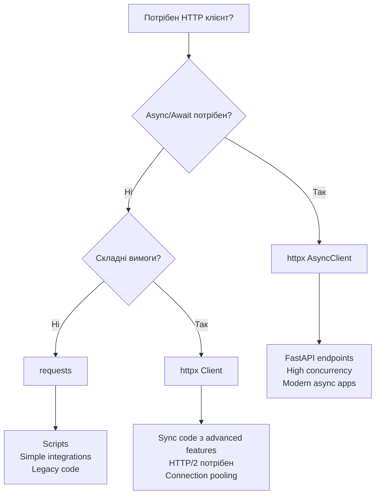
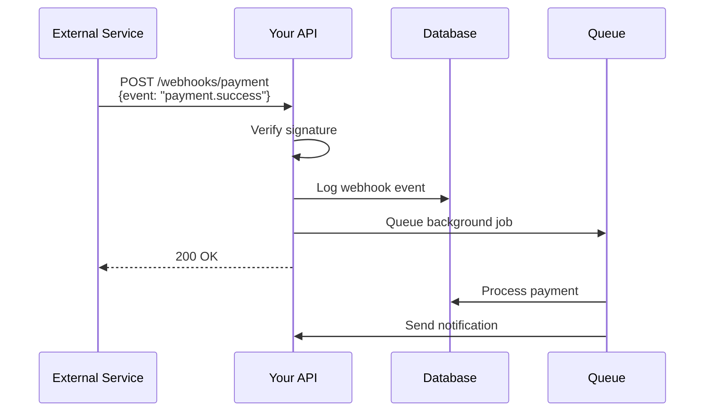
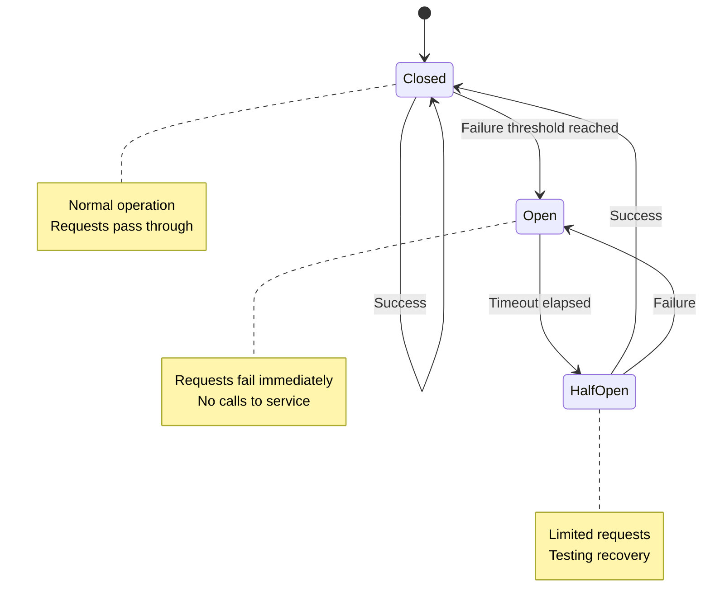

# Лекція 6. HTTP клієнти та інтеграція з зовнішніми API


## 1. HTTP клієнт у Python: httpx vs requests

### 1.1. Традиційна бібліотека requests

Бібліотека requests є стандартом де-факто для HTTP клієнтів у Python протягом багатьох років. Вона надає простий та інтуїтивний API для виконання HTTP запитів, але має одне суттєве обмеження: requests є синхронною бібліотекою і не підтримує async/await.

У синхронному коді requests працює чудово. Коли потрібно виконати HTTP запит, код просто чекає на відповідь, блокуючи поточний потік виконання. Для простих скриптів або застосунків, де потрібно виконувати запити послідовно, це цілком прийнятно.

```python
import requests

response = requests.get('https://api.example.com/users')
data = response.json()

for item in data:
    detail_response = requests.get(f'https://api.example.com/users/{item["id"]}')
    print(detail_response.json())
```

У цьому прикладі кожен запит виконується послідовно. Якщо один запит займає 1 секунду, то для 10 користувачів знадобиться щонайменше 10 секунд. У FastAPI застосунку, який за замовчуванням є асинхронним, використання синхронної бібліотеки requests призведе до блокування event loop та погіршення продуктивності.

### 1.2. Сучасна альтернатива httpx

Бібліотека httpx створена як наступник requests з повною підтримкою async/await. Вона зберігає знайомий API requests, але додає можливість асинхронних операцій. Це робить httpx ідеальним вибором для FastAPI застосунків.

httpx підтримує обидва режими роботи: синхронний та асинхронний. Можна використовувати звичайний клієнт для синхронного коду або AsyncClient для асинхронного. API обох клієнтів практично ідентичний, що полегшує перехід між ними.

```python
import httpx
import asyncio

async def fetch_user(user_id: int):
    async with httpx.AsyncClient() as client:
        response = await client.get(f'https://api.example.com/users/{user_id}')
        return response.json()

async def fetch_multiple_users(user_ids: list[int]):
    tasks = [fetch_user(user_id) for user_id in user_ids]
    results = await asyncio.gather(*tasks)
    return results

users = asyncio.run(fetch_multiple_users([1, 2, 3, 4, 5]))
```

У цьому прикладі всі запити виконуються паралельно. Якщо один запит займає 1 секунду, то для 10 користувачів знадобиться близько 1 секунди завдяки конкурентному виконанню. Це драматично покращує продуктивність у реальних застосунках.

### 1.3. Порівняльна таблиця httpx vs requests

Обидві бібліотеки мають свої сильні сторони та use cases. requests залишається відмінним вибором для синхронних скриптів, CLI утиліт або простих інтеграцій, де продуктивність не є критичною. Бібліотека стабільна, добре документована та має величезну екосистему плагінів.

httpx краще підходить для асинхронних застосунків, високонавантажених систем з багатьма одночасними запитами, FastAPI та інших async frameworks, а також сучасних проєктів, де важлива продуктивність.

Ключові переваги httpx включають підтримку async/await для неблокуючих операцій, HTTP/2 підтримку для кращої продуктивності, можливість використання connection pooling для повторного використання з'єднань, а також streaming responses для ефективної роботи з великими файлами.

requests має перевагу у більшій екосистемі плагінів, ширшій підтримці у legacy проєктах та простішому налагодженні для початківців через синхронну природу.



### 1.4. Базове використання httpx у FastAPI

```python
from fastapi import FastAPI, HTTPException
import httpx

app = FastAPI()

EXTERNAL_API_URL = "https://api.example.com"

@app.get("/users/{user_id}")
async def get_user_proxy(user_id: int):
    async with httpx.AsyncClient() as client:
        try:
            response = await client.get(f"{EXTERNAL_API_URL}/users/{user_id}")
            response.raise_for_status()
            return response.json()
        except httpx.HTTPError as e:
            raise HTTPException(status_code=500, detail=f"External API error: {str(e)}")
```

У цьому прикладі FastAPI endpoint виступає як проксі до зовнішнього API. Використання `async with` забезпечує автоматичне закриття з'єднання після виконання запиту. Метод `raise_for_status()` викликає виключення для HTTP кодів помилок, що дозволяє обробити їх у блоці except.


## 2. Async HTTP запити через httpx

### 2.1. AsyncClient та управління з'єднаннями

AsyncClient у httpx підтримує connection pooling за замовчуванням. Це означає, що TCP з'єднання можуть бути повторно використані для кількох запитів, що значно зменшує overhead встановлення з'єднання.

Існує два основних способи використання AsyncClient. Перший використовує context manager для автоматичного управління ресурсами. Це зручно для разових операцій або коли клієнт потрібен тільки в одному місці коду.

```python
async def fetch_data():
    async with httpx.AsyncClient() as client:
        response = await client.get("https://api.example.com/data")
        return response.json()
```

Другий підхід створює довгоживучий клієнт, який існує протягом життя застосунку. Це ефективніше для production систем, оскільки дозволяє повторно використовувати connection pool між багатьма запитами.

```python
from fastapi import FastAPI
import httpx

app = FastAPI()
http_client: httpx.AsyncClient = None

@app.on_event("startup")
async def startup_event():
    global http_client
    http_client = httpx.AsyncClient(
        timeout=10.0,
        limits=httpx.Limits(max_keepalive_connections=20, max_connections=100)
    )

@app.on_event("shutdown")
async def shutdown_event():
    await http_client.aclose()

@app.get("/data")
async def get_data():
    response = await http_client.get("https://api.example.com/data")
    return response.json()
```

У цьому прикладі клієнт створюється при старті застосунку та закривається при зупинці. Параметр `limits` дозволяє контролювати розмір connection pool. `max_keepalive_connections` визначає скільки idle з'єднань зберігати, а `max_connections` встановлює максимальну кількість одночасних з'єднань.

### 2.2. Паралельне виконання запитів

Одна з найбільших переваг async HTTP клієнтів це можливість виконувати багато запитів паралельно без створення окремих потоків або процесів.

```python
import asyncio
from typing import List

async def fetch_user(client: httpx.AsyncClient, user_id: int) -> dict:
    response = await client.get(f"https://api.example.com/users/{user_id}")
    return response.json()

async def fetch_users_parallel(user_ids: List[int]) -> List[dict]:
    async with httpx.AsyncClient() as client:
        tasks = [fetch_user(client, user_id) for user_id in user_ids]
        results = await asyncio.gather(*tasks)
        return results

@app.get("/users/batch")
async def get_multiple_users(user_ids: List[int]):
    users = await fetch_users_parallel(user_ids)
    return {"users": users, "count": len(users)}
```

Функція `asyncio.gather()` виконує всі tasks паралельно та чекає завершення всіх з них. Якщо потрібно обробляти результати по мірі їх готовності, можна використовувати `asyncio.as_completed()`.

```python
async def fetch_users_as_completed(user_ids: List[int]):
    async with httpx.AsyncClient() as client:
        tasks = [fetch_user(client, user_id) for user_id in user_ids]

        for coro in asyncio.as_completed(tasks):
            user = await coro
            yield user
```

Цей підхід корисний для streaming responses або коли потрібно почати обробку даних до завершення всіх запитів.

### 2.3. Streaming responses для великих файлів

Коли потрібно завантажити великий файл або обробляти response по частинах, httpx підтримує streaming.

```python
from fastapi.responses import StreamingResponse

@app.get("/download-large-file")
async def download_file():
    async def generate():
        async with httpx.AsyncClient() as client:
            async with client.stream("GET", "https://example.com/large-file.zip") as response:
                async for chunk in response.aiter_bytes(chunk_size=8192):
                    yield chunk

    return StreamingResponse(generate(), media_type="application/zip")
```

У цьому прикладі файл завантажується та передається клієнту по частинах, не завантажуючи весь файл у пам'ять одразу. Це критично важливо для роботи з великими файлами.

### 2.4. Handling concurrent requests з обмеженнями

Іноді потрібно обмежити кількість одночасних запитів, щоб не перевантажити зовнішній API або власні ресурси.

```python
import asyncio

class RateLimitedClient:
    def __init__(self, max_concurrent: int = 10):
        self.semaphore = asyncio.Semaphore(max_concurrent)
        self.client = None

    async def __aenter__(self):
        self.client = httpx.AsyncClient()
        return self

    async def __aexit__(self, exc_type, exc_val, exc_tb):
        await self.client.aclose()

    async def get(self, url: str, **kwargs):
        async with self.semaphore:
            response = await self.client.get(url, **kwargs)
            return response

async def fetch_with_limit():
    async with RateLimitedClient(max_concurrent=5) as client:
        tasks = [
            client.get(f"https://api.example.com/items/{i}")
            for i in range(100)
        ]
        results = await asyncio.gather(*tasks)
        return results
```

Semaphore обмежує кількість одночасних операцій. У цьому прикладі максимум 5 запитів виконуються паралельно, навіть якщо створено 100 tasks.


## 3. Робота з REST API: GET, POST, PUT, DELETE

### 3.1. GET запити з query parameters

GET запити використовуються для отримання даних з сервера. Query parameters дозволяють фільтрувати, сортувати та пагінувати результати.

```python
from typing import Optional
from pydantic import BaseModel

class UserFilter(BaseModel):
    name: Optional[str] = None
    email: Optional[str] = None
    active: Optional[bool] = None
    page: int = 1
    page_size: int = 10

async def fetch_users(filters: UserFilter) -> dict:
    async with httpx.AsyncClient() as client:
        params = {k: v for k, v in filters.dict().items() if v is not None}

        response = await client.get(
            "https://api.example.com/users",
            params=params
        )
        response.raise_for_status()
        return response.json()

@app.get("/users")
async def list_users(filters: UserFilter = Depends()):
    return await fetch_users(filters)
```

httpx автоматично кодує parameters у URL. Використання Pydantic моделі для фільтрів забезпечує валідацію та автодокументацію через OpenAPI.

### 3.2. POST запити для створення ресурсів

POST запити надсилають дані на сервер для створення нових ресурсів. Дані зазвичай передаються як JSON у body запиту.

```python
class CreateUserRequest(BaseModel):
    username: str
    email: str
    password: str
    full_name: Optional[str] = None

class UserResponse(BaseModel):
    id: int
    username: str
    email: str
    full_name: Optional[str]
    created_at: str

async def create_user_external(user_data: CreateUserRequest) -> UserResponse:
    async with httpx.AsyncClient() as client:
        response = await client.post(
            "https://api.example.com/users",
            json=user_data.dict(),
            headers={"Content-Type": "application/json"}
        )
        response.raise_for_status()
        return UserResponse(**response.json())

@app.post("/users", response_model=UserResponse)
async def create_user(user: CreateUserRequest):
    return await create_user_external(user)
```

Використання `json=` параметру автоматично серіалізує дані у JSON та встановлює правильний Content-Type. Pydantic моделі гарантують, що дані відповідають очікуваній структурі.

### 3.3. PUT та PATCH для оновлення

PUT використовується для повної заміни ресурсу, тоді як PATCH для часткового оновлення.

```python
class UpdateUserRequest(BaseModel):
    email: Optional[str] = None
    full_name: Optional[str] = None
    active: Optional[bool] = None

async def update_user_external(user_id: int, updates: UpdateUserRequest) -> UserResponse:
    async with httpx.AsyncClient() as client:
        update_data = {k: v for k, v in updates.dict().items() if v is not None}

        response = await client.patch(
            f"https://api.example.com/users/{user_id}",
            json=update_data
        )
        response.raise_for_status()
        return UserResponse(**response.json())

@app.patch("/users/{user_id}", response_model=UserResponse)
async def update_user(user_id: int, updates: UpdateUserRequest):
    return await update_user_external(user_id, updates)
```

PATCH дозволяє оновлювати тільки необхідні поля, не надсилаючи всі дані ресурсу. Це економить bandwidth та зменшує ризик конфліктів при одночасних оновленнях.

### 3.4. DELETE для видалення ресурсів

DELETE запити видаляють ресурси з сервера.

```python
async def delete_user_external(user_id: int) -> dict:
    async with httpx.AsyncClient() as client:
        response = await client.delete(f"https://api.example.com/users/{user_id}")
        response.raise_for_status()

        if response.status_code == 204:
            return {"status": "deleted", "user_id": user_id}

        return response.json()

@app.delete("/users/{user_id}")
async def delete_user(user_id: int):
    return await delete_user_external(user_id)
```

DELETE запити часто повертають статус 204 No Content без body, що вказує на успішне видалення. Код перевіряє статус та обробляє обидва випадки.

### 3.5. Handling різних response formats

API можуть повертати дані у різних форматах: JSON, XML, plain text або бінарні дані.

```python
async def fetch_different_formats(url: str, format_type: str):
    async with httpx.AsyncClient() as client:
        response = await client.get(url)
        response.raise_for_status()

        if format_type == "json":
            return response.json()
        elif format_type == "text":
            return response.text
        elif format_type == "binary":
            return response.content
        elif format_type == "xml":
            import xml.etree.ElementTree as ET
            return ET.fromstring(response.text)

@app.get("/fetch/{format_type}")
async def fetch_data(format_type: str, url: str):
    return await fetch_different_formats(url, format_type)
```


## 4. Обробка timeout та retry logic

### 4.1. Налаштування timeout

Timeout важливий для запобігання зависанню застосунку при проблемах з мережею або повільними API. httpx підтримує гнучкі налаштування timeout для різних етапів запиту.

```python
timeout_config = httpx.Timeout(
    connect=5.0,
    read=10.0,
    write=10.0,
    pool=5.0
)

async with httpx.AsyncClient(timeout=timeout_config) as client:
    response = await client.get("https://api.example.com/data")
```

Параметри timeout включають `connect` для встановлення з'єднання, `read` для читання response, `write` для надсилання request body, та `pool` для отримання з'єднання з pool. Можна встановити єдиний timeout для всіх операцій або налаштувати кожен окремо.

### 4.2. Обробка timeout exceptions

```python
import httpx
from fastapi import HTTPException

async def fetch_with_timeout(url: str) -> dict:
    try:
        async with httpx.AsyncClient(timeout=5.0) as client:
            response = await client.get(url)
            response.raise_for_status()
            return response.json()

    except httpx.TimeoutException:
        raise HTTPException(
            status_code=504,
            detail="External service timeout"
        )
    except httpx.HTTPStatusError as e:
        raise HTTPException(
            status_code=e.response.status_code,
            detail=f"External API error: {e.response.text}"
        )
    except httpx.RequestError as e:
        raise HTTPException(
            status_code=503,
            detail=f"Network error: {str(e)}"
        )

@app.get("/data")
async def get_data(url: str):
    return await fetch_with_timeout(url)
```

Різні типи exceptions дозволяють розрізняти причини помилки та повертати відповідні HTTP статус коди клієнту.

### 4.3. Retry logic для надійності

Автоматичні retry можуть значно покращити надійність при тимчасових проблемах з мережею.

```python
import asyncio
from typing import Optional, Callable

class RetryConfig:
    def __init__(
        self,
        max_attempts: int = 3,
        base_delay: float = 1.0,
        max_delay: float = 60.0,
        exponential_base: float = 2.0,
        retryable_status_codes: set = None
    ):
        self.max_attempts = max_attempts
        self.base_delay = base_delay
        self.max_delay = max_delay
        self.exponential_base = exponential_base
        self.retryable_status_codes = retryable_status_codes or {408, 429, 500, 502, 503, 504}

async def retry_request(
    func: Callable,
    config: RetryConfig = RetryConfig(),
    *args,
    **kwargs
):
    last_exception = None

    for attempt in range(config.max_attempts):
        try:
            return await func(*args, **kwargs)

        except httpx.HTTPStatusError as e:
            if e.response.status_code not in config.retryable_status_codes:
                raise
            last_exception = e

        except (httpx.TimeoutException, httpx.RequestError) as e:
            last_exception = e

        if attempt < config.max_attempts - 1:
            delay = min(
                config.base_delay * (config.exponential_base ** attempt),
                config.max_delay
            )
            await asyncio.sleep(delay)

    raise last_exception

async def fetch_with_retry(url: str) -> dict:
    async def do_request():
        async with httpx.AsyncClient() as client:
            response = await client.get(url)
            response.raise_for_status()
            return response.json()

    return await retry_request(do_request)
```

Цей retry механізм використовує exponential backoff: затримка між спробами збільшується експоненційно. Це зменшує навантаження на сервер під час проблем та дає йому час на відновлення.

### 4.4. Jittered exponential backoff

Додавання випадкового jitter запобігає thundering herd problem, коли багато клієнтів retry одночасно.

```python
import random

async def retry_with_jitter(
    func: Callable,
    config: RetryConfig = RetryConfig(),
    *args,
    **kwargs
):
    for attempt in range(config.max_attempts):
        try:
            return await func(*args, **kwargs)
        except Exception as e:
            if attempt == config.max_attempts - 1:
                raise

            delay = config.base_delay * (config.exponential_base ** attempt)
            jittered_delay = delay * (0.5 + random.random())
            jittered_delay = min(jittered_delay, config.max_delay)

            await asyncio.sleep(jittered_delay)
```

Jitter додає випадковий множник від 0.5 до 1.5 до базової затримки, розподіляючи retry спроби у часі.


## 5. Автентифікація у HTTP клієнтах: Bearer, API keys, OAuth2

### 5.1. Bearer Token Authentication

Bearer tokens широко використовуються для API автентифікації, особливо з JWT.

```python
from pydantic import BaseModel

class AuthConfig(BaseModel):
    api_url: str
    bearer_token: str

async def fetch_with_bearer(config: AuthConfig, endpoint: str):
    headers = {
        "Authorization": f"Bearer {config.bearer_token}",
        "Accept": "application/json"
    }

    async with httpx.AsyncClient() as client:
        response = await client.get(
            f"{config.api_url}/{endpoint}",
            headers=headers
        )
        response.raise_for_status()
        return response.json()

@app.get("/protected-resource")
async def get_protected_resource(config: AuthConfig = Depends()):
    return await fetch_with_bearer(config, "users/me")
```

Bearer token додається до заголовка Authorization у форматі `Bearer <token>`. Це стандартний спосіб автентифікації для багатьох сучасних API.

### 5.2. API Key Authentication

API ключі можуть передаватися через заголовки, query parameters або custom headers.

```python
class APIKeyAuth:
    def __init__(self, api_key: str, header_name: str = "X-API-Key"):
        self.api_key = api_key
        self.header_name = header_name

    def get_headers(self) -> dict:
        return {self.header_name: self.api_key}

async def fetch_with_api_key(auth: APIKeyAuth, url: str):
    async with httpx.AsyncClient() as client:
        response = await client.get(url, headers=auth.get_headers())
        response.raise_for_status()
        return response.json()
```

Деякі API використовують query parameters для API ключів:

```python
async def fetch_with_api_key_param(api_key: str, url: str):
    async with httpx.AsyncClient() as client:
        response = await client.get(url, params={"api_key": api_key})
        response.raise_for_status()
        return response.json()
```

### 5.3. OAuth2 Client Credentials Flow

OAuth2 Client Credentials flow використовується для server-to-server автентифікації.

```python
from datetime import datetime, timedelta
from typing import Optional

class OAuth2Client:
    def __init__(self, client_id: str, client_secret: str, token_url: str):
        self.client_id = client_id
        self.client_secret = client_secret
        self.token_url = token_url
        self.access_token: Optional[str] = None
        self.token_expires_at: Optional[datetime] = None

    async def get_access_token(self) -> str:
        if self.access_token and self.token_expires_at:
            if datetime.now() < self.token_expires_at:
                return self.access_token

        await self.refresh_token()
        return self.access_token

    async def refresh_token(self):
        async with httpx.AsyncClient() as client:
            response = await client.post(
                self.token_url,
                data={
                    "grant_type": "client_credentials",
                    "client_id": self.client_id,
                    "client_secret": self.client_secret
                },
                headers={"Content-Type": "application/x-www-form-urlencoded"}
            )
            response.raise_for_status()

            data = response.json()
            self.access_token = data["access_token"]
            expires_in = data.get("expires_in", 3600)
            self.token_expires_at = datetime.now() + timedelta(seconds=expires_in - 60)

    async def make_request(self, method: str, url: str, **kwargs):
        token = await self.get_access_token()

        headers = kwargs.get("headers", {})
        headers["Authorization"] = f"Bearer {token}"
        kwargs["headers"] = headers

        async with httpx.AsyncClient() as client:
            response = await client.request(method, url, **kwargs)

            if response.status_code == 401:
                await self.refresh_token()
                token = self.access_token
                headers["Authorization"] = f"Bearer {token}"
                response = await client.request(method, url, **kwargs)

            response.raise_for_status()
            return response

oauth_client = OAuth2Client(
    client_id="your_client_id",
    client_secret="your_secret",
    token_url="https://auth.example.com/oauth/token"
)

@app.get("/oauth-protected")
async def get_oauth_resource():
    response = await oauth_client.make_request(
        "GET",
        "https://api.example.com/protected/resource"
    )
    return response.json()
```

Цей клієнт автоматично отримує та оновлює access token, кешує його до закінчення терміну дії, та автоматично retry запит при 401 помилці після оновлення токену.

### 5.4. Basic Authentication

Деякі API все ще використовують HTTP Basic Authentication.

```python
import base64

def create_basic_auth_header(username: str, password: str) -> dict:
    credentials = f"{username}:{password}"
    encoded = base64.b64encode(credentials.encode()).decode()
    return {"Authorization": f"Basic {encoded}"}

async def fetch_with_basic_auth(username: str, password: str, url: str):
    headers = create_basic_auth_header(username, password)

    async with httpx.AsyncClient() as client:
        response = await client.get(url, headers=headers)
        response.raise_for_status()
        return response.json()
```

httpx також підтримує basic auth через параметр `auth`:

```python
async def fetch_with_basic_auth_simple(username: str, password: str, url: str):
    async with httpx.AsyncClient() as client:
        response = await client.get(url, auth=(username, password))
        response.raise_for_status()
        return response.json()
```


## 6. Інтеграція сторонніх сервісів: payment gateways, email services

### 6.1. Інтеграція Payment Gateway (приклад Stripe)

Payment gateways потребують особливої уваги до безпеки та обробки помилок.

```python
from typing import Optional
from pydantic import BaseModel, Field

class PaymentIntent(BaseModel):
    amount: int = Field(..., description="Amount in cents")
    currency: str = "usd"
    customer_email: str
    description: Optional[str] = None

class StripeClient:
    def __init__(self, api_key: str):
        self.api_key = api_key
        self.base_url = "https://api.stripe.com/v1"

    def _get_headers(self) -> dict:
        return {
            "Authorization": f"Bearer {self.api_key}",
            "Content-Type": "application/x-www-form-urlencoded"
        }

    async def create_payment_intent(self, payment: PaymentIntent) -> dict:
        async with httpx.AsyncClient() as client:
            data = {
                "amount": payment.amount,
                "currency": payment.currency,
                "receipt_email": payment.customer_email
            }

            if payment.description:
                data["description"] = payment.description

            response = await client.post(
                f"{self.base_url}/payment_intents",
                headers=self._get_headers(),
                data=data
            )

            response.raise_for_status()
            return response.json()

    async def retrieve_payment_intent(self, payment_intent_id: str) -> dict:
        async with httpx.AsyncClient() as client:
            response = await client.get(
                f"{self.base_url}/payment_intents/{payment_intent_id}",
                headers=self._get_headers()
            )
            response.raise_for_status()
            return response.json()

stripe_client = StripeClient(api_key="sk_test_...")

@app.post("/payments/create")
async def create_payment(payment: PaymentIntent):
    try:
        result = await stripe_client.create_payment_intent(payment)
        return {
            "client_secret": result["client_secret"],
            "payment_intent_id": result["id"]
        }
    except httpx.HTTPStatusError as e:
        error_data = e.response.json()
        raise HTTPException(
            status_code=400,
            detail=error_data.get("error", {}).get("message", "Payment failed")
        )
```

При роботі з payment gateways критично важливо правильно обробляти помилки та зберігати логи всіх транзакцій для можливості розслідування проблем.

### 6.2. Інтеграція Email Service (приклад SendGrid)

Email сервіси часто використовуються для нотифікацій, підтвердження реєстрації та маркетингових розсилок.

```python
from typing import List

class EmailRecipient(BaseModel):
    email: str
    name: Optional[str] = None

class EmailMessage(BaseModel):
    to: List[EmailRecipient]
    subject: str
    html_content: str
    text_content: Optional[str] = None
    from_email: str
    from_name: Optional[str] = None

class SendGridClient:
    def __init__(self, api_key: str):
        self.api_key = api_key
        self.base_url = "https://api.sendgrid.com/v3"

    def _get_headers(self) -> dict:
        return {
            "Authorization": f"Bearer {self.api_key}",
            "Content-Type": "application/json"
        }

    async def send_email(self, message: EmailMessage) -> dict:
        personalizations = [{
            "to": [{"email": r.email, "name": r.name} for r in message.to]
        }]

        content = [{"type": "text/html", "value": message.html_content}]
        if message.text_content:
            content.insert(0, {"type": "text/plain", "value": message.text_content})

        payload = {
            "personalizations": personalizations,
            "from": {
                "email": message.from_email,
                "name": message.from_name or message.from_email
            },
            "subject": message.subject,
            "content": content
        }

        async with httpx.AsyncClient() as client:
            response = await client.post(
                f"{self.base_url}/mail/send",
                headers=self._get_headers(),
                json=payload
            )

            if response.status_code == 202:
                return {"status": "sent", "message_id": response.headers.get("X-Message-Id")}

            response.raise_for_status()
            return response.json()

sendgrid_client = SendGridClient(api_key="SG....")

@app.post("/emails/send")
async def send_email(message: EmailMessage, background_tasks: BackgroundTasks):
    background_tasks.add_task(sendgrid_client.send_email, message)
    return {"status": "queued"}
```

Email відправка часто виконується у background tasks, щоб не блокувати відповідь користувачу.

### 6.3. Обробка rate limits від сторонніх сервісів

Багато API мають rate limits, які потрібно поважати.

```python
import time
from collections import deque

class RateLimiter:
    def __init__(self, max_requests: int, time_window: int):
        self.max_requests = max_requests
        self.time_window = time_window
        self.requests = deque()

    async def acquire(self):
        now = time.time()

        while self.requests and self.requests[0] < now - self.time_window:
            self.requests.popleft()

        if len(self.requests) >= self.max_requests:
            sleep_time = self.time_window - (now - self.requests[0])
            await asyncio.sleep(sleep_time)
            return await self.acquire()

        self.requests.append(now)

class RateLimitedAPIClient:
    def __init__(self, api_key: str, max_requests: int = 100, time_window: int = 60):
        self.api_key = api_key
        self.rate_limiter = RateLimiter(max_requests, time_window)

    async def make_request(self, method: str, url: str, **kwargs):
        await self.rate_limiter.acquire()

        async with httpx.AsyncClient() as client:
            response = await client.request(method, url, **kwargs)

            if response.status_code == 429:
                retry_after = int(response.headers.get("Retry-After", 60))
                await asyncio.sleep(retry_after)
                return await self.make_request(method, url, **kwargs)

            response.raise_for_status()
            return response
```

Цей rate limiter забезпечує, що застосунок не перевищує дозволену кількість запитів та автоматично чекає при отриманні 429 Too Many Requests.


## 7. Webhooks: отримання та обробка

### 7.1. Що таке webhooks

Webhooks це механізм, який дозволяє зовнішнім сервісам push-ати події до вашого застосунку. Замість того щоб періодично опитувати API для перевірки нових подій, сервіс сам надсилає HTTP POST запит до вашого endpoint при виникненні події.

Webhooks зазвичай використовуються для нотифікацій про платежі, оновлення статусу замовлень, події у CRM системах, репозиторії GitHub та багато іншого.



### 7.2. Прийом та валідація webhooks

Webhook endpoints мають бути швидкими та надійними. Критично важливо верифікувати, що webhook прийшов від легітимного джерела.

```python
import hmac
import hashlib
from fastapi import Header, Request, HTTPException

class WebhookVerifier:
    def __init__(self, secret: str):
        self.secret = secret.encode()

    def verify_signature(self, payload: bytes, signature: str) -> bool:
        expected_signature = hmac.new(
            self.secret,
            payload,
            hashlib.sha256
        ).hexdigest()

        return hmac.compare_digest(signature, expected_signature)

class WebhookEvent(BaseModel):
    id: str
    type: str
    data: dict
    created_at: str

webhook_verifier = WebhookVerifier(secret="your_webhook_secret")

@app.post("/webhooks/stripe")
async def stripe_webhook(
    request: Request,
    stripe_signature: str = Header(None, alias="Stripe-Signature"),
    background_tasks: BackgroundTasks
):
    body = await request.body()

    if not stripe_signature:
        raise HTTPException(status_code=400, detail="Missing signature")

    if not webhook_verifier.verify_signature(body, stripe_signature):
        raise HTTPException(status_code=403, detail="Invalid signature")

    event = WebhookEvent(**await request.json())

    background_tasks.add_task(process_webhook_event, event)

    return {"status": "received"}

async def process_webhook_event(event: WebhookEvent):
    if event.type == "payment_intent.succeeded":
        await handle_successful_payment(event.data)
    elif event.type == "payment_intent.failed":
        await handle_failed_payment(event.data)
```

Signature verification критично важлива для безпеки. Зловмисник не може підробити запит без знання секретного ключа.

### 7.3. Idempotency для webhooks

Сервіси можуть надсилати один і той самий webhook кілька разів через мережеві проблеми або retry. Важливо обробляти webhooks idempotently.

```python
from datetime import datetime

class WebhookLog(BaseModel):
    webhook_id: str
    event_type: str
    received_at: datetime
    processed: bool
    payload: dict

webhook_logs: dict[str, WebhookLog] = {}

async def process_webhook_idempotent(event: WebhookEvent):
    if event.id in webhook_logs:
        existing = webhook_logs[event.id]
        if existing.processed:
            print(f"Webhook {event.id} already processed, skipping")
            return

    webhook_logs[event.id] = WebhookLog(
        webhook_id=event.id,
        event_type=event.type,
        received_at=datetime.now(),
        processed=False,
        payload=event.data
    )

    try:
        await process_event_logic(event)

        webhook_logs[event.id].processed = True
    except Exception as e:
        print(f"Error processing webhook {event.id}: {e}")
        raise
```

У production системах webhook logs зазвичай зберігаються у базі даних з unique constraint на webhook_id для гарантування idempotency.

### 7.4. Відправка webhooks до інших сервісів

Ваш застосунок також може надсилати webhooks до інших систем.

```python
from typing import List

class WebhookSubscription(BaseModel):
    url: str
    events: List[str]
    secret: str

subscriptions: List[WebhookSubscription] = []

async def send_webhook(event_type: str, data: dict):
    relevant_subscriptions = [
        sub for sub in subscriptions
        if event_type in sub.events
    ]

    for subscription in relevant_subscriptions:
        await deliver_webhook(subscription, event_type, data)

async def deliver_webhook(subscription: WebhookSubscription, event_type: str, data: dict):
    payload = {
        "id": str(uuid.uuid4()),
        "type": event_type,
        "data": data,
        "created_at": datetime.now().isoformat()
    }

    payload_bytes = json.dumps(payload).encode()
    signature = hmac.new(
        subscription.secret.encode(),
        payload_bytes,
        hashlib.sha256
    ).hexdigest()

    max_attempts = 3
    for attempt in range(max_attempts):
        try:
            async with httpx.AsyncClient(timeout=10.0) as client:
                response = await client.post(
                    subscription.url,
                    json=payload,
                    headers={"X-Webhook-Signature": signature}
                )

                if response.status_code in (200, 201, 202):
                    print(f"Webhook delivered to {subscription.url}")
                    return

                if response.status_code >= 500:
                    await asyncio.sleep(2 ** attempt)
                    continue

                print(f"Webhook rejected by {subscription.url}: {response.status_code}")
                return

        except Exception as e:
            print(f"Error delivering webhook (attempt {attempt + 1}): {e}")
            if attempt < max_attempts - 1:
                await asyncio.sleep(2 ** attempt)

    print(f"Failed to deliver webhook to {subscription.url} after {max_attempts} attempts")
```

Ця реалізація включає retry logic, signature generation для верифікації та proper timeout handling.


## 8. Circuit breaker pattern для надійності

### 8.1. Концепція Circuit Breaker

Circuit breaker pattern запобігає каскадним збоям у розподілених системах. Коли зовнішній сервіс стає недоступним, продовження відправки запитів тільки погіршує ситуацію, витрачаючи ресурси та збільшуючи затримки.

Circuit breaker має три стани: Closed (нормальна робота), Open (сервіс недоступний, запити блокуються), Half-Open (тестування відновлення).



### 8.2. Реалізація Circuit Breaker

```python
from enum import Enum
from datetime import datetime, timedelta

class CircuitState(str, Enum):
    CLOSED = "closed"
    OPEN = "open"
    HALF_OPEN = "half_open"

class CircuitBreaker:
    def __init__(
        self,
        failure_threshold: int = 5,
        timeout_duration: int = 60,
        success_threshold: int = 2
    ):
        self.failure_threshold = failure_threshold
        self.timeout_duration = timeout_duration
        self.success_threshold = success_threshold

        self.state = CircuitState.CLOSED
        self.failures = 0
        self.successes = 0
        self.last_failure_time: Optional[datetime] = None

    def can_execute(self) -> bool:
        if self.state == CircuitState.CLOSED:
            return True

        if self.state == CircuitState.OPEN:
            if self.last_failure_time:
                elapsed = (datetime.now() - self.last_failure_time).total_seconds()
                if elapsed >= self.timeout_duration:
                    self.state = CircuitState.HALF_OPEN
                    self.successes = 0
                    return True
            return False

        if self.state == CircuitState.HALF_OPEN:
            return True

        return False

    def record_success(self):
        if self.state == CircuitState.HALF_OPEN:
            self.successes += 1
            if self.successes >= self.success_threshold:
                self.state = CircuitState.CLOSED
                self.failures = 0
        else:
            self.failures = 0

    def record_failure(self):
        self.failures += 1
        self.last_failure_time = datetime.now()

        if self.state == CircuitState.HALF_OPEN:
            self.state = CircuitState.OPEN
        elif self.failures >= self.failure_threshold:
            self.state = CircuitState.OPEN

    async def execute(self, func: Callable, *args, **kwargs):
        if not self.can_execute():
            raise Exception(f"Circuit breaker is OPEN. Service unavailable.")

        try:
            result = await func(*args, **kwargs)
            self.record_success()
            return result
        except Exception as e:
            self.record_failure()
            raise

class ExternalAPIClient:
    def __init__(self, base_url: str):
        self.base_url = base_url
        self.circuit_breaker = CircuitBreaker(
            failure_threshold=5,
            timeout_duration=30,
            success_threshold=2
        )

    async def get(self, endpoint: str):
        async def make_request():
            async with httpx.AsyncClient(timeout=5.0) as client:
                response = await client.get(f"{self.base_url}/{endpoint}")
                response.raise_for_status()
                return response.json()

        return await self.circuit_breaker.execute(make_request)

api_client = ExternalAPIClient("https://api.example.com")

@app.get("/data")
async def get_data():
    try:
        return await api_client.get("data")
    except Exception as e:
        if "Circuit breaker is OPEN" in str(e):
            raise HTTPException(
                status_code=503,
                detail="External service temporarily unavailable"
            )
        raise
```

### 8.3. Fallback strategies

Коли circuit breaker відкритий, потрібна fallback стратегія для обробки запитів.

```python
from typing import Optional, Callable

class CircuitBreakerWithFallback:
    def __init__(
        self,
        failure_threshold: int = 5,
        timeout_duration: int = 60,
        fallback: Optional[Callable] = None
    ):
        self.circuit_breaker = CircuitBreaker(failure_threshold, timeout_duration)
        self.fallback = fallback

    async def execute(self, func: Callable, *args, **kwargs):
        try:
            return await self.circuit_breaker.execute(func, *args, **kwargs)
        except Exception as e:
            if "Circuit breaker is OPEN" in str(e) and self.fallback:
                return await self.fallback(*args, **kwargs)
            raise

async def cached_fallback(endpoint: str):
    from_cache = await get_from_cache(f"api:{endpoint}")
    if from_cache:
        return {"data": from_cache, "source": "cache"}

    return {"data": None, "source": "unavailable"}

api_client_with_fallback = CircuitBreakerWithFallback(
    fallback=cached_fallback
)
```


## 9. Rate limiting та throttling

### 9.1. Client-side rate limiting

Обмеження кількості запитів на стороні клієнта запобігає перевантаженню зовнішніх API та отриманню rate limit errors.

```python
import time
from collections import deque
from dataclasses import dataclass, field

@dataclass
class RateLimitConfig:
    max_requests: int
    time_window: int  # seconds
    burst_size: int = field(init=False)

    def __post_init__(self):
        self.burst_size = self.max_requests

class TokenBucketRateLimiter:
    def __init__(self, config: RateLimitConfig):
        self.config = config
        self.tokens = config.max_requests
        self.last_update = time.time()

    async def acquire(self, tokens: int = 1):
        while True:
            now = time.time()
            elapsed = now - self.last_update

            self.tokens = min(
                self.config.max_requests,
                self.tokens + elapsed * (self.config.max_requests / self.config.time_window)
            )
            self.last_update = now

            if self.tokens >= tokens:
                self.tokens -= tokens
                return

            sleep_time = (tokens - self.tokens) / (self.config.max_requests / self.config.time_window)
            await asyncio.sleep(sleep_time)

class SlidingWindowRateLimiter:
    def __init__(self, max_requests: int, time_window: int):
        self.max_requests = max_requests
        self.time_window = time_window
        self.requests: deque = deque()

    async def acquire(self):
        now = time.time()

        while self.requests and self.requests[0] < now - self.time_window:
            self.requests.popleft()

        if len(self.requests) >= self.max_requests:
            oldest_request = self.requests[0]
            sleep_time = self.time_window - (now - oldest_request)
            await asyncio.sleep(sleep_time)
            return await self.acquire()

        self.requests.append(now)

class RateLimitedHTTPClient:
    def __init__(self, base_url: str, rate_limit_config: RateLimitConfig):
        self.base_url = base_url
        self.rate_limiter = TokenBucketRateLimiter(rate_limit_config)

    async def get(self, endpoint: str, **kwargs):
        await self.rate_limiter.acquire()

        async with httpx.AsyncClient() as client:
            response = await client.get(f"{self.base_url}/{endpoint}", **kwargs)
            response.raise_for_status()
            return response.json()
```

### 9.2. Обробка rate limit responses від API

Коли API повертає 429 Too Many Requests, важливо правильно обробити цю відповідь.

```python
async def handle_rate_limit_response(response: httpx.Response) -> int:
    if response.status_code != 429:
        return 0

    retry_after = response.headers.get("Retry-After")
    if retry_after:
        try:
            return int(retry_after)
        except ValueError:
            from email.utils import parsedate_to_datetime
            retry_date = parsedate_to_datetime(retry_after)
            return max(0, (retry_date - datetime.now()).total_seconds())

    x_rate_limit_reset = response.headers.get("X-RateLimit-Reset")
    if x_rate_limit_reset:
        reset_timestamp = int(x_rate_limit_reset)
        return max(0, reset_timestamp - time.time())

    return 60

class SmartRateLimitedClient:
    async def make_request(self, method: str, url: str, **kwargs):
        max_retries = 3

        for attempt in range(max_retries):
            async with httpx.AsyncClient() as client:
                response = await client.request(method, url, **kwargs)

                if response.status_code == 429:
                    if attempt < max_retries - 1:
                        wait_time = await handle_rate_limit_response(response)
                        print(f"Rate limited, waiting {wait_time} seconds")
                        await asyncio.sleep(wait_time)
                        continue

                response.raise_for_status()
                return response

        raise Exception("Max retries reached due to rate limiting")
```

### 9.3. Adaptive rate limiting

Адаптивний rate limiting автоматично підлаштовується під відповіді API.

```python
class AdaptiveRateLimiter:
    def __init__(self, initial_rate: int = 10, time_window: int = 60):
        self.current_rate = initial_rate
        self.time_window = time_window
        self.min_rate = 1
        self.max_rate = initial_rate * 2
        self.rate_limiter = SlidingWindowRateLimiter(self.current_rate, time_window)

    async def acquire(self):
        await self.rate_limiter.acquire()

    def adjust_rate_on_success(self):
        self.current_rate = min(self.max_rate, self.current_rate * 1.1)
        self.rate_limiter = SlidingWindowRateLimiter(int(self.current_rate), self.time_window)

    def adjust_rate_on_limit(self):
        self.current_rate = max(self.min_rate, self.current_rate * 0.5)
        self.rate_limiter = SlidingWindowRateLimiter(int(self.current_rate), self.time_window)
```


## 10. Кешування відповідей у Redis

### 10.1. Базове кешування з TTL

Кешування зменшує навантаження на зовнішні API та покращує час відгуку.

```python
import redis.asyncio as redis
import json
from typing import Optional

class RedisCache:
    def __init__(self, redis_url: str):
        self.redis = redis.from_url(redis_url)

    async def get(self, key: str) -> Optional[dict]:
        value = await self.redis.get(key)
        if value:
            return json.loads(value)
        return None

    async def set(self, key: str, value: dict, ttl: int = 300):
        await self.redis.setex(key, ttl, json.dumps(value))

    async def delete(self, key: str):
        await self.redis.delete(key)

    async def close(self):
        await self.redis.close()

cache = RedisCache("redis://localhost:6379")

async def fetch_with_cache(url: str, cache_ttl: int = 300):
    cache_key = f"api:{url}"

    cached = await cache.get(cache_key)
    if cached:
        return cached

    async with httpx.AsyncClient() as client:
        response = await client.get(url)
        response.raise_for_status()
        data = response.json()

    await cache.set(cache_key, data, cache_ttl)
    return data

@app.get("/users/{user_id}")
async def get_user(user_id: int):
    return await fetch_with_cache(
        f"https://api.example.com/users/{user_id}",
        cache_ttl=600
    )
```

### 10.2. Cache invalidation strategies

Cache invalidation є однією з найскладніших проблем у програмуванні. Існує кілька стратегій.

```python
class CacheManager:
    def __init__(self, redis_url: str):
        self.cache = RedisCache(redis_url)

    async def get_or_fetch(
        self,
        key: str,
        fetch_func: Callable,
        ttl: int = 300,
        force_refresh: bool = False
    ):
        if not force_refresh:
            cached = await self.cache.get(key)
            if cached:
                return cached

        data = await fetch_func()
        await self.cache.set(key, data, ttl)
        return data

    async def invalidate_pattern(self, pattern: str):
        keys = []
        async for key in self.cache.redis.scan_iter(match=pattern):
            keys.append(key)

        if keys:
            await self.cache.redis.delete(*keys)

    async def invalidate_related(self, resource_type: str, resource_id: str):
        patterns = [
            f"{resource_type}:{resource_id}",
            f"{resource_type}:list:*",
            f"{resource_type}:*:{resource_id}"
        ]

        for pattern in patterns:
            await self.invalidate_pattern(pattern)

cache_manager = CacheManager("redis://localhost:6379")

@app.put("/users/{user_id}")
async def update_user(user_id: int, user_data: dict):
    async with httpx.AsyncClient() as client:
        response = await client.put(
            f"https://api.example.com/users/{user_id}",
            json=user_data
        )
        response.raise_for_status()

    await cache_manager.invalidate_related("user", str(user_id))

    return response.json()
```

### 10.3. Стратегія cache-aside pattern

```python
class CacheAsideService:
    def __init__(self, cache: RedisCache, api_client: httpx.AsyncClient):
        self.cache = cache
        self.api_client = api_client

    async def get_user(self, user_id: int) -> dict:
        cache_key = f"user:{user_id}"

        cached = await self.cache.get(cache_key)
        if cached:
            return cached

        response = await self.api_client.get(f"/users/{user_id}")
        response.raise_for_status()
        user_data = response.json()

        await self.cache.set(cache_key, user_data, ttl=600)

        return user_data

    async def update_user(self, user_id: int, updates: dict) -> dict:
        response = await self.api_client.patch(
            f"/users/{user_id}",
            json=updates
        )
        response.raise_for_status()
        updated_user = response.json()

        cache_key = f"user:{user_id}"
        await self.cache.set(cache_key, updated_user, ttl=600)

        return updated_user

    async def delete_user(self, user_id: int):
        await self.api_client.delete(f"/users/{user_id}")

        cache_key = f"user:{user_id}"
        await self.cache.delete(cache_key)
```


## Висновки

HTTP клієнти є фундаментальною частиною сучасних вебдодатків, які інтегруються з зовнішніми сервісами. Бібліотека httpx надає потужний async/await API, який ідеально підходить для FastAPI застосунків.

Правильна обробка timeout та retry logic критично важлива для надійності. Circuit breaker pattern запобігає каскадним збоям та покращує resilience системи. Автентифікація вимагає уваги до безпеки, особливо при роботі з OAuth2 та API ключами.

Webhooks дозволяють створювати event-driven архітектури, але потребують proper signature verification та idempotent обробки. Rate limiting та throttling захищають як ваш застосунок, так і зовнішні API від перевантаження.

Кешування з Redis значно покращує продуктивність та зменшує кількість запитів до зовнішніх сервісів. Правильна cache invalidation стратегія забезпечує актуальність даних.


## Контрольні питання

1. У чому основна різниця між бібліотеками requests та httpx? Чому httpx краще підходить для FastAPI?
2. Як правильно управляти життєвим циклом AsyncClient у FastAPI застосунку?
3. Поясніть переваги паралельного виконання HTTP запитів через asyncio.gather(). Наведіть приклад use case.
4. Що таке connection pooling і як він покращує продуктивність HTTP клієнтів?
5. Які різні типи timeout існують у httpx? Навіщо розділяти їх?
6. Опишіть стратегію exponential backoff з jitter для retry logic. Чому jitter важливий?
7. Які методи автентифікації найчастіше використовуються у REST API? Порівняйте Bearer token та API key.
8. Як працює OAuth2 Client Credentials flow? Коли його використовувати?
9. Що таке webhooks і чим вони відрізняються від polling? Наведіть приклади використання.
10. Чому важлива signature verification для webhooks? Як її реалізувати?
11. Що таке idempotency у контексті webhooks? Як забезпечити idempotent обробку?
12. Опишіть три стани circuit breaker pattern. Як відбувається перехід між ними?
13. Які fallback стратегії можна використовувати, коли circuit breaker відкритий?
14. У чому різниця між token bucket та sliding window алгоритмами rate limiting?
15. Як обробляти 429 Too Many Requests відповіді від зовнішніх API?
16. Що таке cache-aside pattern? Які його переваги та недоліки?
17. Які стратегії cache invalidation існують? Коли використовувати кожну?
18. Як інтегрувати payment gateway у FastAPI застосунок? Які аспекти безпеки важливі?
19. Чому email відправка часто виконується у background tasks? Як це реалізувати?
20. Як налаштувати nginx як reverse proxy для HTTP API з proper timeout handling?
