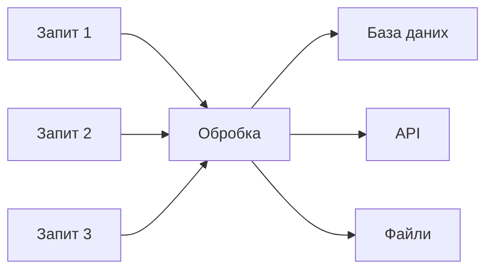
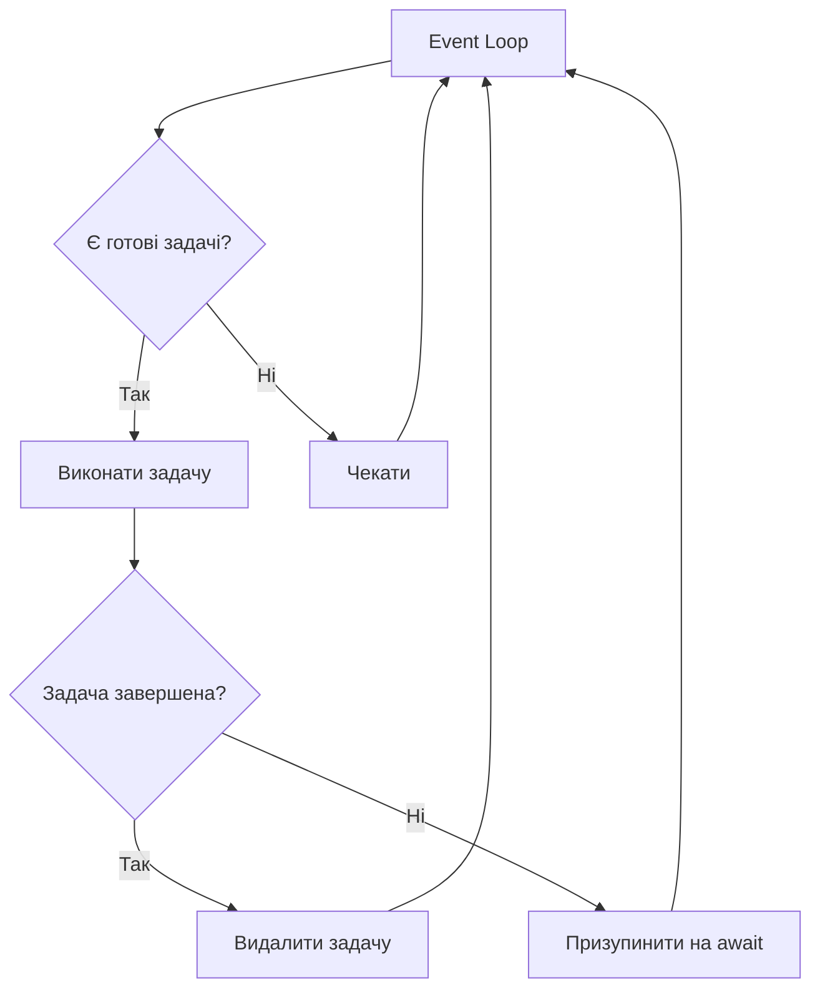

# Презентація: Python для веброзробки та FastAPI основи

---

## Зміст лекції

- Python Type Hints та їх роль у FastAPI
- Асинхронне програмування: async/await, asyncio
- Введення у FastAPI: переваги та можливості
- Перший FastAPI застосунок
- Pydantic Models для валідації
- Path, Query та Body Parameters
- Автоматична документація

---

## Python Type Hints

### Навіщо потрібні type hints?

- Покращення читабельності коду
- Виявлення помилок до запуску програми
- Кращі підказки в IDE
- Автоматична валідація в FastAPI
- Генерація документації

---

## Type Hints: Базові типи

```python
def greet(name: str) -> str:
    return f"Привіт, {name}"

age: int = 25
is_active: bool = True
price: float = 99.99
```

Прості та інтуїтивно зрозумілі анотації типів для базових даних.

---

## Type Hints: Складні типи

```python
from typing import List, Dict, Optional, Union

users: List[str] = ["Олександр", "Марія"]
user_data: Dict[str, int] = {"Олександр": 30}
optional_email: Optional[str] = None
identifier: Union[int, str] = "USER_123"
```

Модуль typing надає інструменти для опису складних структур даних.

---

## Type Hints у FastAPI

```python
from fastapi import FastAPI
from pydantic import BaseModel

app = FastAPI()

class Task(BaseModel):
    title: str
    description: str
    completed: bool = False

@app.post("/tasks/")
async def create_task(task: Task) -> Task:
    return task
```

FastAPI автоматично валідує дані на основі type hints.

---

## Асинхронне програмування

### Що таке асинхронність?

Підхід до виконання операцій, який дозволяє програмі не блокуватися на операціях вводу-виводу.



---

## Синхронний vs Асинхронний код

### Синхронний підхід

```python
def fetch_data():
    time.sleep(2)  # Блокує виконання
    return "дані"

result = fetch_data()  # Чекає 2 секунди
```

### Асинхронний підхід

```python
async def fetch_data():
    await asyncio.sleep(2)  # Не блокує
    return "дані"

result = await fetch_data()  # Інші задачі можуть виконуватись
```

---

## Async/Await в Python

```python
import asyncio

async def fetch_data():
    print("Починаємо завантаження")
    await asyncio.sleep(2)
    print("Дані завантажено")
    return {"data": "важливі дані"}

async def main():
    result = await fetch_data()
    print(f"Отримано: {result}")

asyncio.run(main())
```

Ключові слова async та await роблять код асинхронним.

---

## Event Loop



Event Loop керує виконанням асинхронних операцій.

---

## Паралельне виконання задач

```python
import asyncio

async def task_one():
    print("Задача 1: початок")
    await asyncio.sleep(1)
    print("Задача 1: завершення")

async def task_two():
    print("Задача 2: початок")
    await asyncio.sleep(2)
    print("Задача 2: завершення")

async def main():
    await asyncio.gather(task_one(), task_two())

asyncio.run(main())
```

Функція gather дозволяє запустити кілька корутин одночасно.

---

## Чому FastAPI?

- **Швидкість**: продуктивність як у Node.js та Go
- **Простота**: мінімум коду для максимуму функціональності
- **Автоматична валідація**: на основі type hints
- **Документація**: генерується автоматично
- **Асинхронність**: підтримка async/await
- **Стандарти**: OpenAPI, JSON Schema

---

## FastAPI vs Flask vs Django

| Характеристика | FastAPI | Flask | Django |
|---|---|---|---|
| Асинхронність | ✅ Вбудована | ⚠️ Обмежена | ⚠️ Частково |
| Валідація | ✅ Автоматична | ❌ Вручну | ⚠️ Forms/DRF |
| Документація | ✅ Автоматична | ❌ Вручну | ⚠️ DRF |
| Продуктивність | ⭐⭐⭐⭐⭐ | ⭐⭐⭐ | ⭐⭐⭐ |
| Складність | Низька | Низька | Висока |

---

## Встановлення FastAPI

```bash
pip install fastapi uvicorn[standard]
```

- **fastapi**: основний фреймворк
- **uvicorn**: ASGI сервер для запуску застосунку
- **[standard]**: додаткові залежності для покращення продуктивності

---

## Перший FastAPI застосунок

```python
from fastapi import FastAPI

app = FastAPI()

@app.get("/")
async def root():
    return {"message": "Вітаємо у FastAPI"}

@app.get("/items/{item_id}")
async def read_item(item_id: int):
    return {"item_id": item_id}
```

Всього кілька рядків для створення функціонального API.

---

## Запуск застосунку

```bash
uvicorn app.main:app --reload
```

- **app.main**: модуль з файлом main.py
- **app**: змінна з екземпляром FastAPI
- **--reload**: автоматичне перезавантаження при змінах

Застосунок доступний за адресою: http://localhost:8000

---

## Структура проєкту

```
my_project/
├── app/
│   ├── __init__.py
│   ├── main.py
│   ├── models.py
│   ├── schemas.py
│   └── routers/
│       ├── __init__.py
│       └── tasks.py
├── tests/
├── requirements.txt
└── README.md
```

Організована структура для масштабованих проєктів.

---

## Pydantic BaseModel

```python
from pydantic import BaseModel
from typing import Optional

class Task(BaseModel):
    id: Optional[int] = None
    title: str
    description: str
    completed: bool = False
```

BaseModel забезпечує автоматичну валідацію даних на основі type hints.

---

## Валідація з Pydantic

```python
try:
    task = Task(
        title="Тестове завдання",
        description="Опис"
    )
    print(task)
except Exception as e:
    print(f"Помилка: {e}")
```

Pydantic автоматично перевіряє типи та викидає помилки при невідповідності.

---

## Додаткові обмеження з Field

```python
from pydantic import BaseModel, Field

class Task(BaseModel):
    title: str = Field(..., min_length=3, max_length=100)
    description: str
    priority: int = Field(default=1, ge=1, le=5)
```

Field дозволяє встановлювати обмеження на значення полів:

- **min_length/max_length**: для рядків
- **ge/le**: для чисел (greater/less or equal)

---

## Path Parameters

```python
@app.get("/tasks/{task_id}")
async def get_task(task_id: int):
    return {
        "task_id": task_id,
        "title": "Приклад завдання"
    }
```

Path parameters є частиною URL шляху.

Приклад запиту: `GET /tasks/42`

---

## Query Parameters

```python
from typing import Optional

@app.get("/tasks/")
async def list_tasks(
    skip: int = 0,
    limit: int = 10,
    completed: Optional[bool] = None
):
    return {
        "skip": skip,
        "limit": limit,
        "completed": completed
    }
```

Query parameters передаються після знаку питання в URL.

Приклад: `GET /tasks/?skip=10&limit=20&completed=true`

---

## Request Body

```python
@app.post("/tasks/")
async def create_task(task: Task):
    return task
```

Request body передається в тілі HTTP запиту як JSON.

FastAPI автоматично:
- Парсить JSON
- Валідує дані
- Створює об'єкт Task

---

## Комбінування параметрів

```python
@app.put("/tasks/{task_id}")
async def update_task(
    task_id: int,           # Path parameter
    task: Task,             # Request body
    force: bool = False     # Query parameter
):
    return {
        "task_id": task_id,
        "task": task,
        "force": force
    }
```

FastAPI автоматично розпізнає тип кожного параметра.

---

## HTTP статус коди

```python
from fastapi import status

@app.post(
    "/tasks/",
    status_code=status.HTTP_201_CREATED
)
async def create_task(task: Task):
    return task

@app.delete(
    "/tasks/{task_id}",
    status_code=status.HTTP_204_NO_CONTENT
)
async def delete_task(task_id: int):
    return None
```

Правильні статус коди покращують якість API.

---

## Обробка помилок

```python
from fastapi import HTTPException, status

@app.get("/tasks/{task_id}")
async def get_task(task_id: int):
    task = database.get(task_id)

    if not task:
        raise HTTPException(
            status_code=status.HTTP_404_NOT_FOUND,
            detail=f"Завдання з ID {task_id} не знайдено"
        )

    return task
```

HTTPException дозволяє повертати помилки з кастомними повідомленнями.

---

## Автоматична документація

FastAPI автоматично генерує інтерактивну документацію:

- **Swagger UI**: http://localhost:8000/docs
- **ReDoc**: http://localhost:8000/redoc

Обидва інтерфейси створюються на основі OpenAPI специфікації.

---

## Swagger UI

```python
app = FastAPI(
    title="Task Manager API",
    description="API для управління завданнями",
    version="1.0.0"
)
```

Параметри FastAPI покращують документацію, додаючи метаінформацію про API.


---

## Додавання описів до ендпоінтів

```python
@app.post(
    "/tasks/",
    response_model=Task,
    summary="Створити нове завдання",
    description="Створює нове завдання з вказаними параметрами",
    response_description="Створене завдання"
)
async def create_task(task: Task):
    return task
```

Детальні описи з'являються в документації API.

---

## Response Model

```python
@app.post("/tasks/", response_model=Task)
async def create_task(task: TaskCreate):
    new_task = Task(
        id=generate_id(),
        **task.dict()
    )
    return new_task
```

Response model визначає структуру відповіді та автоматично:
- Валідує вихідні дані
- Серіалізує в JSON
- Додає опис до документації

---

## CRUD операції в FastAPI

```mermaid
graph LR
    A[CREATE] -->|POST| B[/tasks/]
    C[READ] -->|GET| D[/tasks/]
    C -->|GET| E[/tasks/id]
    F[UPDATE] -->|PUT| G[/tasks/id]
    H[DELETE] -->|DELETE| I[/tasks/id]
```

Стандартні операції для роботи з ресурсами.

---

## Приклад CRUD: Create

```python
@app.post("/tasks/", status_code=status.HTTP_201_CREATED)
async def create_task(task: TaskCreate) -> Task:
    new_task = Task(
        id=len(tasks) + 1,
        **task.dict()
    )
    tasks.append(new_task)
    return new_task
```

POST запит створює новий ресурс і повертає його з ідентифікатором.

---

## Приклад CRUD: Read

```python
@app.get("/tasks/")
async def get_tasks(
    skip: int = 0,
    limit: int = 100
) -> List[Task]:
    return tasks[skip:skip + limit]

@app.get("/tasks/{task_id}")
async def get_task(task_id: int) -> Task:
    task = find_task(task_id)
    if not task:
        raise HTTPException(status_code=404)
    return task
```

GET запити отримують дані без змін.

---

## Приклад CRUD: Update

```python
@app.put("/tasks/{task_id}")
async def update_task(
    task_id: int,
    task_update: TaskUpdate
) -> Task:
    task = find_task(task_id)
    if not task:
        raise HTTPException(status_code=404)

    update_data = task_update.dict(exclude_unset=True)
    for key, value in update_data.items():
        setattr(task, key, value)

    return task
```

PUT запит оновлює існуючий ресурс.

---

## Приклад CRUD: Delete

```python
@app.delete(
    "/tasks/{task_id}",
    status_code=status.HTTP_204_NO_CONTENT
)
async def delete_task(task_id: int):
    task = find_task(task_id)
    if not task:
        raise HTTPException(status_code=404)

    tasks.remove(task)
    return None
```

DELETE запит видаляє ресурс і повертає статус 204.

---

## Переваги FastAPI

- Мінімальна кількість коду для максимальної функціональності
- Автоматична валідація входу та виходу
- Висока продуктивність завдяки асинхронності
- Інтуїтивна та зрозуміла документація
- Підтримка сучасних стандартів
- Великі можливості розширення

---

## Типові помилки при роботі з FastAPI

- Забування async перед def для асинхронних функцій
- Неправильне використання await
- Відсутність type hints для параметрів
- Неправильні HTTP статус коди
- Відсутність валідації вхідних даних
- Ігнорування помилок без HTTPException

---

## Best Practices

- Завжди використовуйте type hints
- Створюйте окремі Pydantic схеми для вводу та виводу
- Використовуйте правильні HTTP методи та статус коди
- Організовуйте код у роутери для великих проєктів
- Додавайте описи до ендпоінтів для документації
- Обробляйте помилки через HTTPException

---

## Структура великого проєкту

```python
# app/main.py
from fastapi import FastAPI
from app.routers import tasks, users

app = FastAPI()

app.include_router(
    tasks.router,
    prefix="/tasks",
    tags=["tasks"]
)

app.include_router(
    users.router,
    prefix="/users",
    tags=["users"]
)
```

Роутери дозволяють організувати код модульно.

---

## Тестування FastAPI

```python
from fastapi.testclient import TestClient
from app.main import app

client = TestClient(app)

def test_create_task():
    response = client.post(
        "/tasks/",
        json={
            "title": "Test",
            "description": "Test task"
        }
    )
    assert response.status_code == 201
    assert response.json()["title"] == "Test"
```

TestClient дозволяє легко тестувати API.

---

## Висновки

- Type hints є основою FastAPI для валідації та документації
- Асинхронне програмування підвищує продуктивність
- FastAPI спрощує створення сучасних API
- Pydantic забезпечує надійну валідацію даних
- Автоматична документація прискорює розробку
- Правильна структура проєкту полегшує підтримку
