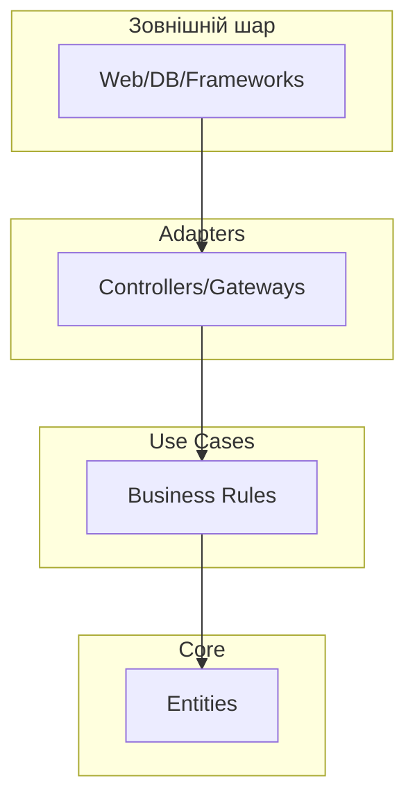
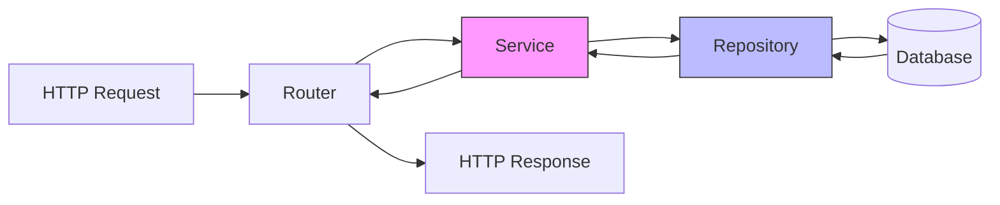
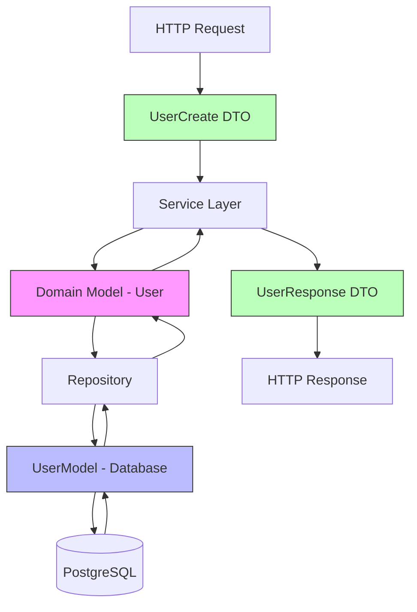
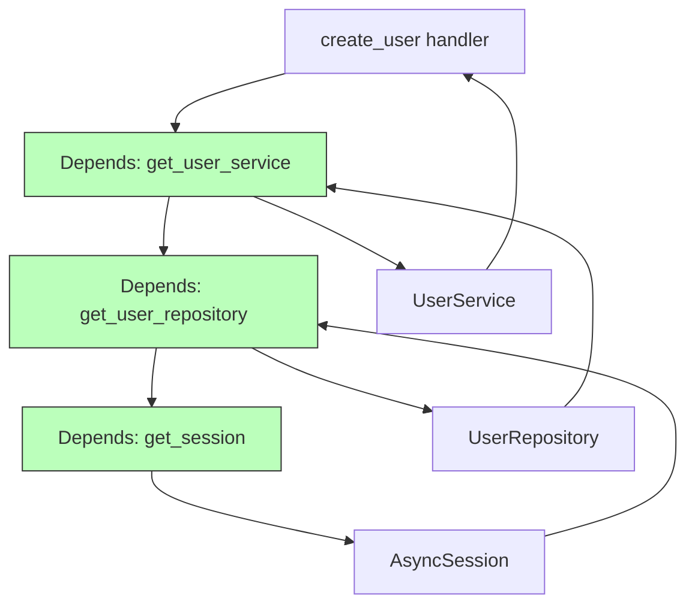

# Архітектурні патерни та Clean Architecture

---

## Зміст лекції

- Clean Architecture: принципи та концепції
- Layered Architecture: розділення відповідальностей
- Domain Model vs Database Model vs DTO
- Service Layer та Unit of Work
- SOLID принципи у Python
- Dependency Injection у FastAPI
- Стратегії тестування

---

## Clean Architecture: основна ідея

**Бізнес-логіка у центрі системи**

- Незалежність від фреймворків
- Незалежність від баз даних
- Незалежність від UI
- Тестованість без зовнішніх залежностей



---

## Чому Clean Architecture?

**Переваги підходу:**

- Легка заміна технологій (FastAPI → Flask)
- Тестування без бази даних
- Багаторазове використання бізнес-логіки
- Ізольовані зміни у різних частинах системи
- Довгострокова підтримуваність

**Ключовий принцип:** залежності спрямовані всередину

---

## Layered Architecture

**Три основні шари:**

1. **Presentation Layer** - HTTP, роутери, валідація запитів
2. **Business Layer** - бізнес-логіка, сервіси
3. **Data Layer** - репозиторії, робота з БД



---

## Presentation Layer

**Відповідальності:**

- Обробка HTTP запитів
- Валідація вхідних даних
- Перетворення у формат для бізнес-шару
- Формування HTTP відповідей

```python
@router.post("/", response_model=UserResponse, status_code=201)
async def create_user(
    user_data: UserCreate,
    user_service: UserService = Depends(get_user_service)
):
    try:
        user = await user_service.create_user(user_data)
        return user
    except ValueError as e:
        raise HTTPException(status_code=400, detail=str(e))
```

**Немає бізнес-логіки в роутерах!**

---

## Business Layer

**Серце додатку:**

- Реалізація бізнес-правил
- Координація роботи репозиторіїв
- Валідація на рівні домену
- Незалежність від способу доставки даних

```python
class UserService:
    def __init__(self, user_repository: UserRepository):
        self._repository = user_repository

    async def create_user(self, user_data: UserCreate) -> User:
        existing = await self._repository.get_by_email(user_data.email)
        if existing:
            raise ValueError("Користувач вже існує")

        if len(user_data.username) < 3:
            raise ValueError("Занадто коротке ім'я")

        return await self._repository.create(User(**user_data.dict()))
```

---

## Data Layer

**Робота зі сховищем:**

- Інкапсуляція логіки БД
- Перетворення між моделями
- Абстракція над ORM
- Уніфікований інтерфейс доступу

```python
class UserRepository:
    def __init__(self, session: AsyncSession):
        self._session = session

    async def create(self, user: User) -> User:
        db_user = UserModel(
            username=user.username,
            email=user.email,
            full_name=user.full_name
        )
        self._session.add(db_user)
        await self._session.commit()
        return self._to_domain(db_user)
```

---

## Domain Model: чиста бізнес-логіка

**Доменна модель не залежить від БД**

```python
class User:
    def __init__(self, username: str, email: str, full_name: str):
        self.username = username
        self.email = email
        self.full_name = full_name
        self.is_active = True

    def deactivate(self) -> None:
        if not self.is_active:
            raise ValueError("Користувач вже деактивований")
        self.is_active = False

    def update_profile(self, full_name: str) -> None:
        if not full_name.strip():
            raise ValueError("Повне ім'я не може бути порожнім")
        self.full_name = full_name
```

**Містить методи з бізнес-логікою**

---

## Database Model: структура БД

**SQLAlchemy модель для таблиць**

```python
class UserModel(Base):
    __tablename__ = "users"

    id = Column(Integer, primary_key=True, index=True)
    username = Column(String(50), unique=True, nullable=False)
    email = Column(String(100), unique=True, nullable=False)
    full_name = Column(String(100), nullable=False)
    is_active = Column(Boolean, default=True)
    created_at = Column(DateTime(timezone=True), server_default=func.now())
```

**Використовується тільки в Data Layer**

---

## DTO: передача даних між шарами

**Pydantic моделі для валідації**

```python
class UserCreate(BaseModel):
    username: str = Field(..., min_length=3, max_length=50)
    email: EmailStr
    full_name: str = Field(..., min_length=1, max_length=100)

class UserResponse(BaseModel):
    id: int
    username: str
    email: str
    full_name: str
    is_active: bool
    created_at: datetime

    class Config:
        from_attributes = True
```

---

## Три типи моделей: потік даних



---

## Service Layer Pattern

**Інкапсуляція бізнес-логіки:**

- Координація між репозиторіями
- Виконання складних операцій
- Застосування бізнес-правил
- Незалежність від транспорту

```python
class OrderService:
    def __init__(
        self,
        order_repo: OrderRepository,
        user_repo: UserRepository
    ):
        self._order_repo = order_repo
        self._user_repo = user_repo

    async def create_order(self, user_id: int, data: OrderCreate):
        user = await self._user_repo.get_by_id(user_id)
        if not user.is_active:
            raise ValueError("Неактивний користувач")
        # ... бізнес-логіка
```

---

## Unit of Work Pattern

**Управління транзакціями:**

- Атомарність операцій
- Координація змін
- Спрощення rollback

```python
class UnitOfWork:
    def __init__(self, session: AsyncSession):
        self._session = session

    @property
    def users(self) -> UserRepository:
        return UserRepository(self._session)

    @property
    def orders(self) -> OrderRepository:
        return OrderRepository(self._session)

    async def commit(self):
        await self._session.commit()

    async def rollback(self):
        await self._session.rollback()
```

---

## Unit of Work: використання

```python
class ComplexService:
    def __init__(self, uow: UnitOfWork):
        self._uow = uow

    async def process_order(self, user_id: int, data: OrderCreate):
        try:
            user = await self._uow.users.get_by_id(user_id)
            order = await self._uow.orders.create(Order(...))

            # Нарахування бонусів
            user.loyalty_points += int(data.total_amount * 0.1)
            await self._uow.users.update(user)

            await self._uow.commit()
            return order
        except Exception:
            await self._uow.rollback()
            raise
```

---

## SOLID: Single Responsibility

**Один клас - одна відповідальність**

❌ **Погано:**
```python
class UserManager:
    def create_user(self, data):
        self._validate(data)  # Валідація
        self._save_to_db(data)  # БД
        self._send_email(data)  # Email
```

✅ **Добре:**
```python
class UserValidator: ...
class UserRepository: ...
class EmailService: ...

class UserService:
    def __init__(self, validator, repo, email):
        self._validator = validator
        self._repo = repo
        self._email = email
```

---

## SOLID: Open/Closed Principle

**Відкритий для розширення, закритий для модифікації**

```python
class PaymentProcessor(ABC):
    @abstractmethod
    async def process_payment(self, amount: float) -> bool:
        pass

class CreditCardProcessor(PaymentProcessor):
    async def process_payment(self, amount: float) -> bool:
        # Логіка для карток
        return True

class PayPalProcessor(PaymentProcessor):
    async def process_payment(self, amount: float) -> bool:
        # Логіка для PayPal
        return True
```

**Додаємо нові способи оплати без зміни існуючого коду**

---

## SOLID: Liskov Substitution

**Об'єкти підкласів замінюють базові класи**

```python
class Storage(ABC):
    @abstractmethod
    async def save(self, filename: str, content: bytes) -> str:
        pass

class LocalStorage(Storage):
    async def save(self, filename: str, content: bytes) -> str:
        # Зберігання локально
        return f"file://{filepath}"

class S3Storage(Storage):
    async def save(self, filename: str, content: bytes) -> str:
        # Зберігання у S3
        return f"https://bucket.s3.amazonaws.com/{filename}"
```

**Обидві реалізації взаємозамінні**

---

## SOLID: Interface Segregation

**Клієнти не залежать від непотрібних методів**

```python
class ReadRepository(ABC):
    @abstractmethod
    async def get_by_id(self, id: int): pass

    @abstractmethod
    async def search(self, criteria): pass

class WriteRepository(ABC):
    @abstractmethod
    async def create(self, entity): pass

    @abstractmethod
    async def update(self, entity): pass

# Комбінуємо потрібні інтерфейси
class UserRepository(ReadRepository, WriteRepository):
    pass
```

---

## SOLID: Dependency Inversion

**Залежність від абстракцій, а не конкретних реалізацій**

```python
class NotificationSender(ABC):
    @abstractmethod
    async def send(self, recipient: str, message: str) -> None:
        pass

class EmailSender(NotificationSender):
    async def send(self, recipient: str, message: str) -> None:
        # Email логіка
        pass

class UserService:
    def __init__(self, notifier: NotificationSender):
        self._notifier = notifier  # Залежність від абстракції

    async def register(self, data: UserCreate):
        user = await self._create_user(data)
        await self._notifier.send(user.email, "Вітаємо!")
```

---

## Dependency Injection у FastAPI

**Автоматичне впровадження залежностей**

```python
async def get_session() -> AsyncGenerator[AsyncSession, None]:
    async with AsyncSessionLocal() as session:
        yield session

async def get_user_repository(
    session: AsyncSession = Depends(get_session)
) -> UserRepository:
    return UserRepository(session)

async def get_user_service(
    repo: UserRepository = Depends(get_user_repository)
) -> UserService:
    return UserService(repo)

@router.post("/users/")
async def create_user(
    data: UserCreate,
    service: UserService = Depends(get_user_service)
):
    return await service.create_user(data)
```

---

## Ланцюжок залежностей



---

## DI: класи як залежності

**Більш складні випадки**

```python
class Pagination:
    def __init__(self, skip: int = 0, limit: int = 100):
        self.skip = skip
        self.limit = min(limit, 1000)

class AuthenticatedUser:
    def __init__(self, token: str = Header(...)):
        self.user_id = self._decode_token(token)

@router.get("/orders/")
async def list_orders(
    pagination: Pagination = Depends(),
    user: AuthenticatedUser = Depends(),
    service: OrderService = Depends(get_order_service)
):
    return await service.get_user_orders(
        user.user_id,
        skip=pagination.skip,
        limit=pagination.limit
    )
```

---

## Тестування: доменні моделі

**Тести без зовнішніх залежностей**

```python
def test_user_deactivation():
    user = User(
        username="testuser",
        email="test@example.com",
        full_name="Test User"
    )

    assert user.is_active is True
    user.deactivate()
    assert user.is_active is False

def test_cannot_deactivate_twice():
    user = User(username="test", email="test@example.com",
                full_name="Test")
    user.deactivate()

    with pytest.raises(ValueError):
        user.deactivate()
```

---

## Тестування: репозиторії

**Тести з тестовою БД**

```python
@pytest.fixture
async def session():
    engine = create_async_engine("sqlite+aiosqlite:///:memory:")
    async_session = sessionmaker(engine, class_=AsyncSession)

    async with engine.begin() as conn:
        await conn.run_sync(Base.metadata.create_all)

    async with async_session() as session:
        yield session

@pytest.mark.asyncio
async def test_create_user(session: AsyncSession):
    repository = UserRepository(session)
    user = User(username="test", email="test@example.com",
                full_name="Test")

    created = await repository.create(user)
    assert created.id is not None
```

---

## Тестування: сервіси з моками

**Ізольоване тестування бізнес-логіки**

```python
@pytest.mark.asyncio
async def test_create_user_service():
    mock_repo = AsyncMock(spec=UserRepository)
    mock_repo.get_by_email.return_value = None
    mock_repo.create.return_value = User(
        id=1, username="test", email="test@example.com",
        full_name="Test"
    )

    service = UserService(mock_repo)
    data = UserCreate(username="test", email="test@example.com",
                      full_name="Test")

    result = await service.create_user(data)

    assert result.id == 1
    mock_repo.get_by_email.assert_called_once()
    mock_repo.create.assert_called_once()
```

---

## Тестування: інтеграційні тести

**Тестування всього стеку**

```python
from fastapi.testclient import TestClient

client = TestClient(app)

def test_create_user_endpoint():
    response = client.post(
        "/users/",
        json={
            "username": "testuser",
            "email": "test@example.com",
            "full_name": "Test User"
        }
    )

    assert response.status_code == 201
    data = response.json()
    assert data["username"] == "testuser"
    assert "id" in data
```

---

## Структура проєкту

```
app/
├── models/
│   ├── domain.py          # Доменні моделі
│   └── database.py        # SQLAlchemy моделі
├── schemas/
│   └── user.py            # Pydantic DTO
├── repositories/
│   └── user_repository.py # Data Layer
├── services/
│   └── user_service.py    # Business Layer
├── routers/
│   └── users.py           # Presentation Layer
├── dependencies.py        # DI функції
└── database.py            # Конфігурація БД
```

---

## Переваги архітектури

**Довгострокові вигоди:**

- **Підтримуваність:** зміни ізольовані у шарах
- **Тестованість:** кожен шар тестується окремо
- **Масштабованість:** легко додавати нову функціональність
- **Гнучкість:** заміна технологій без переписування
- **Читабельність:** чітка структура та відповідальності

**Інвестиція у якість коду окупається!**

---

## Поширені помилки

**Чого уникати:**

- Бізнес-логіка в роутерах
- Прямі звернення до БД з сервісів
- Залежність доменних моделей від ORM
- Занадто товсті моделі БД з логікою
- Ігнорування принципів SOLID
- Відсутність інтерфейсів для абстракцій

**Дотримуйтесь принципів з самого початку!**
